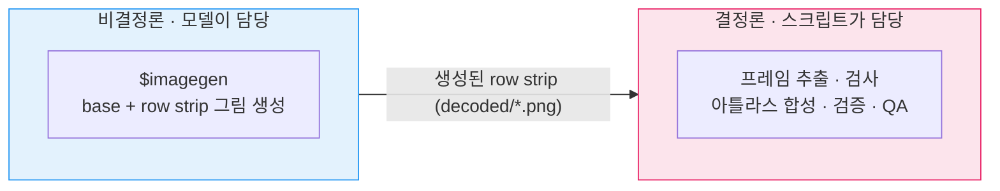
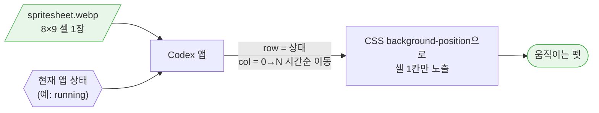
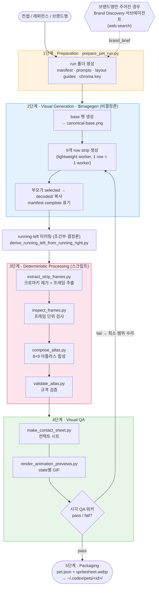
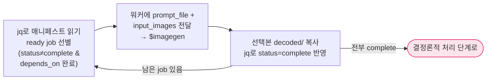
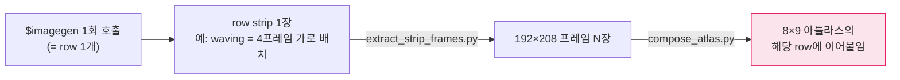
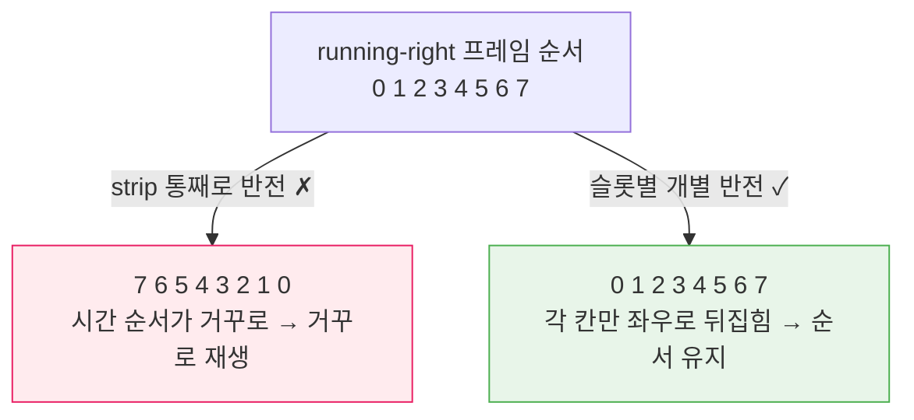
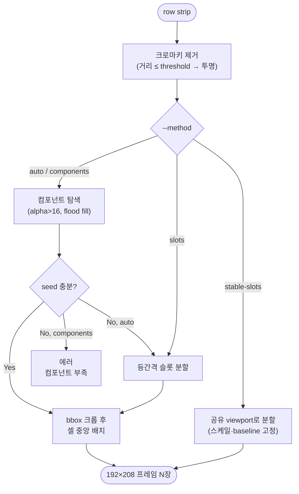

> OpenAI Codex의 `hatch-pet` 스킬이 컨셉 한 줄이나 레퍼런스 이미지 하나로부터 어떻게 "움직이는 펫"을 만들어내는지 내부 동작을 분석합니다. 비결정론적 이미지 생성(`$imagegen`)과 결정론적 래스터 파이프라인의 분리, per-pet 크로마키 자동 선택, connected-component 기반 프레임 추출, 아틀라스 검증, GIF 프리뷰 생성까지 번들 스크립트 레벨에서 들여다봅니다.

> 본 포스팅은 공개된 `hatch-pet` 스킬(`SKILL.md`)과 번들 Python 스크립트, references 문서를 직접 분석한 내용을 바탕으로 작성되었습니다. 따라서 여기서 다루는 내부 로직은 스킬이 공개적으로 드러내는 범위까지입니다. 글의 전체적인 초안은 claude code로 작성되었고, 초안을 직접 눈으로 보며 어색한 부분을 수정하였습니다.

### Terminology

- **스프라이트 아틀라스(sprite atlas / spritesheet)** — 여러 프레임 그림을 한 장에 격자로 모아 담은 이미지. 앱은 "몇 번째 칸"만 계산해 잘라 보여줍니다.
- **프레임 / row / strip** — 프레임은 애니메이션 한 컷, row는 한 상태의 프레임들이 놓인 가로줄, row strip은 그 한 줄을 가로로 길게 그린 생성 결과물입니다.
- **알파(alpha) / 투명도** — 픽셀이 얼마나 불투명한지 나타내는 값(0이면 완전 투명). RGBA의 마지막 `A`입니다.
- **래스터(raster)** — 픽셀 격자로 이루어진 이미지(PNG·WebP). 좌표·수식 기반인 벡터(SVG)의 반대 개념입니다.
- **connected-component(연결 요소)** — 서로 맞닿아 이어진 픽셀 한 덩어리.
- **bbox(bounding box)** — 스프라이트를 빈틈없이 감싸는 최소 직사각형. 크롭과 정렬의 기준이 됩니다.
- **결정론적 / 비결정론적** — 같은 입력에 늘 같은 출력이 나오면 결정론적, 모델처럼 매번 달라지면 비결정론적입니다.
- **size popping / baseline jump** — 프레임마다 크기·바닥선이 들쭉날쭉해 재생할 때 캐릭터가 튀어 보이는 현상입니다.
- **`$imagegen`** — Codex에 설치된 이미지 생성 스킬. hatch-pet의 모든 그림은 이 경로로만 생성됩니다.
- **canonical base / identity lock** — 정체성 기준이 되는 base 이미지, 그리고 모든 row가 그 얼굴·팔레트·실루엣을 유지하도록 묶어 두는 규칙입니다.
- **WebP (lossless)** — 투명도를 지원하면서 무손실 압축이 가능한 이미지 포맷. 펫의 최종 배포 파일 형식입니다.

### Codex Pets

**Codex Pets**는 OpenAI Codex 앱에 추가된 애니메이션 데스크톱 동반자입니다. 앱 한쪽 구석에 살면서 코드 작업의 상태에 반응합니다. 작업을 처리 중이면 집중하는 모습을, 입력을 기다릴 땐 멀뚱히 서 있는 모습을, 작업이 실패하면 시무룩한 모습을 보여주는 식입니다.

여기서 가장 먼저 짚고 갈 점이 하나 있습니다. **화면에서 움직이는 펫은 우리가 흔히 떠올리는 GIF 파일이 아닙니다.** 앱에 설치되는 본체는 한 장의 **스프라이트 아틀라스(spritesheet)** 이고, Codex 앱은 이 한 장의 이미지를 CSS `background-position`으로 셀 단위로 잘라 재생합니다. GIF는 뒤에서 따로 등장하는데, 사람이 움직임을 확인하기 위한 QA 산출물로만 쓰입니다.

커스텀 펫은 로컬 Codex home 아래에 작은 패키지로 배치됩니다.

```text
${CODEX_HOME:-$HOME/.codex}/pets/<pet-id>/
├── pet.json
└── spritesheet.webp
```

`pet.json`은 최소한의 메타데이터만 가집니다.

```json
{
  "id": "pet-name",
  "displayName": "Pet Name",
  "description": "One short sentence.",
  "spritesheetPath": "spritesheet.webp"
}
```

### The hatch-pet Skill

`hatch-pet`은 컨셉, 브랜드 cue, 회사/제품명, 레퍼런스 이미지, 또는 이들의 조합을 입력받아 **Codex 호환 펫을 생성, 수정, 검증, visual QA, 패키징**하는 스킬입니다. 디렉터리를 열어 보면 스킬의 정체가 분명히 드러납니다.

```text
~/.codex/skills/hatch-pet/
├── SKILL.md          # 오케스트레이션 정책 (정책·프롬프트·규칙)
├── scripts/          # 결정론적 Python 파이프라인 (8개)
├── references/       # 계약 문서 (atlas/row/QA 규격)
└── agents/           # 서브에이전트 정의
```

핵심 설계 의도는 이 구조에서 드러납니다. `SKILL.md`는 코드가 아니라 **정책 문서**입니다. 모델이 읽고 따라야 할 규칙, 프롬프트, 제약, 워크플로우를 담고 있을 뿐, 실제 픽셀을 다루는 산술은 전부 번들 스크립트에 위임되어 있습니다.

##### Generation vs. Deterministic Split

`hatch-pet`을 관통하는 단 하나의 원칙은 **비결정론적인 부분과 결정론적인 부분을 철저히 분리**한다는 것입니다.

- **비결정론(이미지 생성):** 모든 시각 생성은 오직 설치된 `$imagegen` 스킬을 통해서만 이루어집니다. `hatch-pet`은 Image API나 이미지 CLI를 직접 호출하지 않고, 로컬에서 스프라이트를 그리거나 타일링, 합성하는 것도 금지합니다.
- **결정론(래스터 처리):** 프레임 추출, 검사, 아틀라스 합성, 검증, QA 미디어 생성처럼 **정답이 정해진 기하학적 작업**은 전부 Python 스크립트가 처리합니다.



이 분리가 중요한 이유는, 아틀라스 규격(`1536x1872`, 셀 `192x208`)은 단 1픽셀의 오차도 허용하지 않기 때문입니다. 비결정론적인 모델에게 "정확히 192픽셀 간격으로 8칸을 그려라"라고 맡기는 대신, 모델에게는 **그림(row strip)**만 맡기고, 그것을 격자에 맞추는 일은 결정론적 코드가 책임집니다.

##### Atlas, Not a GIF

펫의 최종 렌더링 계약(`references/codex-pet-contract.md`)은 다음과 같습니다.

| 항목      | 값                                             |
| --------- | ---------------------------------------------- |
| 포맷      | PNG 또는 WebP (기본 배포는 `spritesheet.webp`) |
| 전체 크기 | `1536 x 1872` px                               |
| 격자      | 8 columns × 9 rows                             |
| 셀 크기   | `192 x 208` px                                 |
| 배경      | 투명 (미사용 셀은 완전 투명)                   |

`1536 x 1872`라는 크기는 가로 `8 × 192`, 세로 `9 × 208`에서 나옵니다. 9개의 row는 각각 Codex 앱의 상태 하나에 대응하고, row마다 실제로 쓰는 프레임 수가 다릅니다. 8칸을 다 쓰지 않는 row의 나머지 셀은 반드시 완전 투명이어야 합니다.

| Row | State           | Frames | 의미                           | Preview duration (ms)        |
| --: | --------------- | -----: | ------------------------------ | ---------------------------- |
|   0 | `idle`          |      6 | 차분한 미세 변화 (호흡·깜빡임) | 280, 110, 110, 140, 140, 320 |
|   1 | `running-right` |      8 | 오른쪽으로 이동                | 120 ×7, 220                  |
|   2 | `running-left`  |      8 | 왼쪽으로 이동                  | 120 ×7, 220                  |
|   3 | `waving`        |      4 | 손/팔 흔들기                   | 140, 140, 140, 280           |
|   4 | `jumping`       |      5 | 수직 점프                      | 140 ×4, 280                  |
|   5 | `failed`        |      8 | 에러/실망 반응                 | 140 ×7, 240                  |
|   6 | `waiting`       |      6 | 사용자 입력 대기               | 150 ×5, 260                  |
|   7 | `running`       |      6 | **작업 처리 중** (방향성 없음) | 120 ×5, 220                  |
|   8 | `review`        |      6 | 집중 검토                      | 150 ×5, 280                  |

여기서 `running`이 특히 헷갈리기 쉬운 상태입니다. `running-right`/`running-left`는 말 그대로 좌우로 **걷는 이동**이지만, `running`은 Codex가 **작업을 처리하는 상태**입니다. 그래서 발로 뛰거나 speed line을 그리면 안 되고, 사고·스캔·타이핑처럼 비방향성 집중 동작으로 표현해야 합니다. 이 미묘한 의미 구분은 스크립트가 아니라 프롬프트와 QA 규칙이 강제합니다.

그렇다면 정적인 시트 한 장이 어떻게 움직이는 펫이 될까요? 앱은 현재 상태에 해당하는 row를 고른 뒤, 그 안에서 컬럼(프레임)을 시간순으로 한 칸씩 옮기며 CSS `background-position`으로 셀 하나만 노출합니다. GIF를 디코딩하는 게 아니라, **한 장의 시트 위에서 보는 창(window)을 옮기는** 방식입니다.



### Pipeline Overview

전체 파이프라인은 준비 → 생성 → 결정론적 처리 → 시각 QA → 패키징의 5단계로 흐릅니다. 아래 다이어그램에서 파란색 계열은 비결정론적(모델) 작업, 분홍색 계열은 결정론적(스크립트) 작업입니다.



각 단계를 담당하는 스크립트와 references 문서는 다음과 같습니다.

| 파일                                        | 역할                                                                |
| ------------------------------------------- | ------------------------------------------------------------------- |
| `prepare_pet_run.py`                        | run 폴더, job manifest, 프롬프트, 레이아웃 가이드, 크로마키 생성    |
| `derive_running_left_from_running_right.py` | 승인된 `running-right`를 프레임 단위로 미러링해 `running-left` 파생 |
| `extract_strip_frames.py`                   | row strip → `192x208` 프레임 추출 (크로마키 제거 포함)              |
| `inspect_frames.py`                         | 아틀라스 합성 전 프레임 품질 검사                                   |
| `compose_atlas.py`                          | 프레임을 8×9 아틀라스로 합성, lossless WebP 저장                    |
| `validate_atlas.py`                         | 최종 아틀라스가 Codex pet 계약을 만족하는지 검증                    |
| `make_contact_sheet.py`                     | 전체 row 확인용 라벨링된 컨택트 시트 생성                           |
| `render_animation_previews.py`              | state별 GIF 프리뷰 생성 (QA 전용)                                   |
| `references/animation-rows.md`              | 9개 row의 상태·프레임 수·duration 계약                              |
| `references/codex-pet-contract.md`          | 아틀라스 규격, 커스텀 펫 패키지 구조                                |
| `references/qa-rubric.md`                   | 인수 전 통과해야 하는 시각 QA 체크리스트                            |

### Preparation

파이프라인의 진입점은 `prepare_pet_run.py`입니다. 이 스크립트는 작업 폴더와 `imagegen-jobs.json` 매니페스트, 상태별 프롬프트, 레이아웃 가이드를 한 번에 만들어 둡니다. 사용자가 이름/설명/스타일을 생략하면 컨셉이나 레퍼런스 파일명에서 추론하고, 그래도 안 되면 기본 이름 `Sprout`를 씁니다.

##### Chroma Key Selection

가장 흥미로운 디테일은 **크로마키가 초록색으로 고정되어 있지 않다**는 점입니다. 흔히 "크로마키 = 초록"이라고 생각하지만, `hatch-pet`은 펫마다 키 색을 다르게 고릅니다.

```python
CHROMA_KEY_CANDIDATES = [
    ("magenta", "#FF00FF"), ("cyan", "#00FFFF"), ("yellow", "#FFFF00"),
    ("blue", "#0000FF"), ("orange", "#FF7F00"), ("green", "#00FF00"),
]
```

레퍼런스 이미지가 있으면 픽셀을 샘플링한 뒤(흰 배경은 제외), 6개 후보 색 각각이 **펫의 색과 얼마나 멀리 떨어져 있는지** 점수를 매깁니다. 그리고 펫의 가장 가까운 색과도 충분히 거리가 먼 키, 즉 추출 과정에서 캐릭터 일부까지 함께 지워버릴 위험이 가장 적은 키를 고릅니다. 레퍼런스가 전혀 없을 때의 기본값은 **초록이 아니라 마젠타(`#FF00FF`)** 입니다.

이렇게 고른 키는 `pet_request.json`에 기록되고, 이후 모든 스크립트가 이 값을 읽습니다. 초록색 펫에 초록 크로마키를 들이대는 식의 실수를 구조적으로 피하기 위한 장치입니다.

##### Layout Guides

`prepare_pet_run.py`는 9개 상태 각각에 대해 **보이지 않는 작도 가이드** 이미지를 그려 `references/layout-guides/`에 저장합니다. 가이드는 `frames × 192` 너비의 회색 캔버스 위에, 셀마다 검은 테두리 사각형 + 파란 safe-area 사각형(여백 18×16) + 회색 점선 중심선 십자를 그린 그림입니다.

row strip을 생성할 때 이 가이드를 **layout-only 입력**으로 첨부하면, 모델이 정확한 프레임 개수/간격/중심 정렬/안전 여백을 따라 그릴 수 있습니다. 단, 생성 결과물에는 이 가이드 선이 보이면 안 됩니다. 어디까지나 "이 칸 안에, 이 정도 여백으로 그려라"라는 눈금자 역할입니다.

##### Job Manifest

`imagegen-jobs.json`은 시각 작업의 의존성 그래프입니다. `SKILL.md`가 제안하는 조회 쿼리를 보면 각 job이 어떤 필드를 갖는지 알 수 있습니다.

```bash
jq '.jobs[] | {id, kind, status, depends_on, prompt_file,
   retry_prompt_file, input_images, output_path, derivation_policy}' \
   imagegen-jobs.json
```

한 번의 일반적인 run은 최대 **10개의 생성 job**(base 1개 + row strip 9개)을 가집니다. job은 `status`가 `complete`가 아니고 `depends_on`의 모든 id가 이미 complete일 때 "준비됨"으로 판단됩니다. 모든 row job은 `prompt_file`과 함께 `retry_prompt_file`을 미리 들고 있어서, `$imagegen`이 transport-level `Bad Request`를 내면 같은 row를 retry 프롬프트로 한 번 더 시도할 수 있습니다.

##### Pet-Safe Styles

스타일도 prepare 단계에서 정해집니다. 기본값은 `auto`로, 사용자 프롬프트와 레퍼런스에서 스타일을 추론한 뒤 모든 row에 동일하게 유지합니다. 사용자가 명시하면 **`pixel`, `plush`, `clay`, `sticker`, `flat-vector`, `3d-toy`, `painterly`, `brand-inspired`** 같은 프리셋을 따릅니다. 픽셀 아트만이 아니라 봉제인형, 클레이, 스티커, 벡터 같은 non-pixel 스타일도 1급 시민으로 취급합니다.

다만 어떤 스타일이든 **pet-safe** 조건을 만족해야 합니다

- `192x208` 셀 안에 들어가는 컴팩트한 전신 실루엣
- 모든 row에서 일관된 얼굴/비율/재질/팔레트/소품
- 깨끗하게 제거 가능한 크로마 배경
- 펫 크기에서도 읽히는 디테일
- 텍스트/라벨/UI/로고가 없을 것 (승인된 레퍼런스가 아닌 한)

### Visual Generation

이제 실제로 그림을 만드는 단계입니다. 이 단계의 핵심은 두 가지입니다.

첫째, 부모 에이전트는 그림을 직접 만들지 않고 **경량 서브에이전트(lightweight worker)** 에게 시각 job을 맡깁니다. 둘째, 모델에게 최종 아틀라스 전체를 그리게 하지 않고, **상태별 row strip**까지만 생성하게 합니다. 이후 프레임 추출과 아틀라스 합성은 결정론적 스크립트가 처리합니다.

##### Parent Agent Loop

`imagegen-jobs.json`은 자동 스케줄러가 아니라 의존성 매니페스트입니다. 부모 에이전트가 직접 `jq`로 읽고, **ready job**을 골라 워커에게 넘기고, 결과를 받은 뒤 다시 상태를 갱신합니다. 여기서 ready job은 `status`가 `complete`가 아니고 `depends_on`의 모든 job이 이미 complete인 항목입니다.



처음에는 `depends_on`이 비어 있는 base job만 ready입니다. base가 complete가 되어야 그 이미지를 grounding으로 쓰는 row job들이 ready가 됩니다. 순서가 어긋나면 뒤따르는 결정론적 스크립트가 가드로 막습니다. 예를 들어 `running-left` 미러 파생은 `running-right`가 complete가 아니면 거부됩니다.

이 루프가 만드는 순서에는 의도가 있습니다.

1. **base 펫 생성.** 평평한 크로마 배경 위에 풀바디 펫 한 마리를 만듭니다. 선택된 결과물은 `decoded/base.png`와 `references/canonical-base.png`로 복사되어, **이후 모든 row의 정체성 기준(source of truth)**이 됩니다.
2. **`idle`과 `running-right` 먼저.** 캐릭터 정체성과 보행감이 유지되는지 가장 먼저 확인하는 체크포인트입니다.
3. **나머지 row 생성.** 각 row job은 canonical base와 해당 레이아웃 가이드를 입력으로 첨부해 따로 생성합니다.

각 워커는 부모의 컨텍스트를 오염시키지 않도록 **딱 두 줄만 반환**합니다. `selected_source=<경로>`와 `qa_note=<한 문장>`이 전부입니다. **Markdown 이미지 미리보기나 base64를 응답에 넣는 것은 금지**됩니다.

결과 이미지를 `decoded/`로 복사하고 매니페스트를 `complete`로 갱신하는 일은 부모가 맡지만, 부모가 이미지를 매번 직접 열어보지는 않습니다. 이것이 **컨텍스트 경제학**을 위한 의도적 설계입니다.

##### Generation Granularity

가장 헷갈리기 쉬운 지점은 생성 단위입니다. 모델은 전체 아틀라스를 한 번에 그리지도, 셀(프레임) 하나씩 따로 그리지도 않습니다. 생성 단위는 **row(상태) 하나**입니다.

`$imagegen` 호출 한 번은 한 상태의 모든 프레임을 **가로로 이어 그린 strip 한 장**을 만듭니다. 예를 들어 `waving`(4프레임) 작업은 4개 포즈가 왼쪽→오른쪽으로 늘어선 이미지 한 장을 생성합니다. 그래서 일반적인 run은 **base 1장 + row strip 9장 = 최대 10번의 생성 호출**로 끝납니다.



- 전체 아틀라스를 한 번에 그리지 않는 이유: 모델에게 `1536×1872` 캔버스에 8×9 셀을 픽셀 단위로 정확히 채우라고 요구할 수 없기 때문입니다(앞서 말한 비결정론↔결정론 분리).
- 셀 하나씩 그리지 않는 이유: 한 row의 프레임들은 같은 스케일, baseline 위에서 동작이 자연스럽게 이어지는 애니메이션 연속성을 가져야 합니다. 한 장에 함께 그려야 그 연속성이 유지되고, 셀을 따로 생성하면 프레임 간 일관성이 깨지기 쉽습니다.

즉 모델은 **한 줄짜리 애니메이션 시트**까지만 그리고, 그 **strip을 `192×208` 프레임으로 자르고 `8×9` 아틀라스에 배치하는 일은 코드**가 맡습니다.

##### Prompt Contract

프롬프트는 `prepare_pet_run.py`가 만들어 `prompts/` 아래에 저장합니다. 프롬프트는 단순한 그림 설명이 아니라, 뒤따르는 추출 스크립트가 성공하도록 모델 출력을 제한하는 **계약서**에 가깝습니다. 아래 인용은 실제 스크립트의 f-string에서 `args.pet_id`, `args.display_name` 같은 동적 값을 `{pet_id}`처럼 일반화한 것입니다.

base 프롬프트는 정체성 기준 1장을 만드는 프롬프트입니다.

```text
Create one clean full-body reference sprite for Codex pet {display_name}.

Pet identity: {pet_notes}.
Style: {style_contract}
{brand_block}
Place a single centered pose on a perfectly flat pure {chroma_name} {chroma_key} chroma-key background. Keep the full pet visible, compact, readable at 192x208, and easy to animate. Preserve approved reference identity cues. No scenery, text, borders, checkerboard transparency, shadows, glows, detached effects, or extra props. Keep {chroma_key} and close colors out of the pet, props, highlights, and effects.
```

row strip 프롬프트는 상태별 strip을 만드는 템플릿입니다. 여기서 `{state_prompt}`, `{state_requirements}`, `{style_contract}`가 핵심 변수입니다.

```text
Create one horizontal animation strip for Codex pet `{pet_id}`, state `{state}`.

Use the attached canonical base for identity. Use the attached layout guide only for slot count, spacing, centering, and padding; do not draw the guide.

Output exactly {frames} full-body frames in one left-to-right row on flat pure {chroma_name} {chroma_key}. Treat the row as {frames} invisible equal-width slots: one centered complete pose per slot, evenly spaced, with no overlap, clipping, empty slots, labels, or borders.

Identity: same pet in every frame: {pet_notes}. Preserve silhouette, face, proportions, markings, palette, material, style, and props.
Style: {style_contract}
Animation continuity: keep apparent pet scale and baseline stable within the row unless the state itself intentionally changes vertical position, such as `jumping`. Move the pose within the slot instead of redrawing the pet larger or smaller frame to frame.

State action: {state_prompt}

State requirements:
{state_requirements}

Clean extraction: crisp opaque edges, safe padding, no scenery, text, guide marks, checkerboard, shadows, glows, motion blur, speed lines, dust, detached effects, stray pixels, or chroma-key colors inside the pet.
```

`{style_contract}`는 `PET_SAFE_STYLE`과 `STYLE_PRESETS[style_preset]`를 합친 문자열입니다. 사용자가 style note를 추가했을 때만 마지막에 `User style notes: ...`가 붙습니다.

```text
Pet-safe sprite: compact full-body mascot, readable in a 192x208 cell, clear silhouette, simple face, stable palette/materials, and crisp edges for chroma-key extraction. Style `{style_preset}`: {preset_contract}
```

프리셋별 `{preset_contract}`는 다음 값 중 하나입니다.

- `auto`: Infer the most appropriate pet-safe style from the user request and reference images, then keep that exact style consistent across every row.
- `pixel`: Pixel-art-adjacent digital mascot with a chunky silhouette, simple dark outline, limited palette, flat cel shading, and visible stepped edges.
- `plush`: Soft plush toy mascot with rounded stitched forms, fuzzy fabric feel, simple sewn details, and readable toy-like proportions.
- `clay`: Handmade clay or polymer-clay mascot with rounded sculpted forms, soft material texture, simple features, and clean readable edges.
- `sticker`: Polished sticker mascot with bold clean shapes, crisp outline, flat colors, and minimal highlight detail.
- `flat-vector`: Flat vector-style mascot with simple geometric forms, crisp color areas, clean outline, and minimal shading.
- `3d-toy`: Stylized 3D toy mascot with smooth rounded forms, simple materials, clear silhouette, and no photoreal complexity.
- `painterly`: Painterly mascot with simplified brush texture, readable forms, stable palette, and enough edge clarity for clean extraction.
- `brand-inspired`: Brand-inspired mascot using approved public or user-provided brand cues such as colors, mascot themes, and vibe while avoiding readable text or logo copying unless explicitly approved.

`{state_prompt}`는 `STATE_PROMPTS[state]`에서 오는 상태별 한 줄 action입니다. 실제 값은 다음과 같습니다.

| State           | `state_prompt`                                                                                                                                                                                                                       |
| --------------- | ------------------------------------------------------------------------------------------------------------------------------------------------------------------------------------------------------------------------------------ |
| `idle`          | Calm low-distraction resting loop: subtle breathing, tiny blink, slight head/body bob, and only quiet persona-preserving motion.                                                                                                     |
| `running-right` | Dragging-right loop: show directional movement to the right through body and limb poses only.                                                                                                                                        |
| `running-left`  | Dragging-left loop: show directional movement to the left through body and limb poses only.                                                                                                                                          |
| `waving`        | Greeting loop: paw or limb down, raised, tilted, and returning in a friendly attention gesture.                                                                                                                                      |
| `jumping`       | Hover jump loop: anticipation, lift, airborne peak, descent, and settle through body height.                                                                                                                                         |
| `failed`        | Blocked/failed loop: slumped or deflated reaction with sad or closed eyes.                                                                                                                                                           |
| `waiting`       | Needs-input loop: expectant asking pose for approval, help, or user input.                                                                                                                                                           |
| `running`       | Working loop: focused active-task processing, thinking, typing, scanning, or effortful concentration; not literal foot-running, jogging, sprinting, treadmill motion, raised knees, long steps, pumping arms, or directional travel. |
| `review`        | Ready-review loop: focused inspection of completed output with lean, blink, narrowed eyes, head tilt, or paw pose.                                                                                                                   |

`{state_requirements}`는 `STATE_REQUIREMENTS[state]`의 각 문장을 `- ...` bullet로 붙인 블록입니다. 예를 들어 `running` row는 action과 requirements가 이렇게 들어갑니다.

```text
State action: Working loop: focused active-task processing, thinking, typing,
scanning, or effortful concentration; not literal foot-running, jogging,
sprinting, treadmill motion, raised knees, long steps, pumping arms, or
directional travel.

State requirements:
- Show the pet actively working or processing, as if running a task: focused
  posture, busy hands or paws, purposeful bobbing, thinking motion, tool or prop
  motion only if already part of the pet identity, or other non-locomotion
  activity.
- Do not show literal foot-running, jogging, sprinting, treadmill motion, raised
  knees, long steps, pumping arms, directional travel, speed lines, dust clouds,
  floor shadows, motion trails, or detached motion effects.
```

즉 `running`이라는 이름 때문에 발로 뛰는 이미지를 만들지 않도록, 프롬프트 안에서 action과 requirements가 이중으로 막습니다. `running-right`/`running-left`는 반대로 좌우 이동을 분명히 보여주라고 요구하고, `jumping`은 그림자나 먼지 없이 몸의 수직 위치만으로 점프를 표현하라고 요구합니다. 이런 상태별 요구사항이 뒤의 크로마키 제거와 컴포넌트 추출을 보호합니다.

마지막으로, `$imagegen`이 transport-level `Bad Request`를 내면 더 짧게 압축한 **retry 프롬프트**(`retry_prompt_file`)로 같은 row를 한 번 더 시도합니다. retry 템플릿은 스타일 설명을 빼고, 프레임 수·크로마키·정체성·상태 동작만 보존합니다.

```text
Create Codex pet row `{state}` for `{pet_id}`: exactly {frames} full-body frames in one horizontal strip on flat pure {chroma_name} {chroma_key}.

Use the attached canonical base for identity and the layout guide only for spacing. Same pet in every frame: {pet_notes}. Preserve silhouette, face, palette, material, proportions, markings, and props.

Keep apparent pet scale and baseline stable within the row unless the state itself intentionally changes vertical position, such as `jumping`.

Action: {state_prompt}

State requirements:
{state_requirements}

One centered complete pose per invisible slot. No text, boxes, guide marks, scenery, shadows, glows, motion blur, speed lines, dust, detached effects, stray pixels, or {chroma_key} colors in the pet.
```

##### Identity Lock

base 외의 모든 row job은 **반드시 grounding 이미지를 첨부**해야 합니다. base만 prompt-only 생성이 허용되고, grounding 이미지 없이 생성된 row는 무효입니다. 9개 row 전체에 걸쳐 얼굴, 비율, 팔레트, 재질, 스타일, 소품 디자인, 실루엣이 동일하게 유지되어야 합니다. 이를 **identity lock**이라고 부르며, `qa/review.json`과 `validation.json`에 에러가 하나도 없더라도 정체성이 흔들리면 그 자체로 인수 거부 사유가 됩니다.

##### Transparency & Effects

row의 모든 픽셀은 둘 중 하나여야 합니다. **펫 스프라이트의 일부이거나, 깨끗하게 제거 가능한 크로마 배경**이거나. 그래서 `hatch-pet`은 장식적 이펙트보다 포즈, 표정, 실루엣 변화를 선호합니다.

이펙트를 넣더라도 다음 조건을 **모두** 만족해야 허용됩니다.

- 상태와 관련 있을 것
- 펫 실루엣에 물리적으로 붙어 있을 것(떠 있으면 안 됨)
- 같은 프레임 슬롯 안에 있어 별도 컴포넌트를 만들지 않을 것
- 불투명하고 엣지가 또렷할 것
- 펫 크기에서 읽힐 만큼 작을 것

반대로 speed line, motion arc, 잔상, 분리된 별·반짝임·먼지, 그림자, glow, halo, 텍스트, 말풍선, UI, 크로마키에 가까운 색은 기본적으로 금지됩니다. 이 금지 목록은 미적 취향이 아니라 **크로마키 제거와 컴포넌트 추출을 보호하기 위한 규칙**입니다. 떠다니는 이펙트나 그림자는 별도 컴포넌트로 잡히거나 배경 제거를 망가뜨릴 수 있습니다.

상태별 가이드도 같은 맥락입니다. `jumping`은 그림자·먼지 없이 몸의 위치만으로 점프를 표현하고, `waving`은 손 흔드는 자세만으로(motion arc 없이), `idle`은 6프레임이 사실상 같은 그림이면 안 되고 미세한 변화를 담아야 합니다.

##### running-left Mirroring

9개 row 중 **결정론적으로 파생 가능한 유일한 row는 `running-left`** 입니다. `running-right`가 좌우 대칭이라 뒤집어도 의미가 깨지지 않는다고 사람이 판단·승인한 경우에 한해, `derive_running_left_from_running_right.py`로 미러링할 수 있습니다.

여기서 미묘한 함정이 하나 있습니다. strip 전체를 한 번에 좌우 반전하면 **프레임의 시간 순서까지 뒤집혀서** 애니메이션이 거꾸로 재생됩니다. 그래서 이 스크립트는 **각 프레임 슬롯을 제자리에서 개별 미러링**합니다.



```python
def mirror_strip_preserving_frame_order(source, frame_count=8):
    mirrored = Image.new("RGBA", source.size, (0, 0, 0, 0))
    slot_width = source.width / frame_count
    for index in range(frame_count):
        left = round(index * slot_width)
        right = round((index + 1) * slot_width)
        mirrored.alpha_composite(
            ImageOps.mirror(source.crop((left, 0, right, source.height))),
            (left, 0),  # 같은 column 위치에 다시 붙임 → 순서 보존
        )
    return mirrored
```

또한 이 derivation은 `--confirm-appropriate-mirror` 플래그와 `--decision-note`를 강제합니다. 아무 근거 없이 미러링하지 못하도록, 사람의 명시적 승인과 이유를 코드 레벨에서 요구하는 것입니다. `waiting`, `running`, `failed`, `review` 등 나머지 상태는 서로 다른 앱 의미를 가지므로 절대 파생/재사용할 수 없고, 각각 독립적으로 생성해야 합니다.

### Deterministic Processing

9개 row strip이 모두 `decoded/`에 모이면, 모델의 역할은 끝납니다. 이제부터는 픽셀을 정해진 규격에 맞추는 단계입니다. 흐름은 단순합니다. **배경을 지우고 → 프레임을 자르고 → 프레임을 검사하고 → 아틀라스로 합치고 → 최종 계약을 검증**합니다.

##### Frame Extraction

`extract_strip_frames.py`는 가로로 긴 row strip을 받아 `192x208` 프레임 N장으로 바꿉니다. 가장 먼저 하는 일은 **크로마키 제거**입니다. `pet_request.json`에 기록된 키 색을 읽고, 그 색과의 유클리드 거리가 임계값(기본 96) 이하인 픽셀을 모두 투명(`0,0,0,0`)으로 만듭니다.

그다음 프레임을 찾습니다. 기본값인 `auto`는 strip을 무조건 N등분하지 않습니다. 먼저 **connected-component(연결 요소)** 분석으로 실제 스프라이트 덩어리를 찾고, 실패할 때만 등간격 슬롯 분할로 fallback합니다.



컴포넌트 방식은 알파값이 16을 넘는 픽셀들을 4-방향 flood fill로 묶습니다. 각 덩어리의 면적, bbox, 중심 x좌표를 구한 뒤, 면적이 큰 덩어리 N개를 **seed**로 뽑아 왼쪽→오른쪽 순서로 프레임에 대응시킵니다. seed가 아닌 작은 조각(눈, 손에 든 소품 등)은 노이즈가 아니라고 판단되면 중심 x좌표가 가장 가까운 seed에 병합됩니다.

모드별 의미는 다음처럼 보면 됩니다.

| Method         | 의미                                                                     |
| -------------- | ------------------------------------------------------------------------ |
| `auto`         | 컴포넌트 추출을 먼저 시도하고, seed가 부족하면 `slots`로 fallback합니다. |
| `components`   | 컴포넌트 추출만 허용합니다. 프레임을 충분히 찾지 못하면 에러입니다.      |
| `slots`        | strip을 프레임 개수만큼 등간격으로 자릅니다.                             |
| `stable-slots` | row 전체에 같은 viewport를 적용해 스케일과 baseline을 고정합니다.        |

`stable-slots`가 따로 있는 이유는 size popping 때문입니다. 일반 컴포넌트 추출은 프레임마다 bbox를 독립적으로 잡고 `fit_to_cell`로 중앙 배치합니다. 그래서 포즈가 넓은 프레임만 더 많이 축소되거나 baseline이 흔들릴 수 있습니다. `stable-slots`는 row 전체에 같은 top/bottom 경계와 같은 스케일을 적용해 이 문제를 줄입니다. 다만 원본 strip 자체가 잘렸거나 포즈가 불량한 경우까지 고쳐 주지는 않습니다.

##### Frame Inspection

`inspect_frames.py`는 아틀라스를 만들기 **전에** 추출된 프레임을 검사합니다. 여기서 잡는 문제는 "이미지로는 그럴듯하지만 아틀라스에 넣으면 깨지는" 것들입니다.

- 프레임 개수가 상태별 기대값과 일치하는가, 각 프레임이 정확히 `192x208`인가
- non-transparent 픽셀이 너무 적어 비어 있는 프레임은 아닌가 (`min_used_pixels`)
- 셀 가장자리에 픽셀이 닿아 잘릴 위험은 없는가 (edge 경고)
- **크로마키와 가까운 잔여 픽셀**이 남아 있지 않은가 (배경 추출 실패의 신호 → 에러)
- 프레임 간 크기가 row median 대비 지나치게 작거나 큰 outlier는 없는가

특히 `--require-components` 옵션을 쓰면, 컴포넌트 추출이 아니라 슬롯 fallback으로 만들어진 row를 **에러로 격상**합니다. `stable-slots`는 `--allow-stable-slots`를 명시했을 때만 경고로 통과됩니다. "fallback이 조용히 묻히지 않도록" 강제하는 게이트인 셈입니다.

##### Atlas Composition & Validation

`compose_atlas.py`는 빈 `1536x1872` RGBA 캔버스를 만들고, `ROW_SPECS`에 정의된 순서대로 각 state의 프레임을 정해진 row의 셀 중앙에 합성합니다.

합성 뒤에는 `clear_transparent_rgb`가 완전 투명 픽셀(alpha=0)의 RGB 값을 모두 `0,0,0`으로 normalize합니다. 투명 픽셀에 색 잔여(residue)가 남아 있으면 일부 렌더러에서 가장자리에 halo가 보일 수 있기 때문입니다. 저장은 PNG와 **lossless WebP**(`method=6`, `exact=True`)로 이루어지고, 최종 패키지에는 `spritesheet.webp`가 들어갑니다.

`validate_atlas.py`는 완성된 아틀라스가 계약을 지키는지 기계적으로 검사하고 `final/validation.json`을 남깁니다.

- 크기가 정확히 `1536x1872`이고 포맷이 PNG/WebP이며 alpha channel이 있는가
- **사용 셀**(col < frame_count)이 비어 있지 않은가
- **미사용 셀**이 완전 투명인가 (non-transparent 픽셀이 하나라도 있으면 에러)
- 사용 셀이 거의 완전 불투명하게 꽉 차 있지는 않은가 (그렇다면 배경이 안 지워졌다는 신호)
- 완전 투명 픽셀에 RGB residue가 남지 않았는가

이 검증은 **필요조건이지 충분조건이 아닙니다.** 규격은 통과해도 펫의 정체성이 흔들리거나 동작이 어색한 문제는 잡지 못하기 때문입니다. 그래서 시각 QA가 뒤따릅니다.

### Visual QA

##### Contact Sheet & Preview GIFs

`make_contact_sheet.py`는 아틀라스를 0.5배로 줄여 9개 row를 라벨과 함께 한 장에 펼친 컨택트 시트를 만듭니다. 사용 셀은 초록 테두리, 미사용 셀은 빨간 테두리로 표시해 한눈에 row별 프레임 사용을 확인할 수 있습니다.

그리고 드디어 **GIF가 등장하는 유일한 지점**, `render_animation_previews.py`입니다. 이 스크립트의 동작에는 오해하기 쉬운 지점이 하나 있습니다.

```python
frames[0].save(
    output,
    save_all=True,
    append_images=frames[1:],
    duration=durations,   # ROW_DURATIONS[state], 프레임별 ms
    loop=0,               # 무한 반복
    disposal=2,           # 다음 프레임 전 배경으로 복원 (잔상 방지)
    optimize=False,       # 최적화보다 예측 가능한 출력 우선
)
```

핵심은 이 스크립트가 **아틀라스를 다시 자르지 않는다**는 것입니다. 대신 `extract_strip_frames.py`가 만들어 둔 `frames/<state>/00.png` 같은 **개별 프레임 파일**을 읽어 PIL로 묶습니다. 타이밍은 FPS가 아니라 **프레임별 millisecond duration 리스트**(`ROW_DURATIONS`)로 지정합니다.

이 사실의 함의는 분명합니다. GIF 프리뷰에서 보이는 문제 대부분은 GIF 인코더의 문제가 **아니라**, 그 앞 단계(row 생성, 크로마키 제거, 컴포넌트 추출, 중앙 정렬, 프레임 개수)에서 온 것입니다. 그리고 다시 강조하면, 이 GIF는 **검수용**입니다. Codex 앱에 들어가는 것은 GIF가 아니라 `spritesheet.webp`입니다.

##### Repair Workflow

시각 QA 워커는 컨택트 시트와 프리뷰 GIF를 보고, 9개 row가 같은 정체성·스타일·팔레트·실루엣을 유지하는지, size popping이나 방향 오류, 정지된 idle 루프 같은 문제가 없는지 판정합니다. 문제가 있으면 `qa-rubric.md`의 **최소 범위 우선(smallest-scope-first)** 원칙을 따릅니다.

1. 단일 불량 프레임
2. 한 개의 row
3. 정체성/레이아웃이 광범위하게 깨진 경우에만 전체 재생성

즉 전체를 다시 만들지 않고, 실패한 row만 재생성해 같은 `decoded/` 경로에 덮어쓴 뒤 프레임 추출부터 다시 돌립니다. 단, 추출 때문에 생긴 popping이라면 이미지를 다시 만들기 전에 `stable-slots`로 재추출부터 시도합니다.

### Packaging

QA를 통과하면 최종 파일만 Codex 펫 폴더로 복사합니다.

```bash
PET_DIR="${CODEX_HOME:-$HOME/.codex}/pets/$PET_ID"
mkdir -p "$PET_DIR"
cp "$RUN_DIR/final/spritesheet.webp" "$PET_DIR/spritesheet.webp"
jq -n --arg id "$PET_ID" ... > "$PET_DIR/pet.json"
```

그다음 `qa/run-summary.json`을 기록하고, 중간 산출물(프롬프트, 레이아웃 가이드, 디코딩된 row, 추출 프레임, `spritesheet.png`, job manifest)을 정리합니다. 남기는 것은 `pet_request.json`, `final/spritesheet.webp`, `final/validation.json`, `qa/` 산출물 정도입니다.

### What the Source Reveals

마지막으로, 이 분석으로 알 수 있는 것과 없는 것을 구분해 둘 필요가 있습니다.

**공개적으로 확인 가능한 부분:** 아틀라스 geometry, 크로마키 선택, 프레임 추출 알고리즘, 투명도 처리, 검증 규칙, GIF 프리뷰 생성, 패키징까지 — `hatch-pet` 스킬과 번들 스크립트 수준에서 모두 드러납니다. 즉 "**그림을 어떻게 격자에 맞추고 검증하는가**"는 완전히 결정론적이고 투명합니다.

**확정할 수 없는 부분:** `$imagegen`이 내부적으로 어떤 이미지 모델과 경로를 고르는지, Codex 앱 렌더러가 정확히 어떤 컴포넌트로 CSS `background-position`을 계산하는지는 이 공개 소스만으로는 알 수 없습니다. 다만 `codex-pet-contract.md`가 webview 애니메이션이 고정 row/column 수의 CSS background position을 쓴다고 명시하므로, 앱 재생이 GIF 디코딩이 아니라 **스프라이트 셀 애니메이션**이라는 점은 분명합니다.

### Summary

`hatch-pet`의 내부 설계를 관통하는 원칙을 정리하면 다음과 같습니다.

- **비결정론과 결정론의 분리:** 그림 생성은 `$imagegen`에, 픽셀 단위 기하학은 결정론적 스크립트에 맡깁니다. 모델에게 정밀한 격자 산술을 요구하지 않는 것이 안정성의 핵심입니다.
- **단일 진실 공급원(identity lock):** base 이미지가 canonical reference가 되고, 9개 row 전체가 동일한 정체성을 유지합니다. 규격을 통과해도 정체성이 흔들리면 거부됩니다.
- **GIF는 산출물이 아니라 검수 도구:** 앱 본체는 `spritesheet.webp` 한 장이고, GIF는 사람이 움직임을 확인하기 위한 QA 프리뷰일 뿐입니다.
- **방어적 기본값:** per-pet 크로마키 자동 선택(기본 마젠타), 프레임 단위 미러링, fallback 추출을 에러로 격상하는 게이트, 투명 RGB residue normalize 등 — 흔한 실패를 구조적으로 차단합니다.
- **컨텍스트 경제학:** 경량 워커가 한 job씩 처리하고 두 줄만 반환하여, 부모 에이전트의 컨텍스트에 이미지 페이로드가 쌓이지 않게 합니다.
- **최소 범위 수리:** 문제가 생기면 전체가 아니라 가장 작은 실패 단위(프레임 → row → 전체)부터 고칩니다.

비슷한 생성기를 직접 만들고 싶다면 핵심은 세 가지입니다. (1) 최종 단일 GIF가 아니라 `1536x1872` 투명 아틀라스를 source of truth로 둘 것, (2) AI 이미지 생성은 row strip까지만 맡기고 추출·검사·합성·프리뷰는 결정론적 코드로 처리할 것, (3) preview GIF는 검수 보조물로만 쓰고 앱에는 `pet.json`과 `spritesheet.webp`를 패키징할 것. 결국 `hatch-pet`이 보여주는 것은, **비결정론적 모델의 출력을 어떻게 결정론적 계약 안으로 밀어 넣어 신뢰할 수 있는 산출물로 바꾸느냐**라는, 코딩 에이전트 설계와 똑같은 질문에 대한 한 가지 답입니다.

### References

- [openai/skills — hatch-pet/SKILL.md](https://github.com/openai/skills/blob/main/skills/.curated/hatch-pet/SKILL.md)
- [openai/skills — hatch-pet/scripts](https://github.com/openai/skills/tree/main/skills/.curated/hatch-pet/scripts) (`extract_strip_frames.py`, `compose_atlas.py`, `validate_atlas.py`, `render_animation_previews.py` 등)
- [openai/skills — codex-pet-contract.md / animation-rows.md / qa-rubric.md](https://github.com/openai/skills/tree/main/skills/.curated/hatch-pet/references)
- [OpenAI Codex manual — Codex Pets](https://developers.openai.com/codex/codex-manual.md)
- [Hongkiat — Codex Pets: What They Are and How to Hatch Your Own](https://www.hongkiat.com/blog/codex-pets-custom-hatch-guide/)
- [crafter-station/petdex — public gallery of animated pets](https://github.com/crafter-station/petdex)
