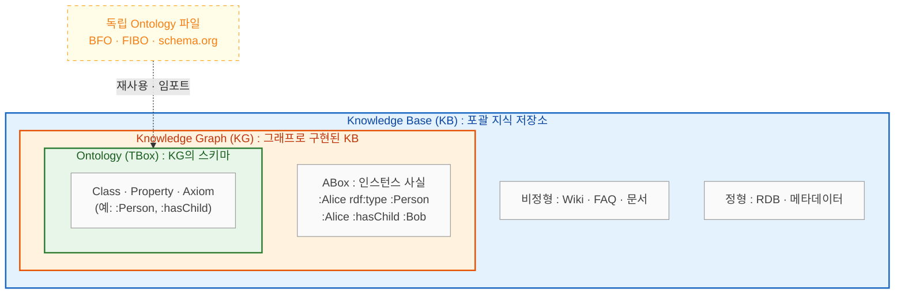
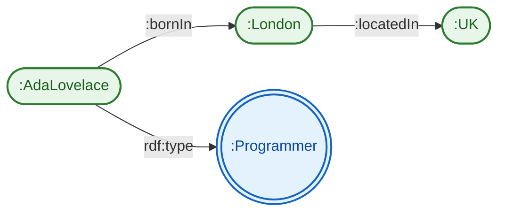
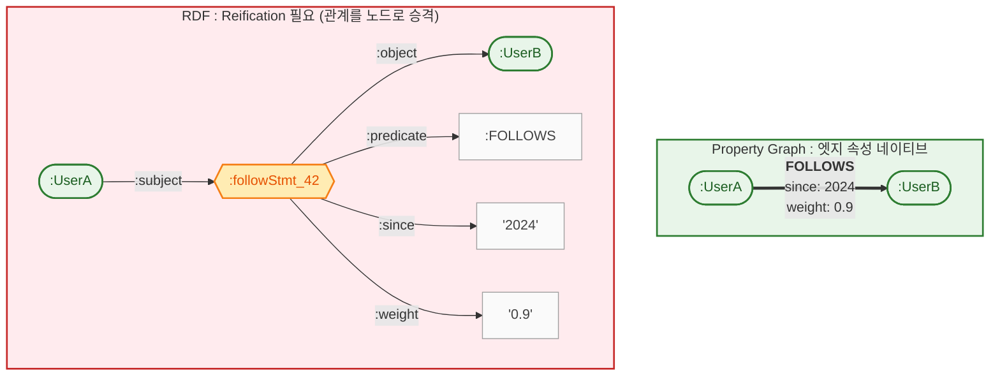
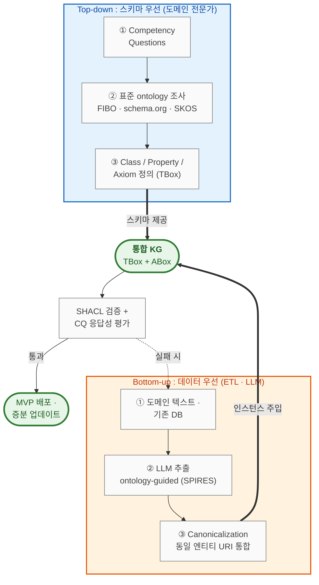
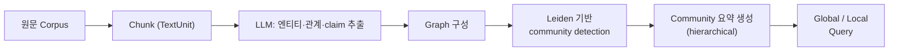
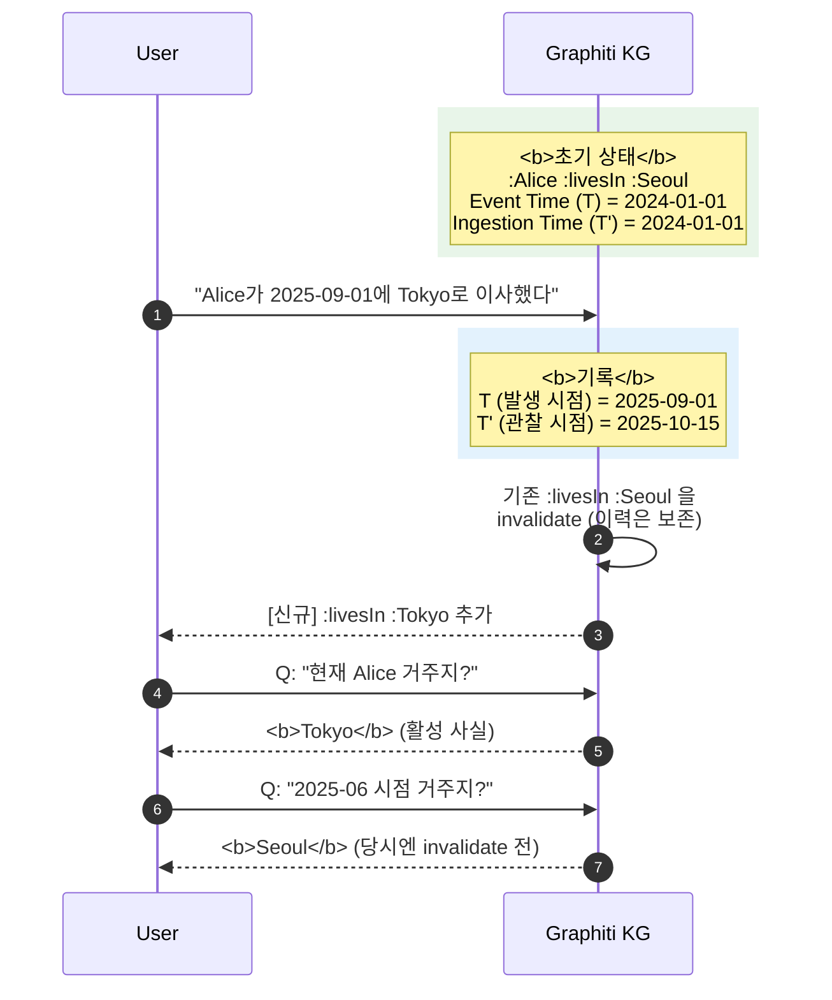
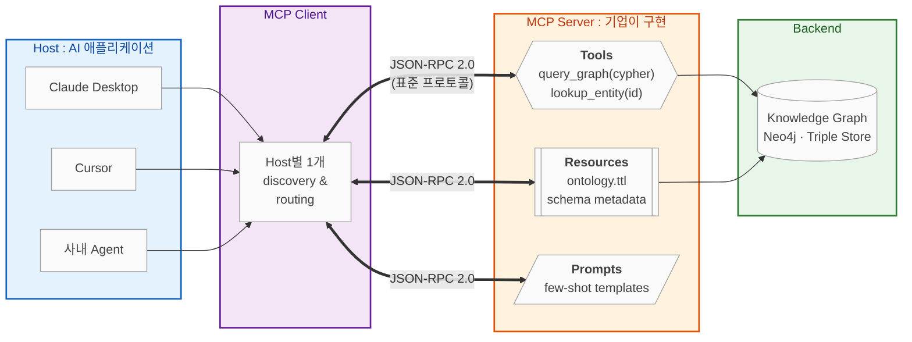
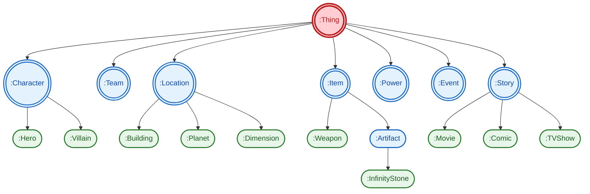
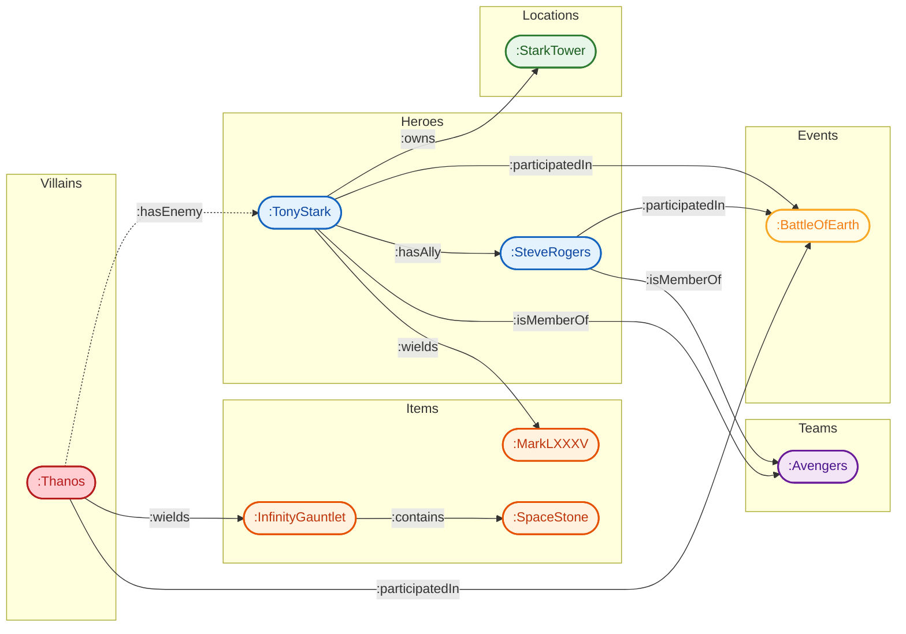

> AI Agent 시대에 다시 주목받는 Knowledge Graph와 Ontology의 개념, 내부 구성 요소, 구축 방법론, 그리고 LLM·Agent와 결합된 최신 기술까지 실전 관점에서 정리합니다. 본 글은 footnote에 명시된 공개 자료들을 AI(Gemini Deep Research + Claude Code) 보조로 재구성·재해석한 정리 글입니다.

### Introduction

Knowledge Graph(KG)와 Ontology는 결코 새로운 개념이 아닙니다. Semantic Web이 태동하던 2000년대 초반부터 존재해 왔으며, 2012년 Google이 *Knowledge Graph*[^1]를 공개하면서 검색 산업에 본격 적용된 이후로는 엔터프라이즈 데이터 통합 영역의 단골 기술로 쓰여 왔습니다. 그러다 최근 LLM 기반 Agent가 확산되면서, 단순 벡터 검색(Vector RAG)의 한계를 보완하고 **구조화된 지식**을 agent에게 공급하는 수단으로 KG와 Ontology가 다시 주목받고 있습니다.[^2][^3]

- **Knowledge Base (KB)**: FAQ·위키·Confluence처럼 주제별로 그룹화된 지식 저장소. 키워드 검색 기반.[^5]
- **Knowledge Graph (KG)**: 엔티티를 노드로, 관계를 엣지로 표현하는 **그래프 기반 데이터**. 인스턴스 중심.[^4][^6]
- **Ontology**: 도메인의 개념·관계·제약을 **형식적으로 명세한 스키마**. 모델 중심적이며 상대적으로 안정적.[^4][^7]

> **Ontology는 스키마, Knowledge Graph는 그 스키마를 실제 데이터에 적용한 결과**

세 개념의 관계는 "단순 포함 계층"이 아니라 **추상화 수준이 다른 세 역할**로 이해하는 편이 정확합니다. 포괄 범위 기준으로는 `KB ⊇ KG ⊇ Ontology`가 성립하지만, Ontology는 KG 없이 스키마 파일 단독으로도 유통·재사용됩니다(BFO·FIBO·schema.org가 대표 예).



- **KB**는 가장 포괄적 상위 용어로, Wiki·RDB·KG 어떤 형식이든 포함합니다.
- **KG**는 그 안에서 **그래프 구조로 구현된 KB**입니다.
- **Ontology**는 KG의 스키마(TBox)에 해당하며, KG 바깥에서도 독립 파일로 존재할 수 있습니다.

Vector RAG가 "의미적으로 유사한 문서 조각"을 찾아 prompt에 주입하는 방식이라면, KG+Ontology 기반 접근은 "명시적 관계를 따라 다단계로 정확한 사실"을 조회하는 방식입니다.[^8][^9] 전자는 구현이 쉽고 unstructured 데이터에 강하지만, **관계 추론(multi-hop reasoning)과 설명 가능성(explainability)에서 구조적 한계**가 있습니다.[^9]

Agent 관점에서 KG+Ontology가 제공하는 역량은 크게 세 가지로 정리할 수 있습니다.[^2][^32]

1. **Persistent Memory(영속 메모리)**: 상태 없는(stateless) LLM 호출을 넘어, 과거 워크플로우 결과·사용자 설정·시스템 변화 이력을 노드와 엣지로 구조화해 저장/조회. 수주~수개월 단위로 상태를 유지하는 stateful agent가 가능해짐.[^32]
2. **환각 통제와 설명 가능한 추론**: 모든 응답이 특정 그래프 관계에 **앵커**되므로, "왜 이 답이 나왔는가"를 노드·엣지 시퀀스로 추적(audit trail) 가능.[^2][^32] 금융·의료·법률처럼 정확성과 규제 준수가 핵심인 도메인에서 결정적 차이.
3. **다단계 추론 + 세분화된 접근 제어**: 여러 조각을 연결해야 답이 나오는 질의를 그래프 순회로 풀면서, **fine-grained access control**을 그래프 계층에서 강제 가능. 기업 신원 시스템과 연동해 "agent가 사용자 권한 범위 내 데이터만 참조"를 구조적으로 보장.[^9][^32]

이 글에서는 아래 내용을 다룹니다.

- KG와 Ontology를 이해하기 위해 필요한 **배경 용어**와 표준(RDF/OWL/SPARQL, Property Graph)
- **구축 방법론**(METHONTOLOGY, NeOn, competency question)과 실제 사례(Google, LinkedIn, Uber, Amazon)
- **LLM 기반 자동 구축**(GraphRAG, OntoGPT)과 **Agent 메모리로서의 KG**(Zep/Graphiti)

### Basics

##### Terminology

이후 내용에서 반복적으로 등장하는 용어를 먼저 정리합니다.

**데이터 모델**

- **Entity / Node / Vertex**: 그래프의 점 — 사람·제품·장소·이벤트 등
- **Edge / Relationship / Relation**: 방향성 있는 연결 (예: `bornIn`, `hasAuthor`)
- **Triple**: `<subject, predicate, object>` 최소 사실 단위 (RDF 기본형)
- **Literal**: URI가 아닌 원시 값 (문자열·숫자·날짜)
- **URI / IRI**: 엔티티·property의 전역 식별자

**스키마 / Ontology**

- **Class / Instance**: 타입(`Person`) / 구체적 인스턴스(`AdaLovelace`)
- **Property / Predicate**: 속성 또는 관계. **Datatype**(→리터럴) vs **Object**(→엔티티)
- **Domain / Range**: property의 subject·object class 제약
- **Axiom / Constraint**: 논리적 공리(subclass 등) / 인스턴스 제약(cardinality, disjointness)
- **TBox / ABox**: **스키마 레벨 지식 / 인스턴스 레벨 사실**
- **Reasoning / Inference / Entailment**: 공리로부터의 연역 과정과 결과
- **Reasoner**: entailment 계산 엔진 (HermiT, Pellet, ELK)

**W3C Semantic Web Stack**

- **RDF**: Resource Description Framework — triple 기반 그래프 모델
- **RDFS**: RDF Schema — class·subClassOf·domain·range 경량 스키마
- **OWL**: Web Ontology Language — Description Logic 기반 ontology 언어
- **SPARQL**: RDF 질의 언어 (재귀 약자)
- **SHACL / SKOS / GQL**: shape 검증 / 분류체계 어휘 / Property Graph용 ISO 질의 언어

##### Entity, Relation, Triple

KG의 기본 단위는 **triple**, 즉 `<subject, predicate, object>` 형태의 이진 명제입니다.[^10][^11] 예: "Ada Lovelace는 프로그래머이고 London에서 태어났다"는 다음처럼 표현됩니다.

```
<:AdaLovelace, rdf:type, :Programmer>
<:AdaLovelace, :bornIn, :London>
<:London, :locatedIn, :UK>
```

이 세 개의 triple이 그리는 그래프는 다음과 같습니다. 노드 모양이 Instance(둥근 사각형)과 Class(원)를 구분합니다.



subject·predicate는 전역 식별자(URI), object는 URI 또는 리터럴입니다.[^11] triple들이 모이면 하나의 **RDF 그래프**가 되며, 같은 형태를 공유하기만 하면 **도메인·출처가 다른 데이터도 하나의 그래프로 통합**됩니다 — Semantic Web이 "web of linked data"를 지향한 이유입니다.[^11]

##### RDF, RDFS, OWL, SPARQL

RDF를 둘러싸고 W3C가 표준화한 기술 스택을 **Semantic Web stack** 이라고 부릅니다. 각 계층은 표현력(expressiveness)이 점점 올라가는 구조입니다.[^11][^12]

| 계층 | 역할 | 표현 가능한 것 |
|---|---|---|
| **RDF** | 데이터 모델 | 엔티티와 관계를 triple로 서술 |
| **RDFS** | 경량 스키마 | class, subClassOf, domain, range |
| **OWL** | 풍부한 ontology 언어 | cardinality, disjointness, equivalence, inverse 등 |
| **SPARQL** | 질의 언어 | 그래프 패턴 매칭, aggregation, federated query |
| **SHACL** | shape 검증 | 데이터 무결성 검증(스키마 validation) |

**RDFS**는 기본 타입 시스템(class·subClassOf·domain·range)을 제공하고,[^12] **OWL**은 description logic 기반으로 cardinality·disjointness·inverse 같은 공리를 추가합니다.[^7] 이 공리 덕분에 reasoner가 명시되지 않은 사실까지 추론할 수 있습니다. 예를 들어 "`:hasMother`의 inverse는 `:hasChild`다" 라는 공리가 있으면, "Alice가 Bob의 어머니다" 라는 사실로부터 "Bob이 Alice의 자식이다" 가 자동으로 도출됩니다.[^7]

**SPARQL**은 RDF 그래프를 질의하는 SQL-like 언어입니다.[^13]

```sparql
PREFIX : <http://example.org/>
PREFIX rdf: <http://www.w3.org/1999/02/22-rdf-syntax-ns#>

SELECT ?person ?city
WHERE {
  ?person rdf:type :Programmer .
  ?person :bornIn ?city .
  ?city :locatedIn :UK .
}
```

패턴 매칭 방식이라 여러 triple 조건을 한번에 걸어 다단계 관계를 탐색할 수 있습니다.[^13] Ontology 기반 **entailment regime**(RDFS/OWL reasoner)을 켜면 명시적으로 저장되지 않은 사실까지 포함해 질의 결과가 반환됩니다.[^12]

##### TBox vs ABox

- **TBox**: class 계층·property 제약·공리 등 **스키마 레벨** 지식
- **ABox**: "Alice는 Programmer다" 같은 구체 인스턴스에 대한 **데이터 레벨** 사실

> Ontology는 주로 TBox, Knowledge Graph는 TBox + ABox를 함께 가리킵니다.[^4][^7] TBox는 상대적으로 안정적, ABox는 ETL·LLM 추출로 지속 업데이트되는 구조가 일반적입니다.[^3][^14]

##### RDF Graph vs. Property Graph

실무에서 "그래프 데이터베이스"를 고를 때 RDF 계열과 **Property Graph** 계열을 나눕니다.[^15][^16]

| 항목 | RDF Graph (Triple Store) | Property Graph |
|---|---|---|
| **엣지에 속성** | 기본 불가 (reification 필요) | 네이티브 지원 |
| **표준** | W3C 표준 (RDF, OWL, SPARQL) | 사실상 표준 없음 (openCypher, GQL 진행 중) |
| **질의 언어** | SPARQL | Cypher (Neo4j), Gremlin (TinkerPop), GQL |
| **식별자** | 전역 URI (interop 강함) | 로컬 ID (앱 내부) |
| **추론** | OWL reasoner 연계 용이 | 기본 제공 X (앱/ML로 구현) |
| **대표 제품** | Apache Jena, Stardog, GraphDB, AllegroGraph | Neo4j, TigerGraph, Memgraph, Amazon Neptune (양쪽 지원) |

**Property Graph**는 `(:User)-[:FOLLOWS {since: 2024}]->(:User)`처럼 엣지에 속성을 직접 붙일 수 있어 애플리케이션 모델링에 편리합니다.[^15] 반면 **RDF**는 엣지 속성을 표현하려면 reification(관계를 노드로 승격)이 필요해 다소 번거롭습니다. 대신 URI 기반 전역 식별자 덕분에 **상호운용성**이 뛰어나고, OWL reasoner·FIBO 같은 표준 ontology 생태계도 풍부합니다.[^15][^17] 그래서 제약·금융처럼 다기관 통합이 중요한 영역에서는 "RDF를 지식 표현 계층, Property Graph를 알고리즘 실행 계층"으로 쓰는 하이브리드 패턴도 자리잡고 있습니다.[^15]

엣지 속성의 차이를 그림으로 보면 다음과 같습니다. 같은 사실("UserA가 2024년부터 weight 0.9로 UserB를 팔로우")을 표현하는데 **PG는 엣지 하나**, **RDF는 추가 노드 + triple 3개**가 필요합니다.



### Common Practice

Ontology 엔지니어링 방법론으로는 **METHONTOLOGY**와 그 후계인 **NeOn**이 대표적입니다.[^18][^19] NeOn은 9가지 시나리오(ontology 재사용, 협업 개발 등)를 조합하는 시나리오 기반 방법론이며, 공통 단계는 다음과 같습니다.[^18][^19]

1. **Requirements specification** — 목적과 범위 정의
2. **Competency Question(CQ) 정의** — ontology가 답해야 할 자연어 질문 목록
3. **Conceptualization → Formalization** — class·property·제약을 OWL/RDFS로 구현
4. **Evaluation** — CQ 응답성 검증, SHACL로 무결성 검증
5. **Maintenance** — 도메인 변화에 따라 지속 업데이트

**Competency Question**은 설계의 핵심 산출물입니다.[^20] "우리 회사 지식을 ontology로 만들자" 같은 추상적 요구를 "2024년 Q3에 한국 리전에서 발생한 결제 실패 중 가맹점 계정 문제 케이스 목록"처럼 **검증 가능한 질문**으로 구체화합니다. 서베이 기준 참여자의 85%가 CQ를 실제로 사용하며, 품질 평가의 사실상 표준입니다.[^20]

##### Top-down vs. Bottom-up vs. Hybrid

실제 KG/Ontology를 구축할 때 접근 전략은 크게 세 가지입니다.[^3][^14]

| 전략 | 설명 | 장점 | 단점 |
|---|---|---|---|
| **Top-down** | 도메인 전문가가 ontology(TBox) 먼저 설계 후 데이터 매핑 | 정교한 스키마, reasoning 품질 ↑ | 초기 비용 ↑, 현장 데이터와 괴리 위험 |
| **Bottom-up** | 데이터/문서에서 엔티티·관계를 추출해 쌓고 사후 정규화 | 빠른 시작, 실제 데이터 반영 | 스키마 중복/불일치, 거버넌스 어려움 |
| **Hybrid** | 표준 ontology(FIBO, schema.org)를 기반으로 가져와 도메인 확장 | 표준 준수 + 속도 균형 | 표준 학습 비용 |

대부분의 성공 사례는 **hybrid**입니다.[^14] 예컨대 금융 도메인이면 **FIBO**(Financial Industry Business Ontology)[^17]의 관련 부분을 서브셋으로 가져오고, 검색·커머스 도메인이면 **schema.org**[^21]의 제품·리뷰 타입을 시작점으로 삼아 도메인 특화 class를 추가하는 식입니다.



##### 실제 사례

- **Google Knowledge Graph**[^1][^22]: 2012년 공개. 500B+ 개의 사실(fact)을 담은 그래프로 검색 결과에 "엔티티 카드"를 제공하고, Google Assistant의 질의응답 백본으로도 사용됨.
- **LinkedIn Economic Graph + LIquid**[^22][^33]: 글로벌 경제의 구성 요소(직장인, 스킬, 회사, 학교, 채용공고)를 네트워크로 형상화한 초대형 그래프로 **2,700억 엣지** 규모. 초기 RDBMS 기반에서는 수백 개 JOIN의 cross-product 폭발로 성능 한계에 부딪힘. 이를 해결하기 위해 **LIquid** 라는 자체 분산 인메모리 그래프 DB를 4세대에 걸쳐 개발. **Datalog 기반 단일 선언적 쿼리**로 **2M QPS** 처리를 달성하고, PYMK(알 수도 있는 사람) 같은 실시간 연결 분석을 기존 시스템 대비 크게 개선.[^33] 엣지를 1급 시민으로 승격하고 live schema extension을 지원하는 설계가 핵심.
- **Amazon Product Graph**[^22]: 제품을 단순 카테고리 트리가 아닌 그래프로 표현해 "호환 부품", "대체품", "자주 함께 구매되는 항목" 같은 관계를 직접 모델링. 추천·검색 품질에 직접 기여.
- **Uber Databook + CRISP**[^22][^23][^34]: 수천 개 마이크로서비스·이기종 데이터 스택(Hive, Kafka, Cassandra 등)의 사일로 문제를 풀기 위해 **Databook**이라는 KG 기반 메타데이터 카탈로그를 구축. 단순 Wiki가 아니라 KB 모델을 채택해 데이터 자산 소유권·품질 검증을 자동화.[^34] 여기에 Jaeger 분산 추적의 RPC 로그에서 서비스 호출 종속성 그래프를 생성하고, **CRISP** 도구로 end-to-end 요청 지연의 **critical path**를 시각화하여 성능 병목을 진단.[^34] KG가 단순 지식 저장이 아니라 **분산 아키텍처 관측성(observability)** 도구로도 활용됨을 보여주는 사례.
- **Uber Eats Food KG**[^23]: restaurant–cuisine–menu item–ingredient 를 잇는 식품 그래프로 사용자 의도(intent)를 정교하게 포착해 검색·추천을 개선.
- **Airbnb, eBay, Facebook 등**도 커머스·소셜 도메인에서 KG를 핵심 인프라로 운영.[^22]

공통 교훈은 **구체 KPI로 시작**, **표준 ontology 재사용**, **SHACL 기반 거버넌스 조기 도입** 세 가지로 수렴됩니다.

##### KG vs. Ontology

| 문제 유형 | 더 적합한 접근 | 이유 |
|---|---|---|
| 제품 추천 (수천만 인스턴스, 지속 업데이트) | **Knowledge Graph** 중심 | 인스턴스 규모·업데이트 빈도 우선 |
| 규제 준수 추론 (금융·헬스케어) | **Ontology** 중심 (OWL reasoner) | 형식 논리로 규정 추론 가능해야 함 |
| Agent의 장기 메모리 | **Temporal KG** | 시간에 따른 사실 변화 추적 |
| 문서 Q&A (대규모 unstructured) | **Vector RAG 우선**, 필요 시 KG 보완 | 구조화 비용 대비 이득 제한적 |
| 다단계 질의가 중요한 분석 (BI, 사기 탐지) | **Knowledge Graph** | 관계 탐색 자체가 가치 |
| 데이터 통합 (여러 source, 스키마 드리프트) | **Ontology 중심 KG** | 공통 개념 체계로 정렬 |

### Recent Techs

##### LLM-based KG

과거 KG 구축의 가장 큰 걸림돌은 엔티티·관계 추출(information extraction)의 비용이었습니다. 규칙 기반 파서, 스팬 분류기, 관계 분류기를 도메인마다 직접 학습시켜야 했죠. LLM은 이 비용 구조를 근본적으로 바꿨습니다.[^3][^14]

**GraphRAG (Microsoft Research)**[^24][^25]는 2024년 공개되어 빠르게 표준처럼 자리잡은 오픈소스 시스템입니다. 동작 원리를 단순화하면 다음과 같습니다.



1. 입력 문서를 일정 크기 청크(공식 용어로 **TextUnit**)로 분할
2. LLM prompt로 각 TextUnit에서 **엔티티(Entity)·관계(Relationship)** 를 추출. 이때 "주장(claim)"에 해당하는 정보는 GraphRAG 공식 지식 모델에서 **Covariate** 라는 이름의 **선택적(optional) 추출 단계**로 제공됨
3. 이렇게 쌓인 그래프에 **Leiden community detection**을 돌려 계층적 클러스터를 만들고, 각 커뮤니티에 대한 요약을 LLM으로 생성. Leiden은 기존 Louvain의 disconnected community 문제를 해결해 그래프 모듈성을 더 안정적으로 최적화[^36]
4. 질의 시에는 기존 벡터 RAG가 잡아내기 어려운 **global sensemaking**(전체를 조망해야 답이 나오는 질문)에 커뮤니티 요약을 활용

추출 품질을 더 끌어올리는 최근 표준 패턴은 **DSPy·TextGrad** 같은 자동 prompt 최적화 도구를 쓰는 것입니다. 수작업으로 prompt를 다듬는 대신, 몇 개의 few-shot 예제만 주면 시스템이 최적 prompt를 스스로 학습해 줍니다.[^14]

벤치마크(원 논문은 Podcast transcripts·News articles 각각 약 1M 토큰 규모로 평가)에서 GraphRAG는 **Comprehensiveness·Diversity** 측면으로 일반 RAG보다 72~83% win rate로 크게 우세합니다.[^24] 다만 후속 서베이[^40]는 **실시간 업데이트가 필요한 시계열 질의**에서 baseline RAG 대비 ~16.6% 정확도가 낮게 나온다고 보고하며, 커뮤니티 재계산·재요약 비용이 높아 **프로덕션 도입 시 토큰·지연 비용**이 큰 병목임을 지적합니다.

이 비용 문제를 해결하기 위해 등장한 후속 아키텍처가 **LightRAG**[^37]입니다. 전체 그래프를 매번 재구성하지 않고 **two-level retrieval**(엔티티 수준의 low-level + 주제 영역의 high-level)을 동시에 수행하며, 새 문서가 들어오면 관련된 노드만 갱신하는 **증분 업데이트**로 처리합니다. 논문에 따르면 쿼리당 토큰 소비가 GraphRAG 대비 수천 배(예: 100 tokens vs 600K+ tokens) 수준으로 줄고, 비용도 $0.15 vs $4~7 정도로 낮아졌습니다.[^37] 그래서 데이터가 자주 바뀌는 운영 환경에서는 GraphRAG의 대안으로 빠르게 자리잡고 있습니다.

**Ontology-guided 추출** 흐름도 활발합니다. 대표적으로 **OntoGPT**[^26]가 제안한 **SPIRES**(Structured Prompt Interrogation and Recursive Extraction of Semantics) 방식은, LLM이 엔티티를 자유롭게 뽑도록 놔두지 않습니다. 대신 **기존 ontology의 class와 property를 prompt에 미리 주입**해, "정의된 class의 인스턴스만 추출하고, 정의된 property로만 관계를 엮도록" 제약을 겁니다.[^26] 일반 GraphRAG가 LLM이 적절하다고 판단한 관계를 그대로 받는다면, ontology-guided 방식은 도메인 표준을 지키는 결과물이 나옵니다.[^3]

금융처럼 이미 FIBO 같은 표준이 정립된 도메인에서는 ontology-guided 추출이 특히 유효합니다.[^17][^26] 반대로 도메인 ontology가 전혀 없는 영역에서는 **이원적 루프**(LLM으로 먼저 bottom-up 추출 → 클러스터링으로 후보 ontology 제안 → 사람이 검토/정제 → 다시 ontology-guided 추출)로 가는 것이 현실적입니다.[^3][^14]

##### KG as Agent Memory

Agent에게 긴 대화·장기 사용자 프로필·사용자별 사실을 유지시키는 "메모리" 구현은 2024~2025년 큰 주제였습니다. 이전에는 주로 vector store에 대화 로그를 임베딩해 retrieval하는 방식이 기본이었지만, **사실이 시간에 따라 바뀌는 문제**(예: "사용자 Alice는 서울 → 2025년 도쿄로 이사")와 **관계 기반 질의**에서 한계가 드러났습니다.[^27]

**Zep (getzep)과 그 코어 엔진 Graphiti**[^27][^28]는 이 문제를 **Temporal Knowledge Graph**로 풉니다. 핵심 설계는 **bi-temporal modeling**입니다.[^27]

- **Event Time (T)**: 사실이 실제로 발생/성립한 시점
- **Ingestion Time (T′)**: 시스템이 그 사실을 관찰/기록한 시점

모든 노드와 엣지가 두 시간축을 가지므로, "2025-06-30 기준으로 알려진 Alice의 거주지"와 "현재 시점 기준 Alice의 거주지"를 구분해서 조회할 수 있습니다.[^27] 새 사실이 들어오면 충돌하는 기존 사실을 **무효화(invalidate)** 하면서도 이력은 보존합니다.[^27][^28]



논문에 따르면 Zep은 **Deep Memory Retrieval(DMR)** 벤치마크에서 MemGPT 대비 94.8% vs 93.4%로 근소하게 우위이고, **LongMemEval** 벤치마크에서는 기존 baseline 대비 정확도 최대 +18.5%, 응답 지연 -90%를 보고합니다.[^27] 실제 구현인 Graphiti는 semantic embedding + BM25 키워드 + graph traversal을 **하이브리드 검색**으로 결합해 P95 300ms 수준의 retrieval 지연을 달성합니다.[^28]

| 항목 | 일반 Vector Memory | Temporal KG (Zep/Graphiti) |
|---|---|---|
| **데이터 구조** | embedding + 문서 청크 | 엔티티·관계 그래프 + embedding |
| **시간 변화 사실** | 과거 embedding도 같이 조회됨 (충돌) | bi-temporal로 "언제 기준"을 명시 |
| **다단계 관계** | 취약 | 그래프 탐색으로 자연스럽게 |
| **스키마** | 암묵적 | 명시적(prescribed) + 학습형(learned) |
| **지연** | 매우 낮음 | 낮음 (P95 ~300ms 보고) |
| **구현 복잡도** | 낮음 | 중간 이상 |

Graphiti는 **MCP(Model Context Protocol) 서버 구현체도 제공**하여, MCP를 지원하는 agent(Claude Desktop, Cursor 등)에 바로 메모리 백엔드로 붙일 수 있습니다.[^28] LLM agent에게 "구조화된 장기 메모리"를 붙이는 실용적 선택지로 자리잡고 있습니다.

##### Agent–KG 연동 패턴

Agent와 KG를 연결하는 접근은 크게 세 가지 패턴으로 수렴되고 있습니다.[^29]

1. **Tool-based access**: KG 위에 `query_graph(cypher | sparql)` 같은 tool을 노출하고 agent가 필요 시 호출. 가장 직관적이지만 agent가 질의 언어를 직접 다뤄야 함.
2. **Retrieval-augmented**: 질의를 받아 관련 서브그래프(subgraph)를 추출해 prompt context로 주입. GraphRAG의 local search가 이 패턴에 해당.
3. **Graph-based tool/agent routing**: 사용 가능한 tool·sub-agent 자체를 그래프로 구성해, 질의에서 요구되는 capability 경로를 추적하여 적절한 tool을 선택. **Agent-as-a-Graph** 논문[^29]은 LiveMCPBench에서 기존 SOTA 대비 **Recall@5 +14.9%p, nDCG@5 +14.6%p** 향상을 보고.

특히 **MCP(Model Context Protocol)**[^38] 생태계가 성장하면서 세 번째 패턴이 주목받고 있습니다. MCP는 JSON-RPC 2.0 기반 오픈 표준으로 host(AI 애플리케이션) ↔ client ↔ MCP server 구조를 따릅니다. **서버 측**이 외부에 노출하는 primitive는 크게 세 가지입니다 — **Tools**(실행 가능한 액션, 예: `query_graph(cypher)`), **Resources**(ontology 파일·메타데이터 같은 컨텍스트), **Prompts**(재사용 가능한 지침 템플릿).[^38] (클라이언트 측 primitive로는 Sampling·Roots·Elicitation 등이 별도로 존재.)

기업이 내부 KG 위에 MCP 서버 하나만 구현해 두면, Claude Desktop·Cursor 같은 어떤 호스트에서도 동일한 방식으로 발견·연결할 수 있습니다. 이렇게 해서 "N×M 통합 폭발" 문제를 구조적으로 해소해 줍니다.



다만 사용할 tool이 수백 개가 넘어가면 "어떤 tool을 언제 쓸지" 자체가 검색/추론 문제가 되는데, KG가 이 선택 문제에 구조적 힌트를 줄 수 있습니다.[^29] Agent 오케스트레이션 프레임워크 측면에서는 **LangGraph**가 상태 머신 기반 그래프로 agent 흐름을 정의하고 순환(cycles)을 허용해, "Cypher 쿼리 결과가 빈약하면 스스로 교정해 재시도"하는 self-correction 루프를 자연스럽게 구현할 수 있습니다.[^39]

##### KG Embedding

전통 KGE 기법도 LLM과 결합하는 맥락에서 다시 유용해지고 있습니다.[^30][^31]

- **TransE**[^30]: triple $(h, r, t)$의 임베딩이 $\mathbf{h} + \mathbf{r} \approx \mathbf{t}$를 만족하도록 학습. 관계를 "벡터 공간의 이동(translation)"으로 모델링. 간단하지만 1:N 관계 표현에 한계.
- **Node2Vec**[^31]: 그래프 위의 편향된 random walk로 노드 근방 구조를 보존하는 임베딩 학습. link prediction, KG completion에 여전히 강한 baseline.
- **ComplEx, RotatE, ULTRA** 등: 대칭·비대칭 관계를 더 잘 표현하도록 복소수·회전·multi-relational 구조로 확장.

LLM 시대에도 KGE가 여전히 가치 있는 이유는, **LLM 임베딩은 자연어 의미를 인코딩하지만 그래프의 구조적 관계를 직접 반영하지 못하기 때문**입니다.[^31] 두 임베딩을 결합해 retrieval에 활용하거나, KGE를 사용해 **링크 예측으로 ontology의 공백을 자동으로 채우는(link prediction as KG completion)** 용도로도 여전히 쓰입니다.[^31]

### Conclusion

프로덕션에서 KG·Ontology를 도입할 때 권장 순서입니다.

1. **문제 정의**: 벡터 RAG만으로 안 되는 질의(multi-hop, 시간 변화, 규제 준수, 설명 가능성)를 구체화
2. **Competency Question**: 시스템이 답해야 할 10~30개 자연어 질문 먼저 정의
3. **표준 재사용**: schema.org·FIBO·SKOS·BFO 등 도메인 표준 적용 여부 확인
4. **MVP 그래프**: 핵심 엔티티·관계 20~30개로 작게 시작
5. **추출 파이프라인**: ontology-guided LLM 추출(SPIRES) + canonicalization
6. **거버넌스**: SHACL validation, 스키마 리뷰, 버저닝
7. **Agent 연동**: tool-based 또는 GraphRAG로 노출. 장기 메모리는 Graphiti/Zep 계열 고려
8. **지속 개선**: CQ 확장, KGE로 누락 관계 후보 자동 제안

KG와 Ontology는 오래된 기술이지만, LLM·Agent 환경에서 "신뢰 가능한 구조화 지식" 수요가 커지며 실무 가치가 재평가되고 있습니다. 핵심은 다음과 같습니다.

- **Ontology = TBox, KG = TBox + ABox**. 용어부터 구분해야 설계 대화가 꼬이지 않음
- **RDF/OWL vs Property Graph**는 interop ↔ 앱 편의성의 트레이드오프. 엔터프라이즈 통합이면 전자, 빠른 앱 개발이면 후자
- **구축은 Competency Question에서 시작**, **Top-down + Bottom-up hybrid**가 현실적
- **LLM은 구축 비용을 낮췄지만**, ontology-guided 추출이 품질·유지보수 모두에서 유리
- **Temporal KG**(Zep/Graphiti)는 vector memory의 한계를 보완하는 agent 장기 메모리 옵션

Vector RAG가 "유사성 기반 기억", KG가 "관계 기반 기억"이라면, 실전 표준은 둘의 **하이브리드**가 될 가능성이 높습니다. "무엇을 알고 있는가"만큼 "그 지식이 어떻게 연결되어 있는가"가 중요해지고 있기 때문입니다.

### Example

여기서는 구체 예시로 마블 Avengers IP 세계관을 KG/Ontology로 설계한다고 가정하고, agent가 참조하는 지식사전 형태로 구축하는 방법을 스케치해봅니다. 수많은 캐릭터·장소·아이템·사건이 얽혀 있고, 원작·영화·드라마 등 여러 source가 존재하며, Civil War·Snap·멀티버스처럼 사실이 시간·우주축을 따라 변하는 도메인이라 KG가 특히 잘 맞습니다.

##### Ontology Sketch (TBox)

핵심 class와 property를 먼저 정의합니다. 20~30개 수준으로 시작하는 것이 실용적입니다.



> 원(◯) = 추상 클래스 (추가 서브클래스 존재), 둥근 사각형(▭) = 구체 leaf 클래스

```
Core Property:
  :hasAlias           Character → Literal
  :hasPower           Character → Power
  :wields             Character → Item
  :isMemberOf         Character → Team        (temporal)
  :hasAlly / :hasEnemy Character → Character   (symmetric)
  :locatedIn          Building → Location
  :appearedIn         Character → Story
  :participatedIn     Character → Event
  :occurredAt         Event → Location

Axiom 예:
  :InfinityStone rdfs:subClassOf :Artifact
  :Character owl:disjointWith :Item
  :hasEnemy a owl:SymmetricProperty
```

##### ABox 예시

위 TBox를 실제 인스턴스로 채우면 다음과 같은 그래프가 됩니다. 같은 클래스의 인스턴스끼리 색과 그룹으로 묶었습니다.



##### Competency Question으로 요구사항 고정

Marvel KG가 답해야 할 대표 질문 예시입니다. 이 목록이 그대로 **스키마 검증·agent evaluation set**이 됩니다.

- "Infinity Stone을 한 번이라도 소지한 캐릭터는?"
- "Civil War 전후로 Avengers 소속 상태가 바뀐 캐릭터는?"
- "Thanos와 직접 싸운 적 있는 히어로 중 Phase 4에서 죽은 인물은?"
- "Stark Industries가 만든 장비를 사용한 비-Stark 계열 캐릭터는?"

첫 질문은 `:wields`·`:hadItem`의 **시간축 추적**을, 두 번째는 **bi-temporal modeling**을 요구합니다. CQ를 먼저 쓰고 나서 보면 "아, `:isMemberOf`에 단순 엣지가 아니라 시간 구간이 필요하구나"가 자연스럽게 드러납니다.

##### Temporal & Multi-Universe 처리

IP 세계관 고유의 어려움은 **시간·우주 분기**입니다. 죽었다 부활(Snap·Endgame), time travel, 멀티버스(What If, Spider-Verse)가 모두 공존하죠. 이는 **Temporal KG + Named Graph** 조합으로 풀기에 좋습니다.

- 각 사실에 event time 부여: `:TonyStark :status "deceased" @t=2024-Endgame`
- 우주·타임라인별로 named graph 분리: `<Earth-616>`, `<Earth-199999(MCU)>`, `<Earth-TRN734>` 각각 별도 컨텍스트
- 앞서 다룬 Graphiti의 **bi-temporal modeling**을 그대로 적용하면 "MCU Earth-199999 기준 Phase 4 종료 시점의 Avengers 라인업" 같은 질의가 깨끗해집니다

##### 구축 전략

1. **Top-down (TBox first)**: 위처럼 core class 20~30개를 정의. `schema.org`의 `Person`·`CreativeWork`·`Place` 일부를 재사용하고 IP 특화 class만 추가
2. **Bottom-up (LLM extraction)**: Fandom **Marvel Database** 위키 텍스트에 ontology-guided LLM 추출(SPIRES)로 인스턴스 대량 수집 후 canonicalization
3. **외부 KG 흡수**: **Wikidata**에는 이미 Marvel 캐릭터·배우·영화가 풍부하며 URI 기반이라 `owl:sameAs`로 연결 가능. Marvel 공식 API는 보조 source로 활용

##### 구현 스택과 참고 사례

- **Neo4j (Property Graph)**: `(c:Character)-[:WIELDS {since:"IronMan1", movie:"M001"}]->(i:Item)` 처럼 **엣지 속성**으로 맥락을 붙이기 쉬워 팬 앱·게임 개발에 적합
- **Triple Store + SPARQL**: Wikidata 연합 질의와 OWL reasoning이 필요하면 이쪽. `wd:Q7747` 같은 외부 URI를 그대로 흡수
- **MCP 서버로 노출**: 그래프 위에 `lookup_character`, `find_shared_events` 같은 tool을 정의한 MCP 서버를 구현하면 Claude Desktop·Cursor 등 호스트에서 그대로 호출 가능

참고할 만한 실제 사례로는 Meta AI의 **LIGHT**(판타지 세계를 KG로 모델링한 agent 학습 환경), **Wikidata의 MCU 서브그래프**, 팬 커뮤니티 기반 **Fandom/Marvel Database**가 있습니다. 어느 하나도 완전하지 않으므로, 자체 KG는 "여러 source를 공통 canonical URI로 흡수 → 도메인 특화 관계·시간축 추가" 패턴이 현실적입니다.

##### 예상 Agent 활용 시나리오

- **팬 Q&A 봇**: "Tony Stark Mark 슈트 버전 몇 개야?" → `:TonyStark` → `:wields` → `rdf:type :IronManArmor`인 노드 count
- **스포일러 인지 응답**: 사용자의 "최근 시청 시점"을 graph에 기록 → `:appearedIn` + 개봉 순서로 그 이후 사실은 숨기고 답변
- **작품 추천**: 특정 캐릭터 선호 벡터 + KG의 `:appearedIn` 다단계 탐색으로 "해당 캐릭터가 핵심 역할인 미시청 작품" 추천
- **시나리오 작가 보조**: "이 두 캐릭터의 공통 과거 사건"을 multi-hop으로 즉시 조회

### Reference

[^1]: [Introducing the Knowledge Graph: things, not strings (Google, 2012)](https://blog.google/products/search/introducing-knowledge-graph-things-not/)
[^2]: [From RAG to Knowledge Graphs: Why the Agent Era Is Redefining AI Architecture](https://dev.to/sreeni5018/from-rag-to-knowledge-graphs-why-the-agent-era-is-redefining-ai-architecture-3fgc)
[^3]: [From LLMs to Knowledge Graphs: Building Production-Ready Graph Systems in 2025](https://medium.com/@claudiubranzan/from-llms-to-knowledge-graphs-building-production-ready-graph-systems-in-2025-2b4aff1ec99a)
[^4]: [What's the Difference Between an Ontology and a Knowledge Graph? (Enterprise Knowledge)](https://enterprise-knowledge.com/whats-the-difference-between-an-ontology-and-a-knowledge-graph/)
[^5]: [Knowledge Base vs Knowledge Graph (Tom Sawyer Software)](https://blog.tomsawyer.com/knowledge-base-vs-knowledge-graph)
[^6]: [What Is a Knowledge Graph? (IBM)](https://www.ibm.com/think/topics/knowledge-graph)
[^7]: [OWL 2 Web Ontology Language Primer (W3C)](https://www.w3.org/TR/owl2-primer/)
[^8]: [Graph RAG vs Vector RAG: 3 differences, pros and cons, and how to choose (Instaclustr)](https://www.instaclustr.com/education/retrieval-augmented-generation/graph-rag-vs-vector-rag-3-differences-pros-and-cons-and-how-to-choose/)
[^9]: [Knowledge Graph vs. Vector RAG: Benchmarking & Optimization (Neo4j)](https://neo4j.com/blog/developer/knowledge-graph-vs-vector-rag/)
[^10]: [Resource Description Framework (Wikipedia)](https://en.wikipedia.org/wiki/Resource_Description_Framework)
[^11]: [RDF 1.1 Primer (W3C)](https://www.w3.org/TR/rdf11-primer/)
[^12]: [RDF Schema 1.1 (W3C)](https://www.w3.org/TR/rdf-schema/)
[^13]: [SPARQL 1.1 Query Language (W3C)](https://www.w3.org/TR/sparql11-query/)
[^14]: [LLM-empowered knowledge graph construction: A survey (2025)](https://arxiv.org/html/2510.20345v1)
[^15]: [RDF vs. Property Graphs: Choosing the Right Approach for Knowledge Graphs (Neo4j)](https://neo4j.com/blog/knowledge-graph/rdf-vs-property-graphs-knowledge-graphs/)
[^16]: [Graph Databases & Query Languages in 2025 — A Practical Guide](https://medium.com/@visrow/graph-databases-query-languages-in-2025-a-practical-guide-39cb7a767aed)
[^17]: [FIBO — Financial Industry Business Ontology (EDM Council)](https://spec.edmcouncil.org/fibo/)
[^18]: [Methodology for ontology design and construction (SciELO, 2019)](https://www.scielo.org.mx/scielo.php?script=sci_arttext&pid=S0186-10422019000500015)
[^19]: [NeOn Methodology for Building Ontology Networks](https://oa.upm.es/5475/1/INVE_MEM_2009_64399.pdf)
[^20]: [Use of Competency Questions in Ontology Engineering: A Survey (2023)](https://www.inf.ufes.br/~monalessa/wp-content/papercite-data/pdf/use_of_competency_questions_in_ontology_engineering__a_survey_2023.pdf)
[^21]: [schema.org](https://schema.org/)
[^22]: [7 Knowledge Graph Examples (PuppyGraph)](https://www.puppygraph.com/blog/knowledge-graph-examples)
[^23]: [Building an Enterprise Knowledge Graph @Uber: Lessons from Reality](https://www.slideshare.net/joshsh/building-an-enterprise-knowledge-graph-uber-lessons-from-reality)
[^24]: [From Local to Global: A Graph RAG Approach to Query-Focused Summarization (Microsoft, 2024)](https://arxiv.org/abs/2404.16130)
[^25]: [GraphRAG GitHub (Microsoft)](https://github.com/microsoft/graphrag)
[^26]: [OntoGPT: LLM-based ontological extraction tools (Monarch Initiative)](https://github.com/monarch-initiative/ontogpt)
[^27]: [Zep: A Temporal Knowledge Graph Architecture for Agent Memory (2025)](https://arxiv.org/abs/2501.13956)
[^28]: [Graphiti: Knowledge Graph Memory for an Agentic World (Neo4j Blog)](https://neo4j.com/blog/developer/graphiti-knowledge-graph-memory/)
[^29]: [Agent-as-a-Graph: Knowledge Graph-Based Tool and Agent Retrieval (2025)](https://arxiv.org/html/2511.18194)
[^30]: [Translating Embeddings for Modeling Multi-relational Data (TransE, Bordes et al., 2013)](https://proceedings.neurips.cc/paper/2013/hash/1cecc7a77928ca8133fa24680a88d2f9-Abstract.html)
[^31]: [node2vec: Scalable Feature Learning for Networks (Grover & Leskovec, 2016)](https://arxiv.org/abs/1607.00653)
[^32]: [How knowledge graphs work and why they are key to context for enterprise AI (Glean)](https://www.glean.com/blog/knowledge-graph-agentic-engine)
[^33]: [LIquid: A Large-Scale Relational Graph Database (LinkedIn Engineering / QCon)](https://engineering.linkedin.com/teams/data/data-infrastructure/graph)
[^34]: [Turning Metadata Into Insights with Databook & CRISP Critical Path Analysis (Uber)](https://www.uber.com/us/en/blog/metadata-insights-databook/)
[^35]: [Automated Knowledge Graph Construction with LLMs and Sentence Complexity (CoDe-KG, 2025)](https://arxiv.org/html/2509.17289v1)
[^36]: [Community detection — GraphRAG docs (Leiden)](https://mintlify.com/microsoft/graphrag/concepts/community-detection)
[^37]: [LightRAG: Simple and Fast Retrieval-Augmented Generation](https://lightrag.github.io/)
[^38]: [Model Context Protocol — Architecture Overview](https://modelcontextprotocol.io/docs/learn/architecture)
[^39]: [LangGraph: Stateful, Cyclic Orchestration for LLM Agents](https://langchain-ai.github.io/langgraph/)
[^40]: [When to use Graphs in RAG: A Comprehensive Analysis for Graph Retrieval-Augmented Generation (arXiv 2506.05690)](https://arxiv.org/abs/2506.05690)
