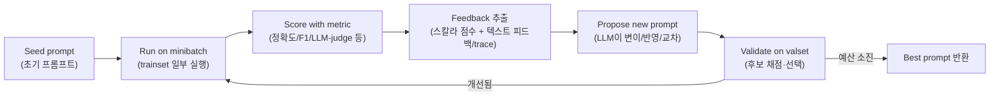

# GEPA와 테스트셋 기반 LLM 프롬프트 자동 최적화 방법론

작성일: 2026-05-30

이 문서는 (1) **GEPA**가 무엇이고 어떻게 동작하는지 정리하고, (2) GEPA처럼 **고정된 테스트셋(eval set) + 평가 지표(metric)** 를 정해두고 그 점수를 높이는 방향으로 LLM 프롬프트를 자동으로 개선·최적화하는 방법론과 서비스들을 조사한 결과를 담는다. 즉 "사람이 프롬프트를 손으로 고친다"가 아니라, **데이터 + 채점 함수가 있으면 시스템이 프롬프트를 반복적으로 다시 쓰고 점수로 선택한다**는 패러다임을 다룬다.

## Executive Summary

테스트셋 기반 프롬프트 최적화는 모델 가중치를 건드리지 않고(=fine-tuning 없이), 프롬프트라는 **텍스트 파라미터**를 학습 대상으로 보고 메트릭을 최대화하는 흐름이다. 대부분의 방법은 다음 루프로 수렴한다.

핵심 정리는 네 가지다.

1. **GEPA(Genetic-Pareto)는 2025년에 등장한 "반영형 진화(reflective evolution)" 프롬프트 옵티마이저**다. 스칼라 보상만 쓰는 강화학습(RL)과 달리, LLM이 자기 실행 trace를 **자연어로 반영(reflect)** 해 "무엇이 왜 실패했는지"를 진단하고 새 지시문을 제안한다. 단일 최고 후보만 키우지 않고 **Pareto frontier**(인스턴스별 1등 후보들)를 유지해 다양성을 보존한다. 논문 기준 GRPO(RL) 대비 평균 +6%, 최대 +20%를 **rollout 최대 35배 적게** 쓰고 달성했고, 기존 최강 프롬프트 옵티마이저 MIPROv2 대비 +10%p 이상(AIME-2025에서 +12%p)을 보였다.

2. **방법론은 크게 두 계열**이다. ① **진화/탐색 계열**(APE, OPRO, PromptBreeder, EvoPrompt, GEPA)은 프롬프트를 이산 문자열로 보고 LLM이 변이·제안한 후보를 메트릭으로 채점·선택한다. ② **그래디언트 유사 계열**(ProTeGi, TextGrad, AdalFlow, Trace)은 프롬프트를 미분 가능한 파라미터처럼 보고 자연어 "텍스트 그래디언트"로 역전파하듯 업데이트한다. **DSPy**는 두 계열을 아우르면서 few-shot 데모 부트스트랩까지 결합한 사실상의 표준 프레임워크다.

3. **상용에서 진짜 "알고리즘 자동 최적화"는 의외로 드물다.** 대부분의 LLMOps 제품(PromptLayer, Vellum, Langfuse, Braintrust 등)은 **eval/회귀 테스트 + AI 보조 제안**까지이고, 사람이 루프를 돈다. 진짜 데이터 기반 자동 옵티마이저에 가까운 것은 **Google Vertex AI Prompt Optimizer(data-driven mode)** 와 오픈소스/실험적인 **LangSmith Promptim**, 그리고 GEPA를 코어로 채택한 **Comet Opik Agent Optimizer**, **MLflow `optimize_prompts()`** 정도다.

4. **테스트셋에 점수를 맞추는 작업에는 과적합(overfitting) 위험이 상존한다.** 그래서 성숙한 방법은 train/validation/test를 분리하고, 최적화는 valset에서 채점하며, 최종 보고는 한 번도 안 본 test set에서 한다. 이 분리를 안 하면 "리더보드 점수만 오른 프롬프트"가 나온다.

> 주의: 이하 GEPA 수치는 **논문(arXiv:2507.19457) abstract**를 1차 출처로 삼는다. 일부 블로그가 "GRPO 대비 +10%"라고 쓰는데 이는 MIPROv2 대비 수치와 혼동한 것으로 보인다. 리포지토리가 광고하는 "90× 비용 절감", "ARC-AGI 32%→89%" 같은 수치는 **특정 어댑터/데모 기준 주장**이므로 별도 표기한다.

---

## 1. GEPA 정리

- **논문**: *GEPA: Reflective Prompt Evolution Can Outperform Reinforcement Learning*, Agrawal et al., arXiv:2507.19457 (2025-07 공개, **ICLR 2026 Oral 채택**).
- **저자**: Lakshya A. Agrawal, Shangyin Tan, Dilara Soylu, Omar Khattab, Matei Zaharia, Ion Stoica, Dan Klein, Christopher Potts 등 DSPy 계열 연구진 (Berkeley/Stanford/Databricks 등으로 알려짐, arXiv 초록 페이지에는 소속 미표기).
- **저장소**: https://github.com/gepa-ai/gepa · DSPy 통합 `dspy.GEPA`.

### 1.1 한 줄 요약

GEPA = **Ge**netic-**Pa**reto. "프롬프트를 RL로 미세조정하는 대신, LLM이 실행 기록을 **자연어로 반성**해서 더 나은 지시문을 진화시킨다"는 옵티마이저. 언어는 스칼라 보상보다 정보가 훨씬 풍부한 학습 매체라는 것이 핵심 주장이다.

### 1.2 알고리즘 구조

GEPA는 다음 요소로 구성된다.

1. **Reflective Prompt Mutation (반영형 변이)**: 후보 프롬프트를 trainset의 **minibatch**에서 실행하고, 모듈별 실행 trace(추론 과정, 도구 호출, 도구 출력, 평가 피드백)를 모은다. LLM이 이 정보를 보고 "성공/실패를 프롬프트의 어떤 요소 탓으로 돌릴지" **credit assignment**를 수행한 뒤, 실패를 겨냥한 **새 지시문**을 제안한다.
2. **Pareto-aware Candidate Selection (Pareto 기반 후보 선택)**: 단일 최고 점수 후보만 키우면 local optimum에 빠진다. 대신 "**적어도 하나의 train 인스턴스에서 최고 점수**를 낸 후보들" 목록을 만들고, 전 인스턴스에서 열등한(dominated) 후보를 제거한 뒤, 더 많은 인스턴스에서 1등을 한 후보에 높은 확률을 줘 샘플링한다. → 다양성 유지.
3. **System Aware Merge (시스템 인지 교차/crossover)**: 서로 다른 진화 계보(lineage)가 각각 다른 모듈을 잘 개선했다면, 우수한 모듈 버전들을 합쳐 하나의 최적 후보를 만든다. (논문 Appendix F)
4. **Rollout Budget (실행 예산)**: 데이터셋에 대해 최대 B번의 rollout만 허용한다. GEPA는 벤치마크별로 79~737회 수준의 train rollout만으로 최적 성능에 도달했다(GRPO는 고정 24,000회).

### 1.3 메트릭 + 데이터를 쓰는 방식

- 입력: 시드 프롬프트(또는 DSPy 프로그램), **trainset/valset**, **task LM**(실제 추론), **reflection LM**(반영·제안 담당), 평가 **budget**.
- 메트릭은 단순 스칼라가 아니라 **자연어 텍스트 피드백(Actionable Side Information, ASI)** 을 함께 반환할 수 있다. 예: "정답이지만 형식 위반", "여기서 도구 호출 인자가 틀림" 같은 진단 로그. 이 텍스트가 LLM 반영의 재료가 된다.
- 반환: 진화 트리에서 valset 점수가 가장 높은 best candidate.

### 1.4 성능(논문 abstract 기준)

| 비교 대상 | 결과 |
|---|---|
| GRPO (RL, GROup Relative Policy Optimization) | 평균 **+6%**, 최대 **+20%**, **rollout 최대 35× 절감** |
| MIPROv2 (당시 최강 프롬프트 옵티마이저) | **+10%p 이상**, AIME-2025에서 **+12%p** |
| 벤치마크 6종 | HotpotQA, IFBench, HoVer, PUPA + 코드(NPUEval, KernelBench) |

> 리포지토리/블로그가 추가로 광고하는 "Claude Opus 4.1 대비 90× 비용 절감", "ARC-AGI 32%→89%", "MATH 67%→93%" 등은 **특정 어댑터·과제 기준 데모 수치**이며 논문 헤드라인 결과와는 별개로 받아들이는 것이 안전하다.

### 1.5 DSPy / 라이브러리에서의 사용

- **`gepa` 단독 라이브러리**: `pip install gepa`. 핵심은 `optimize()`와 `GEPAAdapter`. 어댑터에 `evaluate()`(채점)와 `make_reflective_dataset()`(진단 피드백 생성)만 구현하면 어떤 시스템에든 붙일 수 있다(프레임워크 무관).
- **내장 어댑터**: DefaultAdapter(단일 프롬프트), DSPy Full Program(시그니처·모듈·제어흐름 전체), LangChain/LangGraph, Generic RAG(Chroma/Weaviate/Qdrant/Pinecone), MCP(툴 설명 최적화), TerminalBench 등.
- **생태계 통합**: `dspy.GEPA`, `mlflow.genai.optimize_prompts()`, Comet **Opik Agent Optimizer**의 코어, Pydantic AI, Google ADK.

### 1.6 GEPA vs MIPROv2 (언제 무엇을)

| | GEPA | MIPROv2 |
|---|---|---|
| 최적화 대상 | 지시문(instruction) 중심, 데모 의존 X | 지시문 + few-shot 데모 **동시** |
| 탐색 방식 | 반영형 진화 + Pareto frontier | 후보 일괄 생성 후 Bayesian 최적화 |
| 데이터 요구 | 적은 데이터로도 강함 | 200+ 예시, 40+ trial일 때 강함 |
| 산출 프롬프트 | 짧은 지시문형 | 데모 포함이라 길어짐 |
| 적합 상황 | rollout이 비싸고 데이터가 적을 때, API-only 모델, 해석가능성 필요 | 데이터·compute가 충분한 프로덕션 파이프라인 |

---

## 2. 학술·오픈소스 방법론

모든 방법은 "labeled 데이터 + 메트릭"을 전제로, 프롬프트의 **지시문(instruction)** / **few-shot 데모(demos)** / **둘 다** 중 무엇을 최적화하는지로 갈린다.

### 2.1 DSPy (사실상의 표준 프레임워크)

- *DSPy: Compiling Declarative LM Calls into Self-Improving Pipelines*, Khattab et al., arXiv:2310.03714 (2023, ICLR 2024). repo: https://github.com/stanfordnlp/dspy

LLM 파이프라인을 **Signature**(타입 있는 입력→출력 명세, 예 `question -> answer`)로 선언하고, 실제 프롬프트 문자열은 **학습 대상 파라미터**로 둔다. 옵티마이저(과거 "teleprompter")가 trainset/devset + metric으로 프로그램을 **컴파일**한다. 주요 옵티마이저:

- **LabeledFewShot / KNNFewShot**: trainset에서 데모를 샘플/검색 (데모만).
- **BootstrapFewShot**: 프로그램 자신을 teacher로 써서 데모(중간 추론 포함)를 **생성**하고, 메트릭을 통과한 trace만 데모로 채택 (데모만). 핵심 self-bootstrapping 루프.
- **BootstrapFewShotWithRandomSearch**: 위를 여러 seed로 돌려 valset 최고 후보 선택.
- **COPRO**: LLM이 모듈별 지시문 후보를 생성하고 **coordinate-ascent/hill-climbing**으로 개선 (지시문만).
- **MIPROv2**: ① 데모 부트스트랩 → ② 코드·데이터 요약·trace를 근거로 지시문 후보 제안 → ③ {지시문 × 데모셋} 조합을 **Bayesian Optimization + minibatch 채점**으로 탐색 (지시문+데모). 가장 범용.
- **SIMBA**, **GEPA**(§1), **BootstrapFinetune/Ensemble/BetterTogether**(프롬프트→가중치 distill 등).

장점: 로직과 프롬프트 분리, 모델 이식성, 데모+지시문 결합, 큰 생태계. 단점: 자체 추상화 학습곡선, 컴파일 LLM 호출 비용, 메트릭/스플릿 품질에 민감.

### 2.2 OPRO — Optimization by PROmpting

- *Large Language Models as Optimizers*, Yang et al. (Google DeepMind), arXiv:2309.03409 (2023, ICLR 2024).

LLM 자체를 블랙박스 옵티마이저로 쓴다. **meta-prompt**에 과제 설명 + 지금까지 시도한 (프롬프트, 점수) 이력을 **점수순 정렬**해 넣으면, optimizer LLM이 "고득점 프롬프트는 이렇게 생겼다"는 패턴을 보고 새 후보를 생성한다. scorer LLM이 **train 서브셋 정확도**로 채점해 다시 이력에 추가. "Take a deep breath and work on this problem step by step" 지시문을 발견한 사례로 유명. 단점: 강한 optimizer LLM 필요(작은 모델은 약함), 채점 비용, local optima.

### 2.3 APE — Automatic Prompt Engineer

- *LLMs Are Human-Level Prompt Engineers*, Zhou et al., arXiv:2211.01910 (2022, ICLR 2023). repo: https://github.com/keirp/automatic_prompt_engineer

지시문을 "프로그램"으로 보고 탐색. LLM이 입출력 예시로부터 **역으로 지시문을 유도(induction)** → 각 후보를 실행해 채점(실행 정확도 또는 정답 logprob) → 최고 후보 선택 → 선택적으로 의미 유사 변형 재샘플링. 24개 과제 중 19개에서 사람 작성 지시문을 동률/상회. 단점: 대체로 1회성 generate-then-filter, 다단계 파이프라인엔 약함.

### 2.4 PromptBreeder (자기참조 진화)

- *Promptbreeder: Self-Referential Self-Improvement via Prompt Evolution*, Fernando et al. (Google DeepMind), arXiv:2309.16797 (2023).

진화 알고리즘인데, **task-prompt뿐 아니라 "어떻게 변이할지 알려주는 mutation-prompt까지 함께 진화**시킨다. fitness = train 배치 정확도. 다양한 변이 연산자(direct, EDA, hyper-mutation, Lamarckian, crossover) 사용. 장점: 변이 연산자를 손으로 설계할 필요 없음, 추론 과제에 강함. 단점: 호출 비용 큼(population×generation×fitness), 공식 repo 부재(커뮤니티 구현 존재).

### 2.5 EvoPrompt

- *Connecting LLMs with Evolutionary Algorithms Yields Powerful Prompt Optimizers*, Guo et al., arXiv:2309.08532 (2023, ICLR 2024). repo: https://github.com/beeevita/EvoPrompt

EA(Genetic Algorithm / Differential Evolution) 연산자를 LLM이 자연어로 수행(crossover·mutation). fitness = **dev set 점수**. 사람 프롬프트 대비 +25%, 기존 자동 방식 대비 +14% 보고(9개 데이터셋). 지시문만 최적화하며 데모는 다루지 않음. labeled dev set + 신뢰할 메트릭 필요.

### 2.6 TextGrad — 텍스트로 하는 자동 미분

- *TextGrad: Automatic "Differentiation" via Text*, Yuksekgonul et al. (Stanford), arXiv:2406.07496 (2024). **Nature(2025)** 게재. repo: https://github.com/zou-group/textgrad

PyTorch autodiff의 비유. AI 시스템을 텍스트 변수(프롬프트, 중간 출력, 코드, 답)로 된 **계산 그래프**로 보고, backward-engine LLM이 "이 변수를 어떻게 바꿔야 downstream loss가 줄어드는지"를 **자연어 그래디언트**로 만들어 역전파한다. **TGD(Textual Gradient Descent)** 옵티마이저가 그 피드백으로 프롬프트를 다시 쓴다. `loss.backward()`, `optimizer.step()` 같은 API. 장점: 프롬프트뿐 아니라 코드·분자 설계 등 범용. 단점: 강한 backward LLM 의존, "그래디언트"가 노이즈 많고 비쌈.

### 2.7 그 밖의 주목 프레임워크

- **AdalFlow (LLM-AutoDiff)** — arXiv:2501.16673 (2025). repo: https://github.com/SylphAI-Inc/AdalFlow. PyTorch 스타일로 텍스트 입력을 `Parameter`로 두고 **텍스트 그래디언트 + 데모 부트스트랩 + 지시문 제안**을 결합. 다단계/순환 호출 처리, "lost-in-the-middle" 완화.
- **Trace (Microsoft Research + Stanford)** — NeurIPS 2024. repo: https://github.com/microsoft/Trace. **OPTO**(Optimization with Trace Oracle)로 일반화: 워크플로를 그래프로 보고 oracle이 실행 trace + 풍부한 피드백(보상/자연어/컴파일 에러)을 반환, **OptoPrime** 옵티마이저가 프롬프트·코드·하이퍼파라미터를 **동시** 업데이트.
- **ProTeGi / APO** — *Automatic Prompt Optimization with Gradient Descent and Beam Search*, Pryzant et al., EMNLP 2023, arXiv:2305.03495. LLM 자연어 비평 + beam search를 쓴 초기 "텍스트 그래디언트" 방법, TextGrad의 개념적 선조.
- **Promptomatix**(Salesforce), **Promptolution**(arXiv:2512.02840) 등 통합 프레임워크.

---

## 3. 상용·서비스 (eval 기반 프롬프트 도구)

핵심 구분: **알고리즘 자동 최적화**(시스템이 프롬프트를 반복적으로 다시 쓰고 점수로 선택) vs **수동/보조 eval 도구**(측정·문제 노출·수정 제안까지, 반복은 사람이).

### 3.1 진짜 자동 최적화에 가까운 것

- **Google Vertex AI Prompt Optimizer** — 대형 클라우드 중 가장 본격적인 eval 데이터 기반 자동 옵티마이저. Google Research의 APO(NeurIPS 2024) 기반. **zero-shot 모드**(즉시 단일 프롬프트 개선)와 **data-driven 모드**(labeled 예시 + 평가 메트릭을 주면 optimizer LM + evaluator LM이 후보 지시문·데모를 생성·채점하는 배치 반복 루프). → "내 eval set에 맞는 최적 프롬프트 찾기"를 직접 자동화. https://cloud.google.com/vertex-ai
- **LangSmith Promptim** — LangChain의 **오픈소스/실험적** 라이브러리. 초기 프롬프트+데이터셋+커스텀 evaluator를 주면 최적화 루프를 돌려 baseline을 이기는 프롬프트를 산출. (호스티드 LangSmith 본체는 eval/회귀용 수동 도구.) https://www.langchain.com/blog/promptim
- **Comet Opik Agent Optimizer / MLflow `optimize_prompts()`** — 둘 다 **GEPA를 코어 알고리즘으로 채택**해 데이터셋+메트릭 기반 자동 최적화를 제공.

### 3.2 eval·회귀 테스트 + AI 보조 제안 (사람이 루프)

- **LangSmith (호스티드)** — 데이터셋 + evaluator(LLM-judge/코드/휴리스틱)로 실험을 나란히 비교, 회귀 탐지. 별도로 **Align Evals**(2025)는 *task 프롬프트가 아니라 judge 프롬프트*를 사람 점수에 맞춰 보정. 요금: Developer 무료 / Plus ~$39/user·월 / Enterprise.
- **PromptLayer** — 버전관리 Prompt Registry + 비주얼 diff, **프롬프트 갱신 시마다 자동 회귀 테스트**, 백테스트, no-code 편집. 무료 / Pro $49·월 / Team $500·월. (Humanloop 이탈 사용자 이주처.)
- **Vellum AI** — 프롬프트/모델 side-by-side 비교, 출시 전 offline eval + 런타임 가드레일 + online eval(프로덕션 실행마다 채점). 자동 재작성기는 아님.
- **Adaline** — prompt-to-production. LLM-judge+룰+코드 evaluator, **AI가 엣지케이스/실패모드 생성**, 코드처럼 다루는 버전관리(불변 커밋, Dev/Staging/Prod 브랜치, 롤백).
- **Braintrust + Loop** — eval 주도 개발 플랫폼. **Loop**는 실패 패턴을 분석해 **프롬프트 수정안·scorer·데이터셋을 제안**하는 AI 코파일럿(반자동: 사람이 적용·재실행). 무료 / Pro ~$249·월.
- **Langfuse** — 오픈소스(YC W23). 트레이싱 + 프롬프트 관리 + 데이터셋/실험 + eval(LLM-judge·코드·수동 라벨). 자동 재작성기는 없음. 자가호스팅 무료.
- **PromptHub / Agenta(OSS) / Helicone(OSS)** — Git식 버전관리·CI/CD 가드레일 / OSS LLMOps eval / OSS 게이트웨이 + **프롬프트 버전 A·B 테스트(통계적 유의성)**.

### 3.3 클라우드 벤더의 1회성 재작성기

- **OpenAI Prompt Optimizer / GPT-5 Prompt Optimizer** — Playground에서 초안 프롬프트를 베스트프랙티스대로 **한 번에 재작성**. 기본은 eval 데이터셋 반복이 아님(별도 Evals 제품 존재).
- **Anthropic Prompt Improver** — Claude Console에서 기존 프롬프트를 CoT·예시 관리 기법으로 자동 개선. Claude 3 Haiku에서 약 30% 정확도 향상 보고. **1회성/보조 재작성**(테스트케이스 채점은 Console의 Evaluate 탭이 별도 담당).

### 3.4 ⚠️ Humanloop는 종료됨

**Humanloop는 2025-08 Anthropic의 acqui-hire(팀 인수)로 2025-09-08 플랫폼 종료.** 자산/IP가 아닌 팀만 합류. 더 이상 추천 대상이 아니며, 공식 이주 가이드는 Keywords AI / Langfuse / Braintrust(및 PromptLayer, Agenta)를 가리킨다.

---

## 4. 통합 비교표

| 이름 | 유형 | 최적화 대상 | 탐색/업데이트 방식 | 데이터+메트릭 | 비고 |
|---|---|---|---|---|---|
| **GEPA** (2025) | OSS/논문 | 지시문 | 반영형 진화 + Pareto frontier | 메트릭 + 텍스트 피드백 | rollout 35× 절감, ICLR'26 Oral |
| **DSPy** (2023) | OSS | 데모/지시문/둘 다 | 부트스트랩 + coordinate/Bayesian | trainset/valset | 사실상 표준 |
| **OPRO** (2023) | 논문 | 지시문 | LLM-옵티마이저 + 점수 이력 | train 정확도 | "deep breath" |
| **APE** (2022) | OSS/논문 | 지시문 | LLM induction + 선택/재샘플 | 정확도/logprob | 1회성 경향 |
| **PromptBreeder** (2023) | 논문 | 프롬프트+변이프롬프트 | 자기참조 진화 | train fitness | 공식 repo X |
| **EvoPrompt** (2023) | OSS | 지시문 | GA/DE를 LLM이 수행 | dev fitness | |
| **TextGrad** (2024) | OSS | 프롬프트+임의 텍스트 | 텍스트 그래디언트 역전파 | LLM/메트릭 loss | Nature 게재 |
| **AdalFlow** (2025) | OSS | 데모+지시문 | 텍스트 그래디언트+부트스트랩 | trainer+메트릭 | |
| **Trace** (2024) | OSS | 프롬프트+코드+HP | OPTO 그래프 + OptoPrime | 피드백 oracle | MS Research |
| **ProTeGi/APO** (2023) | 논문 | 지시문 | 자연어 비평 + beam search | dev 점수 | Vertex 기반 |
| **Vertex Prompt Optimizer** | 상용(자동) | 지시문+데모 | optimizer+evaluator LM 루프 | labeled+메트릭 | data-driven 모드 |
| **LangSmith Promptim** | OSS(자동, 실험) | 프롬프트 | 최적화 루프 | 데이터셋+evaluator | |
| **PromptLayer/Vellum/Langfuse/Braintrust/Adaline** | 상용(보조) | — | eval/회귀 + AI 제안 | 데이터셋+evaluator | 사람이 루프 |
| **OpenAI/Anthropic 옵티마이저** | 상용(1회성) | 프롬프트 | 베스트프랙티스 재작성 | 별도 Evals | 반복 X |

---

## 5. 실전 적용 가이드

테스트셋을 정해두고 프롬프트를 자동 최적화하려는 경우 권장 순서:

1. **메트릭부터 정의한다.** 정답 정확도/F1 같은 객관 지표가 있으면 최고. 없으면 LLM-as-judge를 쓰되, **judge 자체를 사람 점수에 정렬**(LangSmith Align Evals류)해 신뢰도를 확보한다. 메트릭이 프롬프트가 아니라 **시스템의 실제 목표**를 재는지 검증.
2. **데이터를 train/validation/test로 분리한다.** 최적화는 train+val에서만 하고, 보고는 test에서. 과적합(=eval set 점수만 오르는 프롬프트)을 막는 유일한 방법. 데이터가 적으면(수십 개) GEPA/OPRO처럼 **샘플 효율적인** 방법을, 충분하면(200+) MIPROv2를 고려.
3. **도구 선택**:
   - 파이프라인을 코드로 짜고 직접 통제 → **DSPy(MIPROv2/GEPA)** 또는 **gepa 라이브러리**.
   - GCP 환경이고 손쉬운 매니지드 자동화 → **Vertex AI Prompt Optimizer(data-driven)**.
   - 빠른 1회 개선 → **OpenAI/Anthropic 내장 옵티마이저**(이후 eval로 검증).
   - 운영 회귀 방지 + 협업 → PromptLayer/Langfuse/Braintrust로 eval·회귀 테스트 상시화.
4. **rollout 예산을 정한다.** LLM 호출은 곧 비용. GEPA류가 강조하는 "적은 rollout으로 큰 향상"이 API 과금 환경에서 실질 이득.
5. **최적화된 프롬프트를 회귀 테스트에 등록**해, 모델 교체·프롬프트 수정 때마다 점수 하락을 자동 감지한다.

### 과적합·함정 체크리스트

- eval set 점수↑인데 실사용 품질↓ → **test set 누수/과적합** 의심.
- 메트릭이 형식만 보고 의미를 안 봄 → judge 정렬·rubric 보강.
- 후보가 길고 장황해짐(특히 데모 결합 옵티마이저) → 비용·지연 증가, 지시문형(GEPA) 고려.
- optimizer/reflection LM이 약하면 품질 저하 → 반영·제안 단계엔 강한 모델 사용.
- 단일 최고 후보만 추적 → local optimum. Pareto/population 유지가 도움.

---

## 6. 참고 링크

**GEPA**
- 논문: https://arxiv.org/abs/2507.19457 · HTML: https://arxiv.org/html/2507.19457v1
- 라이브러리: https://github.com/gepa-ai/gepa · DSPy 튜토리얼: https://dspy.ai/tutorials/gepa_ai_program/

**방법론**
- DSPy: https://arxiv.org/abs/2310.03714 · https://github.com/stanfordnlp/dspy · https://dspy.ai/learn/optimization/optimizers/
- OPRO: https://arxiv.org/abs/2309.03409
- APE: https://arxiv.org/abs/2211.01910 · https://github.com/keirp/automatic_prompt_engineer
- PromptBreeder: https://arxiv.org/abs/2309.16797
- EvoPrompt: https://arxiv.org/abs/2309.08532 · https://github.com/beeevita/EvoPrompt
- TextGrad: https://arxiv.org/abs/2406.07496 · https://github.com/zou-group/textgrad
- AdalFlow: https://arxiv.org/abs/2501.16673 · https://github.com/SylphAI-Inc/AdalFlow
- Trace: https://github.com/microsoft/Trace
- ProTeGi/APO: https://arxiv.org/abs/2305.03495

**서비스**
- LangSmith/Promptim: https://www.langchain.com/langsmith/evaluation · https://www.langchain.com/blog/promptim
- PromptLayer: https://www.promptlayer.com/
- Vellum: https://www.vellum.ai/ · Adaline: https://www.adaline.ai/
- Braintrust: https://www.braintrust.dev/ · Langfuse: https://langfuse.com/
- Vertex AI Prompt Optimizer: https://cloud.google.com/blog/products/ai-machine-learning/announcing-vertex-ai-prompt-optimizer
- OpenAI: https://developers.openai.com/cookbook/examples/gpt-5/prompt-optimization-cookbook · Anthropic: https://www.anthropic.com/news/prompt-improver
