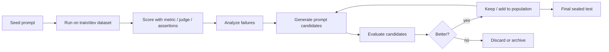
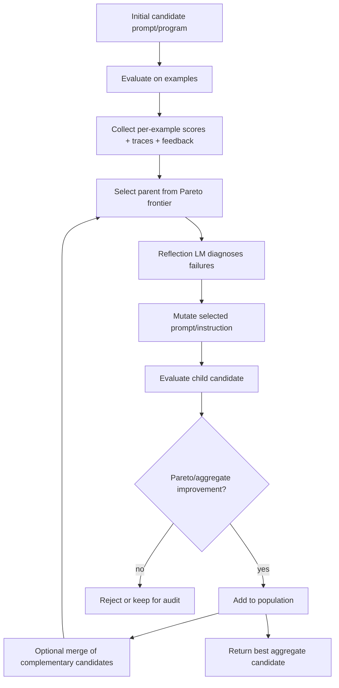
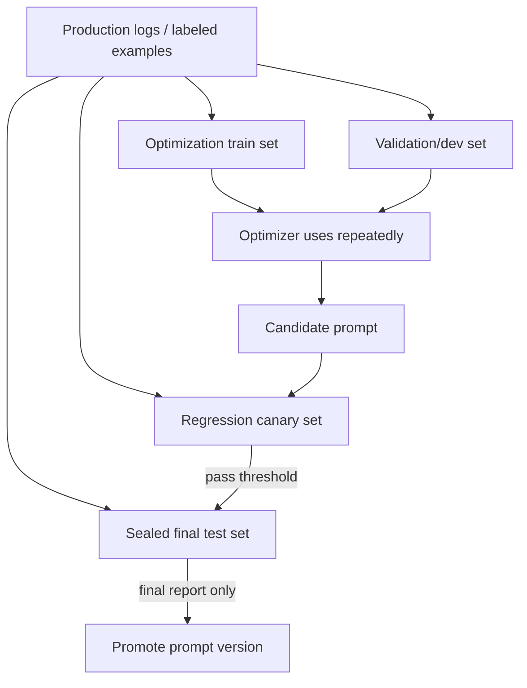

# GEPA와 데이터셋 기반 LLM 프롬프트 최적화 방법론/서비스 리서치

작성일: 2026-05-30

이 문서는 GEPA(Genetic-Pareto)를 중심으로, 미리 정의한 평가 데이터셋과 metric을 기준으로 LLM 프롬프트를 자동 개선하는 방법론과 실제 서비스/프레임워크를 정리한다. 여기서 "테스트셋"은 실무자가 흔히 말하는 반복 평가용 eval set을 포함하지만, 엄밀한 운영에서는 **최적화에 쓰는 train/dev set**과 **마지막에만 확인하는 sealed test set**을 분리하는 것이 안전하다.

## Executive Summary

LLM 프롬프트 최적화의 핵심은 "좋아 보이는 문장을 더 잘 쓰는 것"이 아니라, 같은 입력 세트와 같은 scoring rule로 후보 프롬프트를 반복 평가하며 더 높은 점수의 프롬프트를 찾는 폐루프 최적화다.

조사 결과를 요약하면 다음과 같다.

1. **GEPA는 2025년에 공개되고 ICLR 2026 Oral로 채택된 reflective prompt evolution 방법론**이다. RL처럼 많은 rollout의 scalar reward만 쓰지 않고, 실행 trace와 실패 원인을 자연어로 반성(reflection)하게 해 후보 프롬프트를 진화시킨다. 논문 초록은 GRPO 대비 평균 6%, 최대 20% 성능 향상과 최대 35배 적은 rollout, MIPROv2 대비 10% 이상 향상을 보고한다.
2. **GEPA의 차별점은 "feedback-rich metric + Pareto frontier + mutation/merge" 조합**이다. 단일 평균 점수만 보고 최고 후보를 탐욕적으로 고르는 대신, 특정 예제군에 강한 후보들을 Pareto frontier로 유지하고, 실패 trace에서 얻은 자연어 피드백을 다음 mutation에 넣는다.
3. **GEPA와 같은 문제를 푸는 고전적/최신 방법론은 많다.** APE, OPRO, ProTeGi/APO, TextGrad, PromptBreeder, EvoPrompt/GAAPO, DSPy MIPROv2/SIMBA/COPRO, PromptWizard 등이 모두 "후보 생성 → 평가 → 선택/수정" 루프를 변형한 것이다.
4. **실무 서비스는 크게 둘로 나뉜다.** DSPy, GEPA Python package, MLflow, DeepEval, Opik처럼 자동 최적화 알고리즘을 직접 제공하는 도구가 있고, Braintrust, LangSmith, Promptfoo, Parea처럼 eval dataset, scorer, prompt versioning, experiment comparison, CI gate를 제공해 사람이 또는 별도 optimizer가 반복 개선할 수 있게 하는 플랫폼이 있다.
5. **가장 큰 리스크는 test set overfitting과 judge hacking이다.** 최적화 루프가 같은 데이터셋을 반복해서 보면 프롬프트가 그 데이터셋의 특이점에 맞춰진다. 따라서 최적화용 dev set, 회귀 테스트용 canary set, 최종 sealed test set을 분리하고, LLM judge는 사람 라벨과 calibration해야 한다.

## GEPA란 무엇인가

GEPA는 Genetic-Pareto의 약자로, 임의의 텍스트 파라미터를 가진 시스템을 평가 metric에 맞춰 최적화하는 reflective text evolution 프레임워크다. 공식 GitHub README는 GEPA를 "prompts, code, agent architectures, configurations" 같은 텍스트 파라미터를 LLM 기반 reflection과 Pareto-aware evolutionary search로 최적화하는 도구로 설명한다.

논문 제목은 **GEPA: Reflective Prompt Evolution Can Outperform Reinforcement Learning**이며, arXiv ID는 `2507.19457`이다. arXiv 페이지 기준 v1은 2025-07-25, v2는 2026-02-14에 올라왔고, ICLR 2026 Oral로 채택되었다.

### 핵심 문제의식

기존 RL/GRPO식 접근은 각 rollout 결과를 하나의 보상 숫자로 압축한다. 이 방식은 대규모 rollout이 필요하고, 왜 실패했는지에 대한 정보가 약하다. GEPA는 LLM 시스템의 실행 과정이 대부분 자연어 trace로 남는다는 점을 이용한다.

GEPA가 활용하는 trace 예시:

- 모델의 reasoning 또는 intermediate output
- tool call과 tool output
- parser/schema validation failure
- retrieval 결과
- evaluator가 남긴 실패 이유
- 사람이 특정 예제에 달아둔 코멘트
- 코드 실행 에러, profiler output, 로그

GEPA 논문과 구현체에서는 이런 진단 정보를 **Actionable Side Information(ASI)**로 본다. 숫자 점수만으로는 "틀렸다"만 알 수 있지만, ASI는 "어떤 조건을 놓쳤고 다음 프롬프트에 어떤 규칙을 넣어야 하는지"를 알려준다.

## GEPA의 작동 방식

GEPA의 표준 루프는 다음과 같다.

### 1. 후보 population 유지

GEPA는 하나의 prompt만 계속 수정하지 않고 후보 prompt/program population을 유지한다. 각 후보는 예제별 score vector를 가진다. 평균 점수가 조금 낮더라도 특정 failure cluster에 강한 후보는 유지될 수 있다.

### 2. Pareto frontier에서 parent 선택

평균 점수가 높은 후보만 parent로 고르면 local optimum에 갇히기 쉽다. GEPA는 예제별 성능을 보고 non-dominated 후보, 즉 어떤 예제에서는 다른 후보보다 낫고 그 장점이 명확한 후보들을 Pareto frontier로 유지한다. 다음 mutation의 parent는 이 frontier에서 sampling한다.

### 3. Reflection LM으로 실패 원인 분석

GEPA의 reflection LM은 task를 실제로 수행하는 model과 분리할 수 있다. 예를 들어 저렴한 student model로 모든 후보를 평가하고, 더 강한 model을 reflection과 instruction rewriting에만 쓰는 구성이 가능하다. DSPy 문서는 reflection LM이 mutation마다 low-scoring trace를 읽고 새 instruction을 내며, evaluation은 task model이 수행한다고 설명한다.

### 4. Mutation과 merge

Mutation은 실패 피드백을 반영해 특정 predictor 또는 prompt component의 instruction을 바꾸는 단계다. GEPA는 여러 predictor로 구성된 compound AI system에서도 일부 component만 round-robin으로 수정하거나, 모든 component를 한 번에 수정할 수 있다.

Merge는 서로 다른 예제에 강한 두 후보의 장점을 합치는 시도다. DSPy GEPA 문서는 `use_merge=True`를 통해 서로 다른 예제에서 이긴 후보들의 instruction을 결합하는 후보를 만들 수 있다고 설명한다.

### 5. 최종 winner 선택

Pareto frontier는 탐색을 위한 장치이고, 최종 산출물은 일반적으로 aggregate score가 가장 높은 단일 후보다. DSPy GEPA는 `.compile()` 결과로 best candidate의 instruction이 student program의 signature instruction에 반영된 module을 반환한다.

## GEPA 사용에 필요한 입력

GEPA를 쓰려면 최소한 다음이 필요하다.

| 항목 | 설명 | 품질 기준 |
|---|---|---|
| Seed prompt/program | 현재 사용 중인 prompt, DSPy program, agent prompt 등 | baseline으로 재현 가능해야 함 |
| Train/dev dataset | 최적화 중 반복 평가할 입력과 기대값 | 대표성, edge case, failure case 포함 |
| Metric/scorer | 출력이 좋은지 점수화하는 함수 | 가능하면 deterministic, 아니라면 judge calibration 필요 |
| Feedback channel | 실패 이유를 자연어로 반환 | GEPA 성능의 핵심 신호 |
| Reflection model | 실패 trace를 읽고 prompt를 고치는 LLM | task model보다 강한 모델을 쓰는 경우가 많음 |
| Budget | metric call 수, full eval 수, candidate 수 | 비용과 overfitting을 통제 |
| Sealed test set | 최적화 후 마지막에만 보는 데이터 | 최종 일반화 성능 확인 |

중요한 점은 metric이 bare float만 반환할 수 있어도 GEPA는 동작하지만, GEPA의 장점은 크게 줄어든다는 것이다. DSPy 문서는 GEPA에 `dspy.Prediction(score, feedback)` 형태의 feedback-rich metric을 권장한다.

## GEPA가 잘 맞는 경우와 안 맞는 경우

### 잘 맞는 경우

- 정답 또는 rubric이 비교적 명확한 classification, extraction, routing, QA, RAG answer quality
- 실패 trace가 풍부한 multi-step agent, tool-using workflow, parser/schema validation workflow
- API-only 모델처럼 weight tuning이 불가능한 상황
- prompt가 여러 component에 걸쳐 있고 사람이 어느 component를 고쳐야 할지 찾기 어려운 상황
- rollout 비용이 커서 sample-efficient한 탐색이 중요한 상황
- 사람이 failure note를 남기거나 LLM judge가 구체적인 실패 이유를 줄 수 있는 환경

### 조심해야 하는 경우

- metric이 실제 사용자 품질을 잘 대표하지 못하는 경우
- LLM judge가 불안정하거나 bias가 큰 경우
- training/dev set이 너무 작고 skew가 심한 경우
- prompt가 business policy를 바꾸면 안 되는 규제/법무 도메인
- 최종 prompt가 길어져 inference 비용과 latency가 민감한 경우
- 모델이 prompt shortcut을 학습해 데이터셋 점수만 높이고 일반화가 떨어질 위험이 큰 경우

## GEPA와 유사한 자동 프롬프트 최적화 방법론

아래 방법론들은 모두 "후보 prompt를 만들고, 데이터셋에서 점수화하고, 결과를 바탕으로 다음 후보를 만든다"는 공통 루프를 가진다. 차이는 후보 생성 방식, feedback 사용 방식, 탐색 전략, 최적화 대상의 범위다.

### 1. Manual eval loop / hill climbing

가장 기본적인 방식은 사람이 prompt를 수정하고 같은 dataset에서 반복 평가하는 것이다.

1. baseline prompt 작성
2. dataset과 scorer 정의
3. prompt 실행 후 failure case 확인
4. 실패 패턴별 instruction, examples, output format 수정
5. 같은 dataset에서 재평가
6. 개선/회귀를 비교하고 PR/배포 gate에 연결

Braintrust는 이 루프를 "write prompt → build scorer → run on dataset → review scores → revise and rerun"으로 설명한다. 자동 optimizer가 없어도 이 루프만 제대로 갖춰도 "감" 기반 prompt engineering보다 훨씬 재현성이 높다.

### 2. APE: Automatic Prompt Engineer

APE는 instruction을 일종의 "program"으로 보고, LLM이 후보 instruction을 생성한 뒤 다른 LLM 또는 같은 LLM으로 zero-shot 성능을 평가해 좋은 instruction을 선택한다. 2022년 논문 **Large Language Models Are Human-Level Prompt Engineers**는 24개 NLP task에서 자동 생성 instruction이 기존 LLM baseline을 크게 앞서고, 19/24 task에서 인간 작성 instruction과 비슷하거나 더 좋았다고 보고했다.

적합한 상황:

- 초기 seed prompt가 약하거나 없는 경우
- input-output 예제가 있고 task instruction을 역추론하고 싶은 경우
- 단일 prompt instruction 최적화

한계:

- failure trace를 깊게 활용하지 않는다.
- complex agent나 multi-prompt pipeline에는 직접 적용이 약하다.
- 후보 생성과 selection이 단순하면 local optimum에 머물 수 있다.

### 3. OPRO: Optimization by PROmpting

OPRO는 LLM을 black-box optimizer로 사용한다. 이전 후보들과 score history를 prompt에 넣고, LLM이 더 높은 점수를 낼 후보 solution을 제안한다. Google DeepMind의 **Large Language Models as Optimizers** 논문은 prompt optimization에서 OPRO가 GSM8K와 Big-Bench Hard에서 인간 작성 prompt보다 높은 성능을 낼 수 있음을 보였다.

적합한 상황:

- objective가 자연어로 설명 가능하고 후보/점수 history를 LLM에게 보여줄 수 있는 경우
- 단순한 prompt string 탐색
- 빠른 baseline 자동 탐색

한계:

- 실패 원인을 구조적으로 분해하기보다는 score history에 의존한다.
- optimizer LLM의 능력과 prompt window에 민감하다.
- 작은 optimizer model에서는 성능/비용 tradeoff가 악화될 수 있다는 후속 연구가 있다.

### 4. ProTeGi / APO: textual gradient descent

ProTeGi는 **Automatic Prompt Optimization with "Gradient Descent" and Beam Search** 논문에서 제안된 방식이다. mini-batch에서 현재 prompt가 틀린 사례를 모아 LLM에게 자연어 "gradient", 즉 비판/수정 방향을 생성하게 한다. 그런 다음 prompt를 그 gradient의 "반대 의미 방향"으로 수정하고, beam search와 bandit selection으로 후보를 평가한다.

적합한 상황:

- 명확한 실패 사례가 있고, 그 실패를 자연어 critique로 표현할 수 있는 경우
- prompt 하나를 점진적으로 개선하고 싶은 경우
- jailbreak detection, classification, 간단한 NLP task

GEPA와의 차이:

- 둘 다 자연어 피드백을 쓰지만 ProTeGi는 gradient descent 은유와 beam/bandit search가 중심이다.
- GEPA는 Pareto frontier와 population/merge를 더 전면에 둔다.
- GEPA는 compound AI trace와 per-component feedback을 더 자연스럽게 처리한다.

### 5. TextGrad

TextGrad는 "automatic differentiation via text"라는 프레임워크다. PyTorch식 computation graph 은유를 사용해 LLM이 textual feedback을 "backpropagate"하여 prompt, code, molecule, treatment plan 같은 텍스트 변수들을 최적화한다.

적합한 상황:

- prompt 하나보다 넓은 텍스트 변수 최적화
- 복합 시스템의 component별 feedback 전파
- 연구/실험적 optimization pipeline

GEPA와의 차이:

- TextGrad는 autodiff 추상화와 computation graph가 중심이다.
- GEPA는 evolutionary search, Pareto selection, reflection/mutation/merge가 중심이다.

### 6. PromptBreeder

PromptBreeder는 population 기반 prompt evolution 방법론이다. task prompt뿐 아니라 mutation prompt 자체도 함께 진화시키는 self-referential self-improvement 구조를 제안한다. 즉, "프롬프트를 어떻게 바꿀지 지시하는 프롬프트"까지 진화의 대상이 된다.

적합한 상황:

- 다양한 prompt style을 넓게 탐색하고 싶은 경우
- task family가 있고 mutation strategy 자체를 개선하고 싶은 경우
- 연구적 prompt search

한계:

- 운영 시스템에 넣기에는 탐색 비용과 재현성 관리가 중요하다.
- eval set 품질이 낮으면 population 전체가 잘못된 방향으로 진화한다.

### 7. EvoPrompt / GAAPO: evolutionary prompt optimization

EvoPrompt는 LLM과 evolutionary algorithm을 결합한다. population에서 시작해 LLM이 mutation/crossover operator 역할을 하고, development set 성능으로 다음 세대를 선택한다. GAAPO는 genetic algorithm 원리를 기반으로 APO, OPRO, random mutation, few-shot, crossover 같은 여러 prompt generation strategy를 섞어 prompt를 세대별로 진화시키는 2025년 연구다.

GEPA와의 차이:

- EvoPrompt/GAAPO는 일반적인 유전 알고리즘 틀에 가깝다.
- GEPA는 Pareto frontier sampling, trace reflection, ASI, merge를 강하게 결합해 sample efficiency와 interpretability를 노린다.

### 8. DSPy optimizers: COPRO, MIPROv2, SIMBA, Bootstrap 계열

DSPy는 prompt를 직접 손으로 관리하기보다 typed signature와 module로 LM program을 정의하고, optimizer로 instruction/demos/weights를 조정하는 프레임워크다.

주요 optimizer:

| Optimizer | 최적화 대상 | 방식 | 적합한 상황 |
|---|---|---|---|
| LabeledFewShot | demos | trainset에서 예제 샘플링 | 저비용 baseline |
| BootstrapFewShot | demos | teacher/student가 맞춘 trace를 few-shot demo로 보존 | metric이 명확하고 few-shot이 필요한 경우 |
| BootstrapRS | demos | 여러 random seed로 demo set 탐색 | demo 선택이 성능에 민감한 경우 |
| KNNFewShot | inference-time demos | 입력과 가까운 train examples를 retrieval | 입력 분포가 다양해 단일 demo set이 약한 경우 |
| COPRO | instruction | breadth/depth 후보 instruction 생성/평가 | 가벼운 instruction wording 수정 |
| MIPROv2 | instruction + demos | bootstrapped demos, instruction proposal, Bayesian optimization | instruction과 few-shot examples를 함께 튜닝 |
| SIMBA | instruction 또는 demos | mini-batch 기반으로 약점 예제를 겨냥해 rule/demo 제안 | 현 weak spot에 빠르게 반응 |
| GEPA | instruction | feedback-rich metric, reflection, Pareto evolution | failure feedback과 trace가 풍부한 prompt-only 최적화 |

DSPy의 optimizer 선택 가이드는 instruction, demos, weights 중 무엇이 병목인지 먼저 보라고 권장한다. 또한 demo tuning은 작은 trainset에 overfit되기 쉽고, instruction tuning은 상대적으로 일반화되기 쉽다고 설명한다.

### 9. PromptWizard

PromptWizard는 Microsoft의 task-aware prompt optimization framework다. LLM이 prompt와 in-context examples를 생성, 비판, 정제하는 self-evolving loop를 사용한다. 논문은 instruction과 examples를 함께 최적화하고, synthetic examples와 self-generated reasoning/CoT를 활용한다고 설명한다.

적합한 상황:

- prompt instruction과 few-shot examples를 함께 고치고 싶은 경우
- training data가 제한적인 경우
- Microsoft 오픈소스 구현을 기반으로 자체 실험을 하고 싶은 경우

GEPA와의 차이:

- PromptWizard는 task-aware instruction/example synthesis가 중심이다.
- GEPA는 trace reflection과 Pareto evolution이 중심이다.

### 10. Human feedback 기반 prompt optimization

POHF, iPrOp, PROMST 같은 연구들은 사람이 출력에 대한 선호나 피드백을 제공하고, 그 피드백을 바탕으로 prompt를 자동 수정하는 방향이다. 주관적 품질, 브랜드 톤, 정책 판단처럼 deterministic scorer를 만들기 어려운 영역에서는 사람이 loop에 들어가야 한다.

실무적으로는 Human-in-the-loop가 특히 중요하다.

- LLM judge가 놓치는 business nuance 확인
- prompt 변경이 정책/법무/브랜드 logic을 바꾸지 않는지 승인
- eval dataset에 새로운 failure case 추가
- judge calibration용 gold labels 구축

## 서비스/프레임워크 조사

### GEPA Python package

공식 구현체는 `gepa-ai/gepa` GitHub repo와 PyPI package로 제공된다. `gepa.optimize()`는 seed candidate, trainset, valset, task LM, reflection LM, metric call budget을 받아 prompt를 최적화한다. `optimize_anything` API는 prompt뿐 아니라 code, agent architecture, configuration, SVG 등 텍스트 artifact를 evaluator 기준으로 최적화할 수 있게 한다.

특징:

- 공식 GEPA 구현
- 단일 prompt뿐 아니라 adapter를 통해 RAG, MCP, LangChain, TerminalBench 등으로 확장
- ASI/log 기반 reflection 가능
- 연구/엔지니어링 팀이 직접 optimizer를 코드로 통제하기 좋음

주의:

- dataset/scorer/trace logging 품질을 사용자가 직접 책임져야 한다.
- 실험 관리, 승인, CI gate는 별도 도구와 연결해야 한다.

### DSPy `dspy.GEPA` / `MIPROv2`

DSPy는 GEPA가 가장 자연스럽게 쓰이는 프레임워크 중 하나다. 공식 docs는 DSPy를 "Program, don't prompt" 프레임워크로 설명하며, signature/module/optimizer 구조로 LM program을 관리한다.

DSPy GEPA 특징:

- `dspy.GEPA(metric=..., reflection_lm=..., auto="light|medium|heavy")`
- `compile(student, trainset, valset)` 형태
- metric이 `dspy.Prediction(score, feedback)`를 반환하면 feedback이 reflection prompt로 들어간다.
- multi-predictor program에서 per-predictor feedback 가능
- `detailed_results`로 후보 lineage와 per-example score를 감사할 수 있다.

MIPROv2 특징:

- instruction과 few-shot demos를 함께 최적화
- bootstrapped demos + instruction proposal + Bayesian optimization
- feedback-rich metric이 없거나 examples 튜닝이 중요할 때 GEPA보다 나을 수 있다.

추천:

- 새 LM workflow를 Python으로 짜고 있고 prompt를 코드 수준 artifact로 관리할 수 있다면 DSPy부터 검토한다.
- feedback-rich metric이 있으면 GEPA, instruction+demos 조합이 중요하면 MIPROv2를 먼저 비교한다.

### MLflow GenAI `optimize_prompts`

MLflow 문서는 `mlflow.genai.optimize_prompts()` API를 통해 prompt registry에 등록된 prompt를 training data와 scorer 기준으로 최적화할 수 있다고 설명한다. 지원 optimizer로 `GepaPromptOptimizer`와 `MetaPromptOptimizer`를 제시한다.

특징:

- MLflow Prompt Registry와 연동
- `predict_fn`, `train_data`, `prompt_uris`, `optimizer`, `scorers`를 넣는 형태
- GEPA로 multi-prompt optimization 가능
- LangChain, OpenAI Agent, CrewAI, custom implementation 등과 연결 가능하다고 설명
- prompt optimization 결과에 initial/final score, optimized prompt version이 남는다.

추천:

- 이미 MLflow를 model/prompt registry, experiment tracking에 쓰고 있다면 도입 비용이 낮다.
- 의료/금융/엔터프라이즈처럼 registry와 audit trail이 중요한 조직에 적합하다.

### DeepEval Prompt Optimizer

DeepEval은 evaluation framework이며, Prompt Optimization 섹션에서 GEPA, MIPROv2, SIMBA, COPRO를 제공한다. DeepEval GEPA 문서는 `PromptOptimizer(algorithm=GEPA(), model_callback=...)`와 goldens/metrics를 사용해 prompt를 최적화하는 예시를 제공한다.

특징:

- `goldens`와 metrics 중심의 간단한 API
- GEPA가 default algorithm으로 제공됨
- `iterations`, `pareto_size`, `minibatch_size`, `patience`, `reflection_model`, `mutation_model` 등을 설정 가능
- Answer Relevancy, RAG, safety, agentic metric 등 DeepEval metric ecosystem과 연결

추천:

- Python test/eval 코드에 prompt optimization을 빠르게 붙이고 싶은 경우
- LLM unit test와 prompt optimizer를 같은 프레임워크에서 관리하고 싶은 경우

### Opik Agent Optimizer

Comet의 Opik Agent Optimizer는 open-source agent/prompt optimization SDK다. 문서는 MetaPrompt, HRPO, Evolutionary, GEPA 등 optimizer를 선택해 prompts, tools, agent workflows를 자동 튜닝할 수 있다고 설명한다.

특징:

- prompt뿐 아니라 tool schemas, function calling, multi-step agent workflow 최적화
- trace-level evidence와 dashboard analytics
- Optimization Studio UI
- 로컬 SDK 또는 Docker 환경에서 offline 실행 가능
- GEPA wrapper 제공

추천:

- 이미 Opik으로 trace/eval을 쌓고 있거나 self-host/open-source 관점이 중요한 팀
- 단일 prompt보다 agent/tool workflow optimization이 필요한 팀

### Braintrust

Braintrust는 eval dataset, scorer, experiment, trace, playground, CI gate를 하나의 workflow로 묶는 플랫폼이다. 2026년 글에서 Braintrust는 prompt optimization loop를 "프롬프트를 쓰고, scorer를 만들고, dataset에서 실행하고, failure를 보고, 수정 후 rerun"하는 반복으로 설명한다. Loop agent는 logs/traces 분석, dataset/scorer 생성, prompt optimization suggestion을 지원한다.

특징:

- production trace를 dataset으로 전환
- built-in scorer, custom scorer, LLM-as-judge, human review
- experiment comparison과 prompt diff
- GitHub Action quality gate
- Loop가 failure pattern을 분석하고 prompt edit을 제안

추천:

- 자동 optimizer보다 운영형 eval loop와 release gate가 중요한 팀
- PM/도메인 전문가가 UI에서 prompt를 개선하고 엔지니어가 CI로 보호하는 workflow

### LangSmith

LangSmith는 LangChain 생태계의 eval/observability 플랫폼이지만 framework-agnostic 사용도 가능하다고 설명한다. 문서는 offline evaluation이 dataset examples와 reference outputs를 대상으로 동작하고, experiment가 특정 application version의 outputs, evaluator scores, traces를 저장한다고 설명한다. LangSmith 제품 페이지는 Playground에서 prompt versions/model providers를 비교하고, AI Agent Polly로 prompt 자동 개선을 지원한다고 소개한다.

특징:

- dataset 기반 offline eval과 production online eval
- code evaluator, LLM-as-judge, pairwise evaluator, human annotation
- prompt/model/agent version comparison
- CI/CD pipeline 연동
- agent trajectory, tool call, intermediate decision 평가

추천:

- LangChain/LangGraph 기반 application
- agent trace를 기반으로 어느 step에서 실패했는지 보고 prompt를 개선해야 하는 경우
- human annotation과 judge calibration이 필요한 경우

### Promptfoo

Promptfoo는 CLI-first, YAML 기반 LLM eval/red-team 도구다. 공식 docs는 prompts, providers, tests, assertions를 선언하고 `promptfoo eval`로 모든 prompt/model/test case 조합을 평가한다고 설명한다. assertions로 `contains`, `icontains`, `llm-rubric`, `javascript`, cost, latency 등을 지정할 수 있다.

특징:

- prompt/test config를 repo에 저장하기 좋음
- CLI/CI 친화적
- 60+ provider, local/custom provider 지원
- prompt quality, model quality, RAG quality, agent quality 예제
- red teaming/pentest 기능

추천:

- 자동 최적화보다는 regression test와 비교 실험이 필요한 팀
- Git 기반 prompt review와 CI gate를 선호하는 엔지니어링 팀
- GEPA/MIPRO 같은 optimizer의 외부 평가 harness로 사용 가능

한계:

- 자체적으로 GEPA식 prompt rewriting optimizer라기보다는 eval/assertion runner에 가깝다.
- 실패 분석과 prompt 후보 생성은 사람 또는 별도 optimizer가 담당해야 한다.

### Parea AI

Parea는 prompt engineering/management, dataset/evaluation metric creation, log/analytics exploration을 통합한 플랫폼으로 소개된다. Prompt playground에서 sample과 large dataset에 대해 prompt를 테스트하고, 좋은 prompt를 production에 deploy하는 workflow를 강조한다.

특징:

- prompt playground와 deployment
- dataset/eval function/experiment tracking
- observability와 human annotation
- SDK와 UI 연결

추천:

- 자동 optimizer 자체보다 prompt experiment tracking과 운영 관리를 원하는 팀
- prompt를 UI에서 비교하고 production logging과 연결하려는 팀

### Humanloop

Humanloop은 prompt editor, version control, evals, logging을 제공하던 LLM eval platform이지만, 공식 docs에는 **Humanloop platform will be sunset on September 8th, 2025**라는 안내가 있다. 2026년에 새로 채택할 플랫폼으로는 신중해야 하며, 기존 사용자는 export/migration 관점에서만 검토하는 편이 안전하다.

## 방법론/도구 선택 가이드

| 상황 | 우선 검토 |
|---|---|
| 빠르게 eval loop부터 만들고 싶다 | Promptfoo, Braintrust, LangSmith, Parea |
| Python 코드에서 자동 prompt optimizer를 돌리고 싶다 | DSPy GEPA/MIPROv2, GEPA package, DeepEval |
| MLflow registry/audit 중심으로 운영한다 | MLflow `optimize_prompts` |
| agent/tool workflow 전체를 최적화하고 싶다 | Opik Agent Optimizer, DSPy GEPA, GEPA adapters |
| feedback-rich metric과 trace가 있다 | GEPA |
| 정답 label은 있지만 자연어 feedback은 약하다 | MIPROv2, BootstrapFewShot, PromptWizard |
| prompt와 few-shot examples를 같이 최적화하고 싶다 | MIPROv2, PromptWizard |
| CLI/CI에서 prompt regression test를 하고 싶다 | Promptfoo |
| 도메인 전문가의 리뷰와 human feedback이 중요하다 | Braintrust, LangSmith, Parea |
| 기존 prompt가 거의 없고 instruction을 자동 생성하고 싶다 | APE, OPRO, PromptWizard |

## 안전한 데이터셋 기반 최적화 프로토콜

사용자가 말한 "테스트셋을 정해두고 그 테스트셋에 대해 성능을 높이는" 접근은 실험 초기에 유용하지만, 그 데이터셋을 계속 보고 prompt를 고치면 test set이 사실상 training set이 된다. 실무에서는 다음 구조가 낫다.

### 1. Dataset split

- **Train/optimization set**: GEPA/MIPRO/PromptWizard가 반복적으로 보는 데이터
- **Validation/dev set**: 후보 선택과 early stopping에 사용
- **Regression canary set**: 과거 production failure와 critical edge cases
- **Sealed test set**: 최종 release 전 한 번만 평가
- **Shadow production sample**: 배포 후 online monitoring

### 2. Metric 설계

metric은 task별로 다르게 설계한다.

| Task | 좋은 metric 예시 |
|---|---|
| Classification | exact match, macro F1, confusion matrix |
| Extraction | field-level F1, schema validity, char span match |
| RAG QA | answer correctness, faithfulness, citation support, retrieval recall |
| Agent/tool use | final success, tool call validity, step count, cost, latency, no unsafe action |
| Summarization | reference-based judge, coverage, hallucination penalty, length/cost |
| Safety/refusal | policy compliance, false refusal rate, jailbreak pass/fail |

LLM-as-judge를 쓸 때는 다음을 권장한다.

- 사람 라벨 subset으로 judge agreement 측정
- judge prompt 자체도 versioning
- pairwise judge와 absolute score judge를 함께 사용
- deterministic checks(JSON schema, exact match, regex, unit test)를 가능한 많이 선행
- judge가 긴 답변을 선호하는 bias를 cost/length metric으로 보정

### 3. Optimization budget

GEPA/DSPy/MLflow 등은 metric call 수가 비용의 대부분이다. 특히 GEPA는 reflection LM이 강할수록 mutation 품질은 좋아지지만 비용이 커진다.

운영 기준:

- 먼저 20-50개 대표 예제로 light run
- 개선이 보이면 100-300개 dev set으로 medium run
- final test는 optimizer가 보지 않은 sealed set에서만 실행
- 후보 prompt length, inference cost, latency를 score에 포함
- random seed와 dataset version을 기록

### 4. Overfitting 방지

- 같은 예제를 계속 optimizer에 보여주지 않는다.
- prompt가 gold label 문자열을 암기하는지 검사한다.
- 데이터셋 category별 score를 따로 본다.
- prompt가 특정 judge phrasing에 맞춰지는지 judge prompt를 바꿔 검증한다.
- production failure를 regression set에 추가하되, final sealed set은 자주 갱신하지 않는다.

### 5. 배포 절차

1. Baseline prompt version 저장
2. Optimizer run 생성: dataset version, model version, scorer version, budget 기록
3. Candidate prompt를 dev/regression set에서 비교
4. 사람이 diff review: policy, tone, output contract, forbidden behavior 확인
5. Sealed test 통과 시 prompt registry에 새 version 등록
6. Canary rollout 또는 shadow evaluation
7. Production logs에서 drift/failure를 수집해 다음 optimization cycle에 반영

## 실무 추천 조합

### 가장 단순한 엔지니어링 중심 조합

- Promptfoo로 eval YAML과 assertions 관리
- prompt 후보는 사람이 수정하거나 GEPA/DSPy로 생성
- CI에서 promptfoo eval을 돌려 threshold 미달 시 fail
- 실패 사례를 `tests`에 계속 추가

### Python 연구/프로토타입 조합

- DSPy signature/module로 workflow 작성
- `dspy.Evaluate`로 baseline 측정
- MIPROv2와 GEPA를 같은 train/dev split에서 비교
- `optimized_program.save()`로 artifact 저장
- 최종 prompt/program은 sealed test set으로 검증

### 엔터프라이즈 운영 조합

- MLflow Prompt Registry 또는 Braintrust/LangSmith prompt versioning
- production traces를 dataset으로 샘플링
- deterministic scorer + LLM judge + human review 혼합
- MLflow GEPA 또는 Braintrust Loop/Playground로 후보 생성
- GitHub Action/CI quality gate

### Agent workflow 조합

- LangSmith 또는 Opik으로 full trace 수집
- tool call validity, final success, latency/cost scorer 구성
- Opik Agent Optimizer 또는 DSPy GEPA로 system prompt/tool schema/prompt components 최적화
- prompt뿐 아니라 tool description, router instruction, retrieval query prompt를 component별로 평가

## 결론

GEPA는 "프롬프트를 잘 쓰는 기술"이라기보다, **평가 가능한 LLM 시스템을 자연어 피드백으로 진화시키는 최적화 루프**다. GEPA가 강력한 이유는 prompt 후보를 많이 만드는 데 있지 않고, 실패 trace를 자연어 학습 신호로 바꾸고, 서로 다른 failure cluster에 강한 후보를 Pareto frontier로 유지한다는 데 있다.

다만 GEPA를 제대로 쓰려면 먼저 eval system이 있어야 한다. 좋은 dataset, 신뢰할 수 있는 scorer, feedback-rich metric, sealed test split 없이 GEPA를 돌리면 "테스트셋 점수만 높은 긴 프롬프트"가 나오기 쉽다. 따라서 실무 도입 순서는 보통 다음이 맞다.

1. Promptfoo/Braintrust/LangSmith/Parea 등으로 dataset 기반 eval loop를 만든다.
2. baseline prompt와 failure taxonomy를 확보한다.
3. DSPy GEPA, MLflow GEPA, DeepEval GEPA, Opik Agent Optimizer 중 현재 stack에 맞는 optimizer를 붙인다.
4. MIPROv2/PromptWizard/ProTeGi/OPRO 같은 대안을 같은 split에서 비교한다.
5. sealed test와 production canary로 일반화 성능을 확인한 뒤 prompt registry에 승격한다.

즉, GEPA류 방법론의 본질은 "프롬프트 자동 수정"이 아니라 **프롬프트를 코드처럼 테스트하고, 모델처럼 validation하고, 제품처럼 release gate를 거는 운영 체계**다.

## 참고 자료

- GEPA paper: [GEPA: Reflective Prompt Evolution Can Outperform Reinforcement Learning](https://arxiv.org/abs/2507.19457)
- GEPA GitHub: [gepa-ai/gepa](https://github.com/gepa-ai/gepa)
- UC Berkeley Sky Computing Lab: [GEPA project page](https://sky.cs.berkeley.edu/project/gepa/)
- DSPy docs: [Prompt Optimizing with GEPA](https://dspy.ai/getting-started/gepa-optimization/)
- DSPy docs: [GEPA in depth](https://dspy.ai/diving-deeper/gepa-in-depth/)
- DSPy docs: [Optimizers: choosing one](https://dspy.ai/diving-deeper/choosing-an-optimizer/)
- DSPy docs: [MIPROv2](https://dspy.ai/api/optimizers/MIPROv2/)
- DeepEval docs: [GEPA prompt optimization](https://deepeval.com/docs/prompt-optimization-gepa)
- MLflow docs: [Optimize Prompts](https://mlflow.org/docs/latest/genai/prompt-registry/optimize-prompts/)
- Opik docs: [Agent Optimization](https://www.comet.com/docs/opik/v1/agent_optimization/overview)
- Braintrust article: [The prompt optimization loop](https://www.braintrust.dev/articles/prompt-optimization-loop)
- Braintrust docs: [Loop agent](https://www.braintrust.dev/docs/loop)
- LangSmith docs: [Evaluation concepts](https://docs.langchain.com/langsmith/evaluation-concepts)
- LangSmith product page: [LangSmith Evaluation](https://www.langchain.com/langsmith/evaluation)
- Promptfoo docs: [Getting started](https://www.promptfoo.dev/docs/getting-started/)
- Promptfoo docs: [Assertions and Metrics](https://www.promptfoo.dev/docs/configuration/expected-outputs/)
- Parea docs: [Platform overview](https://docs.parea.ai/platform/overview)
- Parea docs: [Evaluation overview](https://docs.parea.ai/evaluation/overview)
- Humanloop docs: [Quickstart](https://humanloop.com/docs/quickstart)
- APE paper: [Large Language Models Are Human-Level Prompt Engineers](https://arxiv.org/abs/2211.01910)
- OPRO paper: [Large Language Models as Optimizers](https://arxiv.org/abs/2309.03409)
- ProTeGi/APO paper: [Automatic Prompt Optimization with "Gradient Descent" and Beam Search](https://arxiv.org/abs/2305.03495)
- TextGrad paper: [TextGrad: Automatic "Differentiation" via Text](https://arxiv.org/abs/2406.07496)
- PromptBreeder paper: [Promptbreeder: Self-Referential Self-Improvement Via Prompt Evolution](https://arxiv.org/abs/2309.16797)
- EvoPrompt paper: [Connecting Large Language Models with Evolutionary Algorithms Yields Powerful Prompt Optimizers](https://arxiv.org/abs/2309.08532)
- PromptWizard paper: [PromptWizard: Task-Aware Prompt Optimization Framework](https://arxiv.org/abs/2405.18369)
- PromptWizard GitHub: [microsoft/PromptWizard](https://github.com/microsoft/PromptWizard)
- GAAPO paper: [GAAPO: Genetic Algorithmic Applied to Prompt Optimization](https://arxiv.org/abs/2504.07157)
