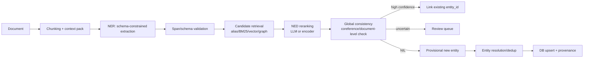

# LLM 기반 최신 NER, NED, Entity DB 확장 방법론

작성일: 2026-05-30

이 문서는 문서에서 엔티티를 찾는 NER(Named Entity Recognition), 찾은 엔티티를 DB의 특정 ID에 연결하는 NED(Named Entity Disambiguation, Entity Linking), 그리고 연결 실패 시 새 엔티티를 DB에 추가하는 운영 파이프라인을 최신 LLM 기반 방식 중심으로 정리한다. POS tagging, CRF, HMM, feature engineering, BERT token classification 같은 고전 방식은 비교 기준으로만 언급한다.

## Executive Summary

최근 흐름은 "LLM에게 문서를 주고 엔티티 목록을 뽑게 한다"보다 훨씬 구조화되어 있다. 실전 파이프라인은 대체로 다음 형태가 된다.



핵심 변화는 네 가지다.

1. **NER는 sequence labeling에서 structured generation으로 이동**했다. LLM은 BIO tag보다 JSON, XML, inline bracket, special marker 같은 생성 친화적 포맷에서 쓰인다. OpenAI, Gemini, LangChain 등은 JSON Schema/Pydantic/Zod 기반 structured output을 제공하므로, 파싱 가능한 엔티티 후보를 바로 만들 수 있다.
2. **LLM 단독 NER는 만능이 아니다.** GPT-NER는 LLM NER가 supervised baseline보다 약한 지점을 지적하고, special token generation과 self-verification으로 보완했다. GLiNER, UniversalNER, GuideX, LinkNER 같은 흐름은 LLM을 직접 호출하는 대신, LLM의 유연성을 작고 빠른 모델이나 데이터 생성/증류/검증 단계에 이식한다.
3. **NED는 여전히 candidate retrieval + reranking 문제다.** 최신 LLM 방식도 DB 전체를 prompt에 넣지 않는다. alias/BM25/vector search/graph prior로 후보를 좁히고, LLM이나 cross-encoder가 top-k 후보를 문맥과 비교한다. 2026년 LELA는 이 coarse-to-fine 구조를 fine-tuning 없이 도메인과 KB를 바꿔 쓸 수 있는 end-to-end EL 프레임워크로 제시한다.
4. **새 엔티티 생성은 NER/NED가 아니라 Entity Resolution까지 포함한 데이터 운영 문제다.** "못 찾았으니 생성"은 위험하다. `NIL` 판정, 중복 후보 검증, canonical name/alias/attribute 생성, provenance 저장, review queue, merge 정책이 필요하다.

## 용어 구분

### NER

문서 안에서 엔티티 mention을 찾고 타입을 붙이는 작업이다. 예를 들어 "Apple released Vision Pro in Cupertino"에서 `Apple`을 `ORG`, `Vision Pro`를 `PRODUCT`, `Cupertino`를 `LOCATION`으로 찾는다.

LLM 기반 NER에서 중요한 산출물은 단순 문자열 목록이 아니라 다음 필드다.

- `mention_text`: 문서에 실제 등장한 표면형
- `char_start`, `char_end`: 원문 기준 span offset
- `entity_type`: 사람, 조직, 장소, 제품, 논문, 법령, 질병 등 도메인 타입
- `normalized_name`: 표준 이름 후보
- `attributes`: 날짜, 역할, 식별자, 직함 등
- `evidence`: 모델이 참조한 문장 또는 chunk id
- `confidence`: 추출 확신도

### NED / Entity Linking

NER가 찾은 mention을 DB 또는 Knowledge Base의 특정 `entity_id`에 연결하는 작업이다. `Apple`이 과일인지, Apple Inc.인지, 음악 레이블인지 결정한다. 문헌에서는 EL(Entity Linking), NED(Named Entity Disambiguation), NEN(Named Entity Normalization)이 유사하게 쓰인다.

실전 NED 산출물은 다음 필드를 포함해야 한다.

- `mention_id`
- `linked_entity_id`
- `candidate_entity_ids`
- `decision`: `linked`, `nil`, `ambiguous`, `needs_review`
- `link_confidence`
- `rationale` 또는 비교 feature
- `evidence`

### NIL / 신규 엔티티

DB 안에 대응 엔티티가 없다고 판단되는 mention을 `NIL`이라고 부른다. NIL은 곧바로 insert가 아니라 "새 엔티티 후보"다. 같은 문서 안의 다른 mention, 기존 alias, 외부 ID, 유사 레코드와 비교해 중복이 아닌지 확인한 뒤 provisional entity로 만든다.

## 과거 방식과 LLM 방식의 차이

고전 NER는 보통 다음 단계로 구성되었다.

- POS tag, dependency parse, capitalization, gazetteer 같은 feature 설계
- HMM, CRF, Maximum Entropy, BiLSTM-CRF, BERT token classification
- BIO/BILOU tag로 각 token에 라벨 부여
- entity linker는 별도 모듈로 mention candidate dictionary, popularity prior, context similarity를 사용

LLM 기반 방식은 작업의 인터페이스가 다르다.

| 구분 | 고전/encoder 기반 | LLM 기반 최신 방식 |
|---|---|---|
| 입력 | token sequence | 문서, task instruction, label definition, ontology, examples |
| 출력 | BIO tag 또는 span list | JSON/XML/inline marker/tool call 등 structured generation |
| 타입 확장 | 재학습 또는 head 변경 | 자연어 label definition으로 zero/few-shot 가능 |
| 도메인 적응 | 라벨링 데이터 중심 | prompt, retrieval, synthetic data, distillation, LoRA/PEFT |
| NED | 후보 사전 + ranker | 후보 검색 + LLM 비교/검증 + global consistency |
| 운영 리스크 | OOD 취약, label set 고정 | hallucination, span offset 오류, 비용/지연, 비결정성 |

중요한 점은 LLM 방식이 기존 방식을 완전히 대체하지 않았다는 것이다. 최신 실전 시스템은 LLM을 parser, teacher, verifier, reranker로 쓰고, 비용과 latency가 중요한 경로는 GLiNER류의 compact model, bi-encoder, cross-encoder, rule/filter와 결합한다.

## LLM 기반 NER 방법론

### 1. Prompted Structured Extraction

가장 직접적인 방식은 문서와 스키마를 주고 엔티티 배열을 생성하게 하는 것이다.

```json
{
  "entities": [
    {
      "mention_text": "Apple",
      "char_start": 0,
      "char_end": 5,
      "entity_type": "organization",
      "normalized_name": "Apple",
      "attributes": {
        "role": "company"
      },
      "evidence": "sentence_0",
      "confidence": 0.87
    }
  ]
}
```

이때 핵심은 free-form 답변을 금지하고, provider-native structured output 또는 tool/function calling을 사용하는 것이다. OpenAI Structured Outputs는 JSON mode보다 강한 schema adherence를 제공하고, Gemini도 JSON Schema 기반 structured output을 제공한다. LangChain도 provider-native structured output을 우선 사용하고, 미지원 모델에는 tool calling 전략으로 fallback한다.

운영 팁:

- 스키마에 `char_start`, `char_end`, `mention_text`를 반드시 포함한다.
- DB에 없는 타입을 임의 생성하지 못하게 `entity_type`은 enum으로 제한한다.
- offset이 원문 substring과 맞는지 deterministic validator로 검사한다.
- 동일 mention이 여러 번 등장할 수 있으므로 문자열만으로 mention을 식별하지 않는다.
- chunk 단위 추출 시 chunk id, document id, absolute offset을 함께 저장한다.

### 2. Generative NER: BIO 대신 생성 친화 포맷 사용

GPT-NER는 NER가 sequence labeling이고 LLM은 text generation이라는 간극을 지적하면서, special token으로 엔티티를 감싸는 방식과 self-verification을 제안했다. 예를 들어 위치 엔티티만 찾는다면 "Columbus is a city"를 "@@Columbus## is a city"처럼 생성하게 만든 뒤 marker를 파싱한다.

2026년 "Assessment of Generative Named Entity Recognition in the Era of Large Language Models"는 NER가 sequence labeling에서 generative paradigm으로 진화하고 있다고 평가하며, inline bracket/XML 같은 structured format과 parameter-efficient fine-tuning이 전통 encoder 기반 모델과 경쟁 가능한 결과를 만든다고 보고했다.

실전에서는 JSON이 DB 연동에 유리하지만, 모델 정확도만 보면 inline marker/XML이 더 안정적인 경우도 있다. 특히 nested NER, span boundary가 중요한 도메인에서는 다음 식으로 2단계를 둔다.

1. 모델은 inline/XML로 mention boundary를 표시한다.
2. parser가 span을 복원한다.
3. 두 번째 call 또는 deterministic code가 JSON schema로 변환한다.

### 3. Few-shot / Retrieval-augmented NER

LLM NER는 label definition과 example quality에 민감하다. 단순히 "find all organizations"보다 다음 요소를 넣을 때 안정적이다.

- 타입별 정의와 반례
- 도메인 ontology 또는 허용 relation
- 동일 도메인의 few-shot examples
- 검색으로 찾은 유사 annotated examples
- 문서 메타데이터: 제목, 출처, 날짜, 작성자, 섹션

GPT-NER는 few-shot/low-resource setting에서 supervised model보다 강점을 보였고, demonstration retrieval과 self-verification을 사용했다. 실전에서는 vector search로 유사 문장을 찾아 prompt에 넣거나, label별 boundary guideline을 동적으로 넣는다.

### 4. LLM을 Teacher로 쓰는 Distillation

UniversalNER는 ChatGPT를 더 작고 비용 효율적인 NER 모델로 증류하는 방향을 보여준다. 핵심은 일반 instruction tuning이 아니라 NER라는 목적에 맞춘 targeted distillation이다. 43개 데이터셋, 9개 도메인, 수만 개 entity type을 다루며 open NER에서 범용 instruction model보다 높은 성능을 보고했다.

이 접근은 다음 상황에서 유용하다.

- API LLM 호출 비용이 너무 큰 경우
- 개인정보/내부문서 때문에 로컬 추론이 필요한 경우
- entity type이 자주 바뀌지만 매번 수작업 라벨링은 어려운 경우
- "LLM 수준의 label flexibility"와 "encoder 수준의 latency"가 모두 필요한 경우

### 5. Synthetic Data / Data Augmentation

LLM-DA는 few-shot NER에서 LLM을 직접 extractor로 쓰기보다 데이터 증강기로 사용한다. 문맥 rewrite, 같은 타입 entity replacement, noise injection 등으로 라벨이 적은 상황의 robustness를 높인다.

GuideX는 2025년 zero-shot IE/NER 흐름에서 더 나아가 domain-specific schema와 guideline을 자동으로 정의하고, synthetically labeled instances를 생성한 뒤 Llama 3.1을 fine-tuning해 out-of-domain generalization을 개선한다.

실전 적용:

- 초기에는 LLM으로 seed annotation을 만든다.
- 사람이 boundary/type 오류를 일부 교정한다.
- LLM이 반례와 edge case를 생성한다.
- compact extractor를 fine-tune한다.
- production feedback을 active learning으로 다시 수집한다.

### 6. Compact Open-type NER 모델과 Hybrid NER

GLiNER는 "자연어로 원하는 entity type을 지정하면 임의 타입을 추출"하는 compact NER 모델 흐름을 대표한다. LLM의 arbitrary entity extraction 유연성을 유지하되, autoregressive LLM보다 작고 빠른 bidirectional transformer encoder로 병렬 추출한다.

LinkNER는 small fine-tuned NER 모델과 GPT-4 같은 LLM을 uncertainty 기반으로 연결한다. 작은 모델이 확신하는 경우는 로컬에서 처리하고, 불확실하거나 unseen entity가 의심되는 경우 LLM을 호출한다. 이는 운영 비용을 낮추면서 out-of-domain robustness를 얻는 실용적 패턴이다.

권장 패턴:

- 대량 문서의 1차 NER: GLiNER/도메인 fine-tuned encoder
- 애매한 mention, 신종 타입, 긴 문맥 필요 케이스: LLM fallback
- LLM 결과는 teacher signal로 다시 compact model 개선

## LLM 기반 NED / Entity Linking 방법론

### 1. Candidate Generation은 여전히 필수

LLM 기반 NED도 DB 전체를 prompt에 넣을 수 없다. 먼저 후보를 좁힌다.

후보 검색 feature:

- exact alias match
- lowercase/spacing/punctuation normalization
- trigram/fuzzy match
- BM25/FTS on name, aliases, description
- vector search on entity profile text
- type filter: `person`, `org`, `product`
- metadata filter: language, region, source, active period
- graph prior: 같은 문서에 이미 연결된 엔티티의 이웃
- popularity prior: 빈도, PageRank, business priority

BLINK는 bi-encoder로 mention context와 entity description을 dense space에 넣어 후보를 빠르게 검색하고, cross-encoder로 rerank하는 2단계 구조를 대표한다. LLM 시대에도 이 구조는 candidate generation의 기본 골격으로 남아 있다.

### 2. LLM Reranking / Disambiguation

후보 top-k를 만든 뒤 LLM에게 문맥과 후보 프로필을 비교시킨다.

프롬프트 입력:

- 원문 mention과 주변 문장
- 문서 제목/출처/날짜
- NER 타입과 추출된 속성
- 후보별 canonical name, aliases, description, source ids
- 후보별 DB evidence 또는 대표 문서
- "후보 중 없으면 NIL을 선택하라"는 명시 규칙

출력:

```json
{
  "decision": "linked",
  "linked_entity_id": "ent_123",
  "confidence": 0.91,
  "rejected_candidates": [
    {
      "entity_id": "ent_456",
      "reason": "same surface form but different industry"
    }
  ],
  "evidence": "The document discusses iPhone revenue, which matches Apple Inc."
}
```

EntGPT와 ChatEL은 naive prompt만으로는 EL이 충분하지 않으며, entity linking에 맞춘 multi-step prompt engineering이 필요하다는 흐름을 보여준다. ChatEL은 3단계 prompting으로 여러 데이터셋에서 entity linking 정확도를 개선했다고 보고한다.

### 3. Coarse-to-fine LLM Entity Linking

2026년 LELA는 LLM 기반 entity linking을 coarse-to-fine 방식으로 정리한다. LELA의 핵심은 target KB나 도메인에 묶이지 않는 modular entity disambiguation이며, fine-tuning 없이 다른 KB와 LLM에서 작동하는 것을 목표로 한다. 2026년 5월에는 zero-shot NER까지 통합해 실사용 end-to-end entity linking Python library 형태로 확장한 논문이 올라왔다.

실전적으로는 다음 구조와 유사하다.

1. surface form으로 coarse candidate retrieval
2. mention context와 후보 설명을 비교해 후보 축소
3. LLM이 후보 중 선택 또는 NIL 판정
4. self-consistency나 verifier로 재검증
5. document-level/global consistency로 충돌 수정

### 4. Document-level / Global Consistency

NED를 mention마다 독립 처리하면 같은 문서 안에서 같은 대상이 다른 ID로 링크되는 문제가 생긴다. 최신 연구는 문서 전체의 coherence를 더 많이 사용한다.

- DeepEL은 LLM을 entity linking의 여러 단계에 통합하고, 같은 문장/문서의 global contextual information으로 self-validation을 수행한다.
- 2025년 Contextual Augmentation for Entity Linking은 LLM으로 mention context를 풍부하게 만들어 entity disambiguation 성능을 개선한다.
- 2026년 LongBEL은 biomedical entity linking에서 full-document context와 previous prediction memory를 결합해 반복 등장 concept의 document-level consistency를 높인다.

실전 체크:

- 같은 surface form이 같은 문서에서 여러 ID로 링크되면 review
- coreference chain이 연결된 mention은 같은 entity cluster로 묶어 후보를 공유
- 동시에 등장하는 엔티티의 관계가 DB graph와 맞는지 확인
- 한 문서 안에서 "Apple", "the company", "Cupertino-based firm"을 같은 cluster로 관리

### 5. Retrieval-Reader / One-pass Linking

ReLiK는 Entity Linking과 Relation Extraction을 Retriever-Reader 구조로 다루며, 후보 엔티티/관계를 텍스트와 함께 입력 representation에 넣어 한 번의 forward pass로 link/extract하도록 설계한다. LLM prompt 기반 방식보다 빠르고, EL과 RE를 동시에 처리하는 continuous IE(cIE)에도 맞다.

대량 처리에서는 다음 선택지가 있다.

- latency 중요: ReLiK, BLINK류 dense retriever + cross-encoder
- 도메인 이동성 중요: LELA류 LLM coarse-to-fine
- 품질/감사 중요: LLM reranker + verifier + human review
- relation extraction까지 필요: ReLiK/GraphRAG/LLM-KG extraction pipeline

## DB에 연결하거나 새 엔티티를 추가하는 전체 방법론

### 1. DB 스키마를 먼저 엔티티 중심으로 잡기

LLM pipeline의 품질은 DB 스키마가 좌우한다. 최소한 다음 테이블 또는 컬렉션이 필요하다.

```text
entities
- id
- canonical_name
- entity_type
- description
- status: active | provisional | merged | deprecated
- created_at, updated_at

entity_aliases
- entity_id
- alias
- language
- source
- confidence

entity_attributes
- entity_id
- key
- value
- source_doc_id
- evidence_span
- confidence

entity_mentions
- mention_id
- doc_id
- chunk_id
- mention_text
- char_start
- char_end
- entity_type
- extraction_model
- extraction_confidence

entity_links
- mention_id
- entity_id nullable
- decision: linked | nil | ambiguous | needs_review
- candidate_ids
- linker_model
- link_confidence
- rationale

entity_merge_events
- from_entity_id
- to_entity_id
- reason
- decided_by
- decided_at
```

중요한 설계 원칙:

- mention과 entity를 분리한다. 문서 속 표현은 mention이고, DB의 고유 대상은 entity다.
- 모든 LLM 산출물에 provenance를 붙인다.
- 새 엔티티는 곧바로 `active`로 만들지 말고 `provisional`로 시작한다.
- merge/deprecate 이력을 남긴다. 잘못 생성된 entity는 삭제보다 merge가 안전하다.

### 2. 문서 입력과 Chunking

LLM NER/NED는 chunk boundary에 민감하다.

권장 입력 pack:

- chunk text
- preceding/following short context
- document title
- source name
- published date
- section heading
- known document-level entities
- domain schema

긴 문서는 chunk별 NER 후 document-level merge를 해야 한다. chunk 안에서만 "he", "the company", "this drug"를 처리하면 coreference와 NED가 흔들린다.

### 3. NER: 후보 mention 추출

절차:

1. allowed entity types와 type definition을 준비한다.
2. LLM structured output 또는 GLiNER/encoder로 mention 후보를 추출한다.
3. deterministic validator가 span offset, enum, 중복, invalid JSON을 검사한다.
4. 필요하면 self-verification을 수행한다.
5. mention cluster를 만든다. 같은 문서의 동일 표면형, coreference, alias를 임시 cluster로 묶는다.

권장 confidence policy:

- `extract_confidence >= 0.85`: candidate generation으로 이동
- `0.55 - 0.85`: second-pass verification 또는 더 큰 모델 호출
- `< 0.55`: discard 또는 review sample

### 4. Candidate Retrieval: DB 후보 생성

각 mention에 대해 최소 3개 계열 후보를 합친다.

```text
candidate_score =
  0.30 * alias_score
+ 0.25 * bm25_score
+ 0.25 * embedding_score
+ 0.10 * type_match
+ 0.05 * graph_context_score
+ 0.05 * popularity_or_source_score
```

이 점수는 최종 link confidence가 아니다. LLM/reader에 넣을 top-k 후보를 고르는 recall-oriented score다. candidate stage는 precision보다 recall이 중요하다.

검색 예:

- `Apple` -> Apple Inc., Apple Corps, Apple Records, apple fruit
- `Jordan` -> Michael Jordan, Jordan country, Jordan brand, Jordan river
- `Transformer` -> neural architecture, electrical device, movie franchise

### 5. NED: 후보 선택, NIL, Ambiguous 판정

LLM reranker에는 top-k 후보만 넣는다. k는 보통 5-20으로 시작한다.

결정 규칙:

- top candidate가 문맥, 타입, 속성, graph context와 모두 일치하면 `linked`
- 후보들이 서로 비슷하고 evidence가 부족하면 `ambiguous`
- 후보 중 어느 것도 문맥을 설명하지 못하면 `nil`
- 모델 confidence는 높지만 retrieval score가 낮거나 근거가 빈약하면 `needs_review`

2-threshold 정책을 둔다.

```text
if link_confidence >= 0.90 and validator_pass:
    auto_link
elif link_confidence >= 0.65:
    review_queue
else:
    nil_candidate_or_discard
```

NIL도 바로 신규 생성하지 않는다. "후보 검색 실패"와 "실제로 DB에 없음"은 다르다. retrieval miss를 줄이기 위해 alias expansion, external lookup, second-pass retrieval을 수행한다.

### 6. 신규 엔티티 생성

NIL로 남은 mention cluster에 대해 새 엔티티 후보를 만든다.

LLM이 생성할 값:

- `canonical_name`
- `entity_type`
- `short_description`
- `aliases`
- `key_attributes`
- `source_evidence`
- `why_not_existing_candidates`

생성 전 dedup check:

- canonical name과 aliases로 exact/fuzzy search
- embedding으로 entity profile similarity search
- type과 key attributes가 같은 후보 비교
- 같은 문서 안 NIL cluster 간 merge
- 외부 ID가 있는 도메인은 Wikidata, DOI, ORCID, IMDb, UMLS, 내부 MDM ID 등과 대조

생성 정책:

- 자동 생성은 `provisional`만 허용한다.
- downstream critical path에서는 human approval 전까지 사용 제한한다.
- provisional entity도 embedding index와 alias index에는 넣되, status filter로 구분한다.
- 나중에 기존 entity와 중복으로 판명되면 merge event를 남긴다.

### 7. Entity Resolution: DB 내부 중복 제거

엔티티 추가가 반복되면 DB 내부 중복이 필연적으로 생긴다. 이 단계는 NED와 비슷하지만 "문서 mention -> DB entity"가 아니라 "record/entity -> record/entity" 비교다.

LLM 기반 Entity Resolution 연구는 pairwise matching에 효과가 있지만, 전체 N^2 비교를 LLM으로 돌리는 것은 비용상 불가능하다. 2024년 LLM entity matching 연구들은 binary matching만으로는 global consistency를 놓칠 수 있음을 지적하고, 2024년 cost-efficient ER 연구는 불확실성을 줄이는 질문만 LLM에 보내는 방향을 제안한다. 2025년 MERAI 같은 enterprise ER pipeline은 blocking, scalable matching, dedup/linkage accuracy를 함께 다룬다.

실전 방식:

1. blocking: type, country, normalized name, domain, identifier로 후보 pair 제한
2. cheap score: fuzzy/embedding/attribute overlap
3. LLM pair judge: 애매한 pair만 비교
4. clustering: pair decision을 connected component 또는 correlation clustering으로 통합
5. survivorship: 어떤 값을 canonical로 남길지 결정
6. merge log: 되돌릴 수 있게 merge 이력 저장

## Prompt / Schema 예시

### NER extraction prompt skeleton

```text
You extract entity mentions from the given document chunk.

Allowed entity types:
- person: real human individual
- organization: company, institution, agency, team
- product: named commercial or technical product
- location: geopolitical or physical place
- concept: technical concept explicitly named in text

Rules:
- Extract only mentions explicitly present in the text.
- Return absolute character offsets.
- Do not infer entities that are not mentioned.
- If the same string appears multiple times, return each occurrence with its own offset.
- Use null for unknown attributes.
- Return JSON that matches the schema.
```

### NED prompt skeleton

```text
Resolve the mention to one of the candidate entities or NIL.

Mention:
- text: "{mention_text}"
- type: "{entity_type}"
- document context: "{context}"

Candidates:
1. id={id_1}, name={name_1}, aliases={aliases_1}, description={description_1}
2. id={id_2}, name={name_2}, aliases={aliases_2}, description={description_2}

Decision rules:
- Select a candidate only if the document context supports it.
- Choose NIL if none of the candidates match.
- Choose ambiguous if evidence is insufficient.
- Explain the decisive evidence briefly.
```

### 신규 엔티티 후보 생성 schema

```json
{
  "decision": "create_provisional_entity",
  "canonical_name": "string",
  "entity_type": "organization",
  "aliases": ["string"],
  "description": "string",
  "key_attributes": {
    "founded_year": "string|null",
    "country": "string|null",
    "external_ids": ["string"]
  },
  "source_mentions": ["mention_id"],
  "not_duplicate_because": "string",
  "confidence": 0.0
}
```

## Evaluation

### NER 평가

- exact span F1: boundary까지 정확히 맞는지
- relaxed span F1: 일부 overlap 허용
- type accuracy: span은 맞지만 type이 틀린 경우 분리
- nested entity F1: 중첩 엔티티 처리
- hallucination rate: 원문에 없는 mention 추출 비율
- offset validity: offset이 실제 substring과 일치하는 비율

LLM 기반 NER는 "그럴듯한 엔티티"를 만들어낼 수 있으므로 hallucination rate와 offset validity를 별도 지표로 둬야 한다.

### NED 평가

- candidate recall@k: 정답 entity가 top-k 후보에 있는지
- linking accuracy: 후보 중 정답 선택률
- NIL precision/recall: 신규 엔티티 판정 품질
- calibration: confidence와 실제 정답률의 일치
- document consistency: 같은 문서/coreference cluster의 link 충돌률
- latency/cost per document

NED 실패는 stage별로 나눠야 한다.

- NER miss: mention을 못 찾음
- retrieval miss: 정답 entity가 후보에 없음
- rerank error: 후보에는 있었지만 잘못 선택
- NIL error: DB에 있는데 새 엔티티로 판정 또는 반대
- merge error: 신규 entity dedup 실패

## 운영 아키텍처 권장안

### MVP

작은 규모에서는 다음으로 충분하다.

1. LLM structured output으로 NER
2. Postgres FTS + pgvector + alias table로 candidate retrieval
3. LLM reranker로 NED
4. confidence threshold에 따라 auto-link/review/NIL
5. provisional entity table에 신규 후보 저장

### Production

대량 처리에서는 LLM 호출을 줄여야 한다.

1. GLiNER 또는 domain encoder로 1차 NER
2. LLM은 uncertain mentions만 처리
3. candidate retrieval은 lexical + vector + graph hybrid
4. reranking은 cross-encoder 또는 small reranker 우선
5. LLM은 top ambiguous cases, NIL verification, entity creation에 집중
6. human review 결과를 학습 데이터로 누적
7. 주기적으로 distillation/fine-tuning

### GraphRAG / Knowledge Graph 구축과의 연결

GraphRAG는 text extraction, network analysis, LLM prompting/summarization을 결합해 문서 집합을 그래프화한다. LOKE는 real-world KG construction에서 entity linking이 필수라고 보고, GPT prompt engineering과 Wikidata 기반 linked open knowledge extraction을 다룬다.

따라서 문서에서 KG를 만들려면 다음 순서가 안정적이다.

1. NER로 mention 추출
2. NED로 기존 entity_id 연결
3. NIL은 provisional entity로 생성
4. relation extraction은 linked entity_id를 기준으로 수행
5. entity/relation/claim마다 provenance 저장
6. graph-level dedup과 community consistency 검증

relation extraction을 먼저 하고 나중에 entity를 맞추면 같은 대상이 여러 노드로 갈라지기 쉽다. KG 품질을 생각하면 entity canonicalization이 relation보다 먼저다.

## 주요 리스크와 대응

| 리스크 | 증상 | 대응 |
|---|---|---|
| Hallucinated entity | 원문에 없는 엔티티 생성 | offset validation, extract-only prompt, self-verification |
| Boundary drift | "University of California" vs "California" | exact span F1, inline marker/XML, deterministic span parser |
| Type drift | company를 product로 분류 | label definition, examples, enum, confusion matrix |
| Retrieval miss | 정답 entity가 후보에 없음 | alias expansion, hybrid search, candidate recall 모니터링 |
| Over-linking | 후보가 애매한데 억지 연결 | NIL option, threshold, "insufficient evidence" 허용 |
| Duplicate new entity | 기존 entity와 중복 생성 | provisional status, ER blocking, LLM pair judge, merge log |
| Cost explosion | 모든 mention에 LLM 호출 | small model first, uncertainty routing, batch, cache |
| Non-determinism | 같은 문서가 매번 다르게 처리 | temperature 낮춤, structured output, deterministic validators, audit log |
| Long-document inconsistency | 같은 엔티티가 문서 내 여러 ID | document-level clustering, global self-validation |

## 결론

LLM 기반 최신 NER/NED의 실전 답은 "LLM 하나로 끝"이 아니라 다음 조합이다.

- NER는 **스키마 강제 structured extraction** 또는 **open-type compact model + LLM fallback**
- NED는 **hybrid candidate retrieval + LLM/cross-encoder reranking + NIL 판정**
- 신규 엔티티는 **provisional create + entity resolution + provenance + review**
- 전체 품질은 **stage별 평가와 feedback loop**로 관리

특히 DB에 엔티티를 추가하는 시스템이라면, NER/NED보다 중요한 것은 `mention`, `entity`, `link decision`, `provenance`, `merge event`를 분리해 저장하는 데이터 모델이다. LLM은 모호한 자연어 판단을 크게 개선하지만, ID를 안정적으로 관리하는 책임은 여전히 시스템 설계에 있다.

## Sources

- Shuhe Wang et al., "GPT-NER: Named Entity Recognition via Large Language Models", arXiv, 2023. <https://arxiv.org/abs/2304.10428>
- Urchade Zaratiana et al., "GLiNER: Generalist Model for Named Entity Recognition using Bidirectional Transformer", arXiv, 2023. <https://arxiv.org/abs/2311.08526>
- Wenxuan Zhou et al., "UniversalNER: Targeted Distillation from Large Language Models for Open Named Entity Recognition", arXiv, 2023. <https://arxiv.org/abs/2308.03279>
- Junjie Ye et al., "LLM-DA: Data Augmentation via Large Language Models for Few-Shot Named Entity Recognition", arXiv, 2024. <https://arxiv.org/abs/2402.14568>
- Neil De La Fuente et al., "GuideX: Guided Synthetic Data Generation for Zero-Shot Information Extraction", arXiv, 2025. <https://arxiv.org/abs/2506.00649>
- Zhen Zhang et al., "LinkNER: Linking Local Named Entity Recognition Models to Large Language Models using Uncertainty", arXiv, 2024. <https://arxiv.org/abs/2402.10573>
- Qi Zhan et al., "Assessment of Generative Named Entity Recognition in the Era of Large Language Models", arXiv, 2026. <https://arxiv.org/abs/2601.17898>
- Ledell Wu et al., "Scalable Zero-shot Entity Linking with Dense Entity Retrieval", arXiv, 2019. <https://arxiv.org/abs/1911.03814>
- Yifan Ding et al., "EntGPT: Entity Linking with Generative Large Language Models", arXiv, 2024. <https://arxiv.org/abs/2402.06738>
- Yifan Ding et al., "ChatEL: Entity Linking with Chatbots", arXiv, 2024. <https://arxiv.org/abs/2402.14858>
- Riccardo Orlando et al., "ReLiK: Retrieve and LinK, Fast and Accurate Entity Linking and Relation Extraction on an Academic Budget", arXiv, 2024. <https://arxiv.org/abs/2408.00103>
- Jiajun Hou et al., "Harnessing Deep LLM Participation for Robust Entity Linking", arXiv, 2025. <https://arxiv.org/abs/2511.14181>
- Daniel Vollmers et al., "Contextual Augmentation for Entity Linking using Large Language Models", arXiv, 2025. <https://arxiv.org/abs/2510.18888>
- Samy Haffoudhi et al., "LELA: an LLM-based Entity Linking Approach with Zero-Shot Domain Adaptation", arXiv, 2026. <https://arxiv.org/abs/2601.05192>
- Samy Haffoudhi et al., "LELA: An End-to-end LLM-based Entity Linking Framework with Zero-shot Domain Adaptation", arXiv, 2026. <https://arxiv.org/abs/2605.26956>
- Adam Remaki et al., "LongBEL: Long-Context and Document-Consistent Biomedical Entity Linking", arXiv, 2026. <https://arxiv.org/abs/2605.13451>
- Huahang Li et al., "On Leveraging Large Language Models for Enhancing Entity Resolution: A Cost-efficient Approach", arXiv, 2024. <https://arxiv.org/abs/2401.03426>
- "Match, Compare, or Select? An Investigation of Large Language Models for Entity Matching", arXiv, 2024. <https://arxiv.org/abs/2405.16884>
- Sandeepa Kannangara et al., "A Robust and Efficient Pipeline for Enterprise-Level Large-Scale Entity Resolution", arXiv, 2025. <https://arxiv.org/abs/2508.03767>
- Jamie McCusker, "LOKE: Linked Open Knowledge Extraction for Automated Knowledge Graph Construction", arXiv, 2023. <https://arxiv.org/abs/2311.09366>
- Microsoft Research, "Project GraphRAG". <https://www.microsoft.com/en-us/research/project/graphrag/>
- OpenAI, "Structured model outputs". <https://developers.openai.com/api/docs/guides/structured-outputs>
- Google AI for Developers, "Structured Outputs". <https://ai.google.dev/gemini-api/docs/structured-output>
- LangChain Docs, "Structured output". <https://docs.langchain.com/oss/python/langchain/structured-output>
