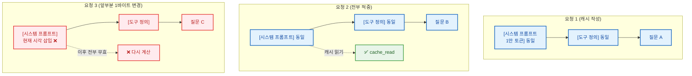

> LLM 프롬프트 캐싱이 비용과 지연을 어떻게 줄여주는지, 그리고 캐시가 실제로 적중하게 만들려면 무엇을 지켜야 하는지를 Claude(Anthropic) API 기준으로 정리합니다. 접두사 매칭이라는 단 하나의 핵심 원리부터 `cache_control` 배치, 비용 손익분기, 그리고 캐시를 조용히 깨뜨리는 함정까지 실무 관점에서 다룹니다. 본 글은 AI(Claude Code)를 활용해 관련 자료를 조사·정리하고 초안을 작성한 뒤, 직접 검토·편집하여 완성하였습니다.

### What is Prompt Caching?

LLM API를 실무에서 쓰다 보면, 매 요청마다 거의 똑같은 내용을 앞부분에 반복해서 보내게 됩니다. 긴 시스템 프롬프트, 수십 개의 도구 정의, RAG로 끌어온 참고 문서, few-shot 예시 같은 것들입니다. 사용자의 실제 질문은 맨 뒤에 짧게 붙고, 나머지 대부분은 어제 보낸 것과 한 글자도 다르지 않습니다.

문제는 모델 입장에서 이 "똑같은 앞부분"도 매번 새로 처리(prefill)해야 한다는 점입니다. 같은 1만 토큰짜리 시스템 프롬프트를 천 번 보내면, 모델은 그 1만 토큰을 천 번 다시 읽고 천 번의 입력 비용을 청구합니다. 지연 시간도 그만큼 늘어납니다.

**프롬프트 캐싱(Prompt Caching)** 은 이 낭비를 없애기 위한 기능입니다. 자주 재사용되는 프롬프트의 앞부분을 서버에 캐싱해 두고, 다음 요청이 같은 앞부분을 보내면 그 부분은 다시 계산하지 않고 캐시에서 읽어옵니다. 그 결과 **캐시된 토큰은 일반 입력 대비 약 1/10 가격**으로 처리되고, 처리 시간도 크게 단축됩니다.

이 글은 **Claude(Anthropic) API의 프롬프트 캐싱**을 기준으로 설명합니다. OpenAI, Gemini 등 다른 제공자도 비슷한 캐싱 기능을 제공하지만, 최소 토큰 수·TTL·가격 배수 같은 구체적인 수치와 동작 방식은 제공자마다 다릅니다. 아래에 나오는 숫자들은 모두 Anthropic 기준이라는 점을 염두에 두시기 바랍니다.

### The One Invariant

프롬프트 캐싱에서 알아야 할 원리는 사실상 하나뿐이고, 나머지 모든 규칙은 여기서 파생됩니다.

> **프롬프트 캐싱은 접두사 매칭(prefix match)입니다. 접두사의 어느 위치든 바이트가 하나라도 바뀌면, 그 지점 이후의 캐시는 전부 무효화됩니다.**

캐시 키는 캐시 지점(breakpoint)까지 **렌더링된 프롬프트의 정확한 바이트**로부터 만들어집니다. 그래서 N번째 위치의 글자 하나가 달라지면, N 이후의 모든 캐시 지점이 함께 깨집니다. 다이어그램으로 보면 직관적입니다.



여기서 결정적으로 중요한 것이 **렌더링 순서**입니다. 프롬프트는 `tools` → `system` → `messages` 순서로 펼쳐집니다. 즉 도구 정의가 가장 앞(위치 0), 그다음이 시스템 프롬프트, 마지막이 대화 메시지입니다.

따라서 설계 원칙은 명확합니다. **변하지 않는 내용은 앞에, 매번 바뀌는 내용은 뒤에 둡니다.** 고정된 시스템 프롬프트와 결정론적으로 정렬된 도구 목록을 앞에 두고, 타임스탬프·요청 ID·매번 달라지는 질문 같은 휘발성 내용은 마지막 캐시 지점 뒤로 보내야 합니다. 이 순서만 맞춰도 캐싱은 대부분 저절로 동작합니다.

### Where to Put cache_control

캐싱을 켜는 방법은 캐싱하려는 지점에 `cache_control` 마커를 붙이는 것입니다. 현재 지원되는 타입은 `ephemeral` 하나입니다. 가장 간단한 방법은 요청 최상단에 두어 마지막 캐시 가능 블록을 자동으로 캐싱하는 것입니다.

```javascript
const response = await client.messages.create({
  model: "claude-opus-4-8",
  max_tokens: 16000,
  cache_control: { type: "ephemeral" }, // 마지막 캐시 가능 블록을 자동 캐싱
  system: "당신은 이 대용량 문서의 전문가입니다 ...",
  messages: [{ role: "user", content: "핵심 내용을 요약해 주세요" }],
});
```

세밀하게 위치를 지정하고 싶다면 특정 블록에 직접 마커를 붙입니다. 상황별로 마커를 어디에 두어야 하는지가 캐시 적중률을 좌우합니다.

##### 여러 요청이 공유하는 큰 시스템 프롬프트

마지막 시스템 텍스트 블록에 캐시 지점을 둡니다. 도구가 있다면 시스템보다 앞서 렌더링되므로, 이 마커 하나로 **도구 + 시스템이 함께** 캐싱됩니다.

```javascript
system: [
  {
    type: "text",
    text: "<크고 공통된 프롬프트>",
    cache_control: { type: "ephemeral" },
  },
];
```

##### 멀티턴 대화

가장 최근에 추가된 턴의 마지막 콘텐츠 블록에 캐시 지점을 둡니다. 그러면 다음 요청은 이전 대화 전체를 접두사로 재사용합니다. 대화가 길어질수록 적중분이 누적됩니다.

##### 공통 접두사 + 변하는 질문

큰 고정 본문(few-shot 예시, 검색된 문서)은 공유하면서 마지막 질문만 다른 경우입니다. 이때 캐시 지점은 **전체 프롬프트의 끝이 아니라 공유 부분의 끝**에 두어야 합니다. 끝에 두면 매 요청이 서로 다른 캐시 항목을 작성하기만 하고 아무것도 읽지 못합니다.

```javascript
messages: [
  {
    role: "user",
    content: [
      { type: "text", text: "<공유 컨텍스트>", cache_control: { type: "ephemeral" } },
      { type: "text", text: "<매번 달라지는 질문>" }, // 마커 없음
    ],
  },
];
```

참고로 캐시 지점은 요청당 **최대 4개**까지 둘 수 있으며, 자동 캐싱도 이 4개 중 하나를 사용합니다.

### Economics

캐싱은 공짜가 아닙니다. 캐시에 **쓸 때(write)** 는 일반 입력보다 비싸고, **읽을 때(read)** 만 싸집니다. 그래서 "몇 번 재사용해야 이득인지"를 따져봐야 합니다. Anthropic 기준 가격 배수는 다음과 같습니다.

| 토큰 종류 | 기본 입력 대비 배수 |
| --- | --- |
| 일반 입력(캐시 안 됨) | 1× |
| 캐시 쓰기 (5분 TTL) | **1.25×** |
| 캐시 쓰기 (1시간 TTL) | **2×** |
| 캐시 읽기 (적중) | **0.1×** |

TTL(Time-To-Live)은 캐시가 유지되는 시간이며, 기본값은 **5분**이고 `{ "type": "ephemeral", "ttl": "1h" }` 로 **1시간** 으로 늘릴 수 있습니다. 매 적중마다 TTL은 다시 갱신됩니다.

손익분기를 계산해 보면 직관이 생깁니다. 5분 TTL은 쓰기 1.25× + 읽기 0.1× = **1.35×** 이므로, 같은 접두사를 **두 번만 써도** 캐시 없이 두 번(2×) 보내는 것보다 이득입니다. 1시간 TTL은 쓰기 2× + 읽기 0.2× = **2.2×** 라서, 캐시 없이 세 번(3×) 대비 이득을 보려면 **최소 세 번 이상** 재사용해야 합니다. 1시간 TTL은 트래픽이 띄엄띄엄 들어와도 캐시를 살려두지만, 쓰기 비용이 두 배라 더 많은 적중이 필요한 셈입니다.

한 가지 더 중요한 제약이 있습니다. **캐시할 수 있는 최소 접두사 길이**입니다. 이보다 짧으면 마커를 붙여도 **에러 없이 조용히** 캐싱되지 않습니다.

이 최솟값은 **모델(과 버전)에 따라 다르며**, 대략 **1,024 ~ 4,096 토큰** 범위입니다. 같은 길이의 프롬프트라도 어떤 모델에서는 캐싱되고 다른 모델에서는 조용히 캐싱되지 않을 수 있습니다. 구체적인 수치는 모델별로 바뀔 수 있으니, 사용하는 모델의 정확한 임계값은 [공식 문서](https://platform.claude.com/docs/en/build-with-claude/prompt-caching)에서 확인하시기 바랍니다. 모델을 교체할 때 이 값을 함께 점검하는 것이 중요한 이유입니다. 예를 들어 임계값이 4,096인 모델로 옮기면, 그보다 짧은 3천 토큰짜리 접두사는 예고 없이 캐싱이 멈춥니다.

### Silent Invalidators

실무에서 캐시가 안 먹는 가장 흔한 원인은 마커를 안 붙여서가 아니라, **접두사를 매 요청마다 미묘하게 바꾸고 있어서** 입니다. 에러도 안 나기 때문에 "캐싱을 켰는데 왜 비용이 안 줄지?" 하고 한참 헤매게 됩니다. 다음은 접두사를 조용히 깨뜨리는 대표적인 패턴들입니다.

| 패턴 | 캐시가 깨지는 이유 |
| --- | --- |
| 시스템 프롬프트에 `datetime.now()` / `Date.now()` 삽입 | 매 요청마다 접두사가 달라짐 |
| 콘텐츠 앞부분에 `uuid4()` / 요청 ID 삽입 | 마찬가지로 매 요청이 고유해짐 |
| `json.dumps(d)` 를 `sort_keys=True` 없이 직렬화 | 키 순서가 비결정적 → 바이트가 달라짐 |
| 시스템 프롬프트에 사용자 ID를 f-string으로 끼워 넣음 | 사용자별 접두사가 생겨 공유 불가 |
| `if flag: system += ...` 식의 조건부 섹션 | 플래그 조합마다 서로 다른 접두사 |
| 사용자마다 다른 도구 목록(`build_tools(user)`) | 도구는 위치 0이라 어떤 캐시도 공유 안 됨 |

핵심 처방은 세 가지입니다. **시스템 프롬프트는 동결**하고(현재 시각·모드·사용자 이름을 끼워 넣지 않기), 동적인 정보는 메시지 뒤쪽으로 보내며, **도구와 모델은 대화 중간에 바꾸지 않습니다.** 특히 도구 목록은 정렬해서 결정론적으로 직렬화하는 습관이 중요합니다.

> 황금률: 캐싱을 켰는데 비용이 줄지 않으면, 마커 위치를 의심하기 전에 **두 요청의 렌더링된 프롬프트 바이트를 직접 비교**해 보세요. 어딘가에 매번 달라지는 한 조각이 숨어 있을 가능성이 높습니다.

### Verifying Cache Hits

캐싱이 실제로 동작하는지는 추측할 필요 없이, 응답의 `usage` 객체에서 바로 확인할 수 있습니다.

| 필드 | 의미 |
| --- | --- |
| `cache_creation_input_tokens` | 이번 요청에서 캐시에 **쓴** 토큰 수 (1.25× 비용 지불) |
| `cache_read_input_tokens` | 이번 요청에서 캐시에서 **읽은** 토큰 수 (0.1× 비용) |
| `input_tokens` | 캐시되지 않고 정가로 처리된 토큰 수 |

가장 먼저 볼 것은 `cache_read_input_tokens` 입니다. 동일한 접두사로 반복 요청하는데도 이 값이 계속 **0**이라면, 앞 절에서 본 조용한 무효화 요인이 작동하고 있다는 신호입니다.

한 가지 흔한 오해도 짚어두겠습니다. `input_tokens` 는 **캐시되지 않은 나머지** 토큰만 보여줍니다. 따라서 전체 프롬프트 크기는 세 값의 합입니다.

```
전체 입력 토큰 = input_tokens
              + cache_creation_input_tokens
              + cache_read_input_tokens
```

에이전트가 몇 시간을 돌았는데 `input_tokens` 가 4K밖에 안 나온다면, 나머지는 캐시에서 읽혔다는 뜻입니다. 단일 필드가 아니라 **세 값의 합**을 봐야 실제 처리량을 알 수 있습니다.

### Wrapping Up

프롬프트 캐싱의 본질은 복잡한 기능이 아니라 단 하나의 원리, **"접두사가 바이트 단위로 같으면 다시 계산하지 않는다"** 입니다. 여기서 모든 실무 규칙이 따라 나옵니다.

- **순서가 전부입니다.** `tools` → `system` → `messages` 순으로 안정적인 것을 앞에, 휘발성인 것을 뒤에 둡니다.
- **시스템 프롬프트를 동결합니다.** 현재 시각·사용자 ID 같은 동적 값을 앞에 끼워 넣지 말고, 메시지 뒤쪽으로 보냅니다.
- **재사용 횟수를 따집니다.** 5분 TTL은 두 번, 1시간 TTL은 세 번 이상 재사용할 때 이득입니다.
- **검증은 `usage`로 합니다.** `cache_read_input_tokens` 가 0이면 조용한 무효화 요인을 찾습니다.

긴 시스템 프롬프트나 대용량 컨텍스트를 반복적으로 쓰는 애플리케이션이라면, 위 원칙 몇 가지를 지키는 것만으로도 입력 비용과 지연을 큰 폭으로 줄일 수 있습니다.

### References

- [Prompt caching (Anthropic 공식 문서)](https://platform.claude.com/docs/en/build-with-claude/prompt-caching)
- [Pricing (Anthropic)](https://platform.claude.com/docs/en/about-claude/pricing)
